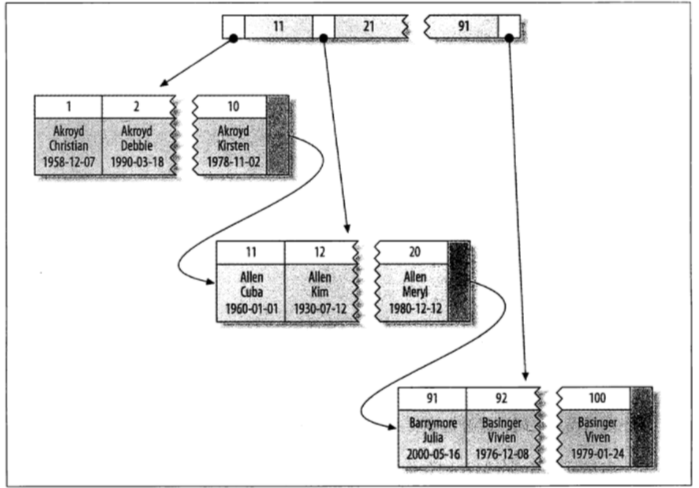
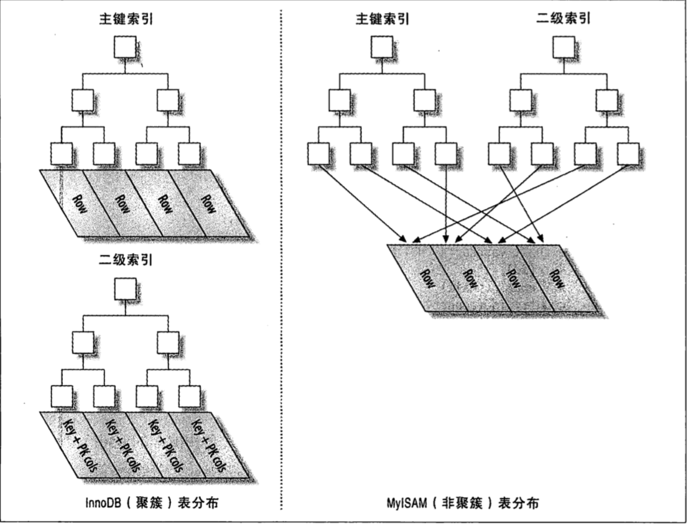

# 第五章 创建高性能的索引

索引在 MySQL 中也叫键（Key），是存储引擎用于快速找到记录的一种数据结构。

索引对良好的性能非常关键，尤其是当表中的数据量越来越大时，索引对性能的影响愈发重要。**索引是优化查询性能的最有效的手段。**索引能够轻易将查询性能提高几个数量级，“最优”的索引有时比一个“好的”索引性能要好两个数量级。

索引可以包含一个或多个列的值。如果索引包含多个列，那么列的顺序也十分重要，因为mysql只能高效的使用索引的最左前缀列。创建一个包含两个列的索引，和创建两个只包含一列的索引大不相同。

复合索引的结构与**电话簿**类似，人名由姓和名构成，电话簿首先按姓氏对进行排序，然后按名对有相同姓氏的人进行排序。**如果您知道姓，电话簿将非常有用；如果您知道姓和名，电话簿则更为有用，但如果您只知道名不姓，电话簿将没有用处**。

所以说创建复合索引时，应该仔细考虑**列的顺序**。对索引中的**所有列**执行搜索或仅对**前几列**执行搜索时，**复合索引非常有用**；**仅对后面的任意列**执行搜索时，**复合索引则没有用处。**

**多个单列索引**在**多条件查询**时优化器会选择**最优索引策略**，**可能只用一个索引，也可能将多个索引全用上！** 但多个单列索引底层会建立多个B+索引树，比较占用空间，也会浪费一定搜索效率，故如果只有**多条件联合查询时最好建联合索引！**

***联合索引本质：***

当创建**(a,b,c)联合索引**时，相当于创建了**(a)单列索引**，**(a,b)联合索引**以及**(a,b,c)联合索引**
想要索引完全生效的话,只能使用 a和(a,b)和(a,b,c)这仅有的三种组合；当然，我们上面测试过，**a,c组合也可以，但实际上只用到了a的索引，c并没有用到！**

使用术语`B-Tree`是因为 MySQL 在其他语句中也使用该关键字。

**`B-Tree`索引适用于全键值、键值范围或键前缀查找，其中键前缀查找只适用于根据最左前缀的查找。**

```sql
CREATE TABLE people(
	last_name VARCHAR(50) NOT NULL,
	first_name VARCHAR(50) NOT NULL,
	dob DATE NOT NULL,
	address VARCHAR(50) NOT NULL,
	KEY(last_name,first_name,dob)
);
```

- 全值匹配。全值匹配指的是和索引中的所有列进行匹配，例如，前述示例中的索引可用于查找姓为Cuba、名为Allen、出生于1960-01-01的人

- 匹配最左前缀。示例索引可用于查找所有姓为Allen的人，即只使用索引的第一列。

- 匹配列前缀。也可以只匹配某一列的值的开头部分，例如，示例索引可用于查找所有以J开头的姓的人，这里也只使用了索引的第一列。

- 匹配范围值。例如，示例索引可用于查找姓在Allen和Barrymore之间的人，这里也只使用了索引的第一列。

- 精确匹配某一列并范围匹配另外一列。示例索引也可用于查找所有姓为Allen，并且名字是字母K开头的人，即第一列last_name全匹配，第二列first_name范围匹配。

- 只访问索引的查询。`B-Tree`通常可以支持“只访问索引的查询”，即查询只需要访问索引，而无须访问数据行。

  

**`B-Tree`的一些限制：**

- 如果不是按照索引的最左列开始查找，则无法使用索引。例如，示例索引中无法用于查找名字为Bill的人，也无法查找某个特定生日的人，因为这两列都不是最左数据列。类似的，也无法查找姓氏以某个字母结尾的人。
- 不能跳过索引中的列。例如，示例索引无法用于查找姓为Smith并且在某个特定日期出生的人。如果不指定first_name，则mysql只能使用索引的第一列。
- 如果索引中有某个列的范围查询，则其右边所有列都无法使用索引优化查找。例如，示例索引中有如下查询语句`WHERE last_name = 'Smith' AND first_name LIKE 'J%' AND dob = '1976-12-23'`，此查询只能使用索引的前两列，因为这里`LIKE`是一个范围条件。如果范围查询列值的数量有限，那么可以通过使用多个等于条件来代替范围条件。


### 哈希索引

`哈希索引（hash index）`基于哈希表实现，只有精确匹配索引所有列的查询才有效。对于每一行数据，存储引擎都会对所有的索引列计算一个`哈希码（hash code）`，`哈希码`是一个较小的值，并且不同键值的行计算出来的`哈希码`也不一样。`哈希索引`将所有的`哈希码`存储在索引中，同时在`哈希表`中保存指向每个数据行的指针。 

在mysql中，只有`Memory`引擎显式支持`哈希索引`。


#### 创建自定义哈希索引

如果存储引擎不支持哈希索引，则可以模拟像 InnoDB 一样创建哈希索引，这可以享受一些哈希索引的便利，例如只需要很小的索引就可以为超长的键创建索引。

思路很简单：在 B-TREE 基础上创建一个伪哈希索引，你需要做的就是在查询的 WHERE 子句中手动指定使用哈希函数。

一个例子：

加入你需要存储大量的 URL，并且需要根据 URL 进行搜索查找，如果使用 B-Tree 来存储 URL，储存的内容就会很大，因为 URL 本身都很长。正常情况下有如下查询：

`mysql> SELECT id FROM url WHERE url="xxx"`

若删除原来 URL 列上的索引，而新增一个被索引的 url_crc 列，使用 CRC32做哈希，就可以使用下面的方式查询：

`mysql> SELECT id FROM url WHERE url_crc=CRC32("XXX") AND url="xxx";`

这样性能会非常高，因为 MySQL 优化器会使用这个选择性很高而体积很小的基于 url_crc 列的索引来完成查找。

不过这也有缺点，那就是需要维护哈希值。可以手动维护，也可以使用触发器实现。下面的案例演示了触发器如何在插入和更新时维护 url_crc 列。首先创建如下表：

```sql
CREATE TABLE pseudohash (
  id int unsigned NOT NULL auto_increment,
  url varchar(256) NOT NULL,
  url_crc int unsigned NOT NULL DEFAULT 0,
  PRIMARY KEY(id)
 );
```

然后创建触发器，在`MySQL`中默认的结束符`DELIMITER`是`;`，它用于标识一段命令是否结束。在默认情况下，在命令行客户端中，如果有一行命令以`;`结束，那么回车后，`MySQL`将会执行该命令。在此先修改一下语句分隔符：

```sql
DELIMITER //
CREATE GRIGGER pseudohash_crc_ins BEFORE INSERT ON pseudohash
	FOR EACH ROW BEGIN SET NEW.url_crc=crc32(NEW.url);
END;
//

CREATE GRIGGER pseudohash_crc_upd BEFORE UPDATE ON pseudohash
	FOR EACH ROW BEGIN SET NEW.url_crc=crc32(NEW.url);
END;
//
```

完成。

注意：使用上述方式，不要使用 SHA1() 和 MD5() 作为哈希函数。因为这俩返回非常长的字符串，会浪费大量空间，比较时也更慢。

当然，如果数据表非常大，CRC32()会出现大量的哈希冲突，则可以考虑自己实现一个简单的64位哈希函数。这个自定义函数要返回整数，而不是字符串。一个最简单的办法可以使用 MD5()返回值的一部分来作为自定义哈希函数。这可能比自己写一个哈希算法的性能要差，但这样最简单。


**处理哈希冲突**

当使用哈希索引进行查询的时候，必须在 WHERE 子句中包含常量值(像上文那样)，而不能：

`mysql> SELECT id FROM url WHERE url_crc=CRC32("XXX");`

假如 CRC32("XXX") 和另一个 CRC32("xxxxx") 发生哈希冲突，这样就会返回多个记录。


### 索引的优点

索引可以让服务器快速的定位到表的指定位置，但这并不是索引的唯一作用，根据创建索引的数据结构不同，索引也有一些其它的附加作用。 

最常见的`B-Tree`索引，按照顺序存储数据，所以mysql可以用来做`ORDER BY`和`GROUP BY`操作。因为数据是有序的，所以`B-Tree`也就会将相关的列值都存储在一起。最后，因为索引中存储了实际的列值，所以某些查询只使用索引就能够完成全部查询，总结如下：

- 索引大大减少了服务器需要扫描的数据量
- 索引可以帮助服务器避免排序和临时表
- 索引可以将随机I/O变为顺序I/O


## 5.3 高性能索引策略

### 独立的列

如果查询中的列不是独立的，则mysql就不会使用索引。“独立的列”是指索引列不能是表达式的一部分，也不能是函数的参数。

- 示例一：索引列不能是表达式的一部分

  `SELECT item_code FROM cc_item WHERE item_code + 1 = 5;`

  应该养成简化`WHERE`条件的习惯，始终将索引列单独放在比较符号的一侧。

* 示例二：索引列不能是函数的参数

  `SELECT ... WHERE TO_DAYS(CURRENT_DATE()) - TO_DAYS(date_col) <= 10;`

### 前缀索引和索引选择性

有时候需要索引很长的字符列，这会让索引变的大且慢，一个策略是`模拟哈希索引`。 

通常还可以索引开始的部分字符，这样可以大大节约索引空间，从而提高索引效率，但这样也会降低`索引的选择性`。`索引的选择性`是指，不重复的索引值（也称为基数）和数据表的记录总数（T）的比值，范围从1/T到1之间。`索引的选择性`越高则查询效率越高，因为选择性高的索引可以让mysql在查找时过滤掉更多的行。唯一索引的选择性是1，这是最好的索引选择性，性能也是最好的。 

一般情况下某个列前缀的选择性也是足够高的，足以满足查询性能。对于`BLOB`、`TEXT`或者很长的`VARCHAR`类型的列，必须使用前缀索引，因为mysql不允许索引这些列的完整长度。 

诀窍在于要选择足够长的前缀以保证较高的选择性，同时又不能太长（以便节约空间）。前缀应该足够长，以使得前缀索引的选择性接近于索引整个列。换句话说，前缀的“基数”应该接近于完整列的“基数”。

- 计算合适的前缀长度的一个办法就是计算完整列的选择性，并使前缀的选择性接近于完整列的选择性，如：

   `SELECT COUNT(DISTINCT LEFT(last_name, 2))/COUNT(*) FROM people; `

可通过调整 LEFT 函数的参数从而选出一个较好的值。

不过只看平均选择性是不够的，也有例外的情况，需要考虑最坏情况下的选择性。如果数据分布很不均匀，可能就会有陷阱。 

前缀索引是一种能使索引更小、更快的有效办法，但另一方面也有其缺点：mysql无法使用前缀索引做`GROUP BY`和`ORDER BY`，也无法使用前缀索引做覆盖扫描。

### 多列索引

一个常见的错误是，为每个列创建独立的索引，或者按照错误的顺序创建多列索引。为每个列创建独立索引的策略，一般是听从“把`WHERE`条件里面的列都建上索引”这种错误建议。 

在多个列上建立独立的索引大部分情况下并不能提高mysql的查询性能。mysql 5.0和更新版本引入了一种叫`索引合并（index merge）`的策略，一定程度上可以使用表上的多个单列索引来定位指定的行，查询能够同时使用这两个单列索引进行扫描，并将结果进行合并，这种算法有三个变种：

- `OR`条件的联合（union）
- `AND`条件的相交（intersection）
- 组合前两种情况的联合及相交

例如，字段last_name、first_name上各有一个单列索引：

```sql
mysql> EXPLAIN SELECT last_name,first_name FROM people WHERE last_name = 'xx' OR first_name = 'xxx'
```

索引合并策略有时候是一种优化的结果，但实际上更多时候说明了表上的索引建的很糟糕：

- 当出现服务器对多个索引做相交操作时（通常有多个AND条件），通常意味着需要一个包含所有xx相关列的多列索引，而不是多个独立的单列索引。
- 当服务器需要对多个索引做联合操作时（通常有多个OR条件），通常需要耗费大量CPU和内存资源在算法的缓存、排序和合并操作上。
- 更重要的是，优化器不会把这些计算到查询成本中，优化器只关心随机页面读取。这会使得查询的成本被低估，导致该执行计划还不如直接走全表扫描。

### 选择合适的索引顺序

正确的索引顺序依赖于使用该索引的查询，并且同时需要考虑如何更好的满足排序和分组的需要(B-Tree 索引；哈希或者其他类型的索引并不会按顺序存储数据)。 

在一个多列`B-Tree`索引中，索引列的顺序意味着索引首先按照最左列进行排序，其次是第二列，等等。所以，索引可以按照升序或者降序进行扫描，以满足精确符合列顺序的`ORDER BY`、`GROUP BY`和`DISTINCT`等子句的查询需求。 

至于如何选择索引的列顺序有一个经验法则：`将选择性最高的列放到索引最前列`。当不需要考虑排序和分组时，将选择性最高的列放在前面通常是很好的，这时候索引的作用只是用于优化`WHERE`条件的查找。然而，性能不只是依赖于所有索引列的选择性（整体基数），也和查询条件的具体值有关，也就是和值的分布有关。

### 聚簇索引

`聚簇索引`并不是一种单独的索引类型，而是一种数据存储方式。具体的细节依赖于其实现方式，`InnoDB的聚簇索引实际上在同一个结构中保存了B-Tree索引和数据行`，本小节主要关注InnoDB。 

`当表有聚簇索引时，它的数据行实际上存放在索引的叶子叶中`。`“聚簇”表示数据行和相邻的键值紧凑的存储在一起`。因为无法同时把数据行存放在两个不同的地方，所以一个表只能有一个聚簇索引。下图展示了聚簇索引中记录的存放，此示例索引列包含的是整数值：




聚集的数据的优点：

- 可以把相关数据保存在一起
- 数据访问更快。`聚簇索引将索引和数据保存在同一个B-Tree中`，因此从聚簇索引中获取数据通常比在非聚簇索引中查找要快
- 使用覆盖索引扫描的查询可以直接使用页结点中的主键值

聚簇主键可能对性能有帮助，但也可能导致严重的性能问题。所以需要仔细的考虑聚簇索引，尤其是将表的存储引擎从InnoDB改成其它引擎时。聚簇索引的缺点：

- `聚簇数据最大限度的提高了I/O密集型应用的性能`，但如果数据全部都放在内存中，则访问的顺序也就没那么重要了，聚簇索引也就没什么优势了
- 插入速度严重依赖于插入顺序
- 更新聚簇索引列的代价很高，因为会强制InnoDB将每个被更新的行移动到新的位置
- 基于聚簇索引的表在插入新行，或者主键被更新导致需要移动行时，可能面临`页分裂（page split）`的问题
- 聚簇索引可能导致全表扫描变慢，尤其是行比较稀疏，或者由于`页分裂`导致数据存储不连续的时候
- `二级索引（非聚簇索引）`可能比想象的要更大，因为在二级索引的叶子节点包含了引用行的主键列
- `二级索引`访问需要两次索引查找，而不是一次

`二级索引叶子结点保存的不是指向行的物理位置的指针，而是行的主键值`。这意味着通过`二级索引`查找行，`存储引擎需要找到二级索引的叶子结点获得对应的主键值，然后根据这个值去聚簇索引中查找到对应的行`。这里做了重复的工作：两次B-Tree查找而不是一次，对于InnoDB，自适应哈希索引能够减少这样的重复工作。 

`在InnoDB中，聚簇索引就是表，所以不像MyISAM那样需要独立的行存储`。`聚簇索引的每一个叶子结点都包含了主键值、事务ID、用于事务和多版本控制(MVVC)的回滚指针以及所有的剩余列`。如果主键是一个列前缀索引，InnoDB也会包含完整的主键列和剩下的其它列。如下图所示：





### 覆盖索引

如果一个索引包含（或者覆盖）所有需要查询的字段的值，则称之为`覆盖索引`，考虑一下如果查询只需要扫描索引而无须回表，会带来很多好处：

- 索引条目通常远小于数据行大小，所以如果只需要读取索引，mysql就会极大的减少数据访问量
- 因为索引是按照列值顺序存储（至少在单个页内是如此），所以对于I/O密集型的范围查询会比随机从磁盘读取每一行数据的I/O要少的多
- 一些存储引擎如MyISAM在内存中只缓存索引，数据则依赖于操作系统来缓存，因此要访问数据需要一次系统调用
- `由于InnoDB的聚簇索引，覆盖索引对InnoDB表特别有用`。InnoDB的二级索引在叶子结点中保存了行的主键值，所以如果二级主键能够覆盖查询，则可以避免对主键索引的二次查询

`不是所有类型的索引都可以成为覆盖索引，覆盖索引必须要存储索引列的值，而哈希索引、空间索引和全文索引等都不存储索引列的值，所以mysql只能使用B-Tree索引做覆盖索引`。另外，不同的存储引擎实现覆盖索引的方式也不同，而且不是所有的引擎都支持覆盖索引。 

当发起一个被索引覆盖的查询时，在`EXPLAIN`的`Extra`列可以看到`Using index`信息，示例如下，`KEY last_name (first_name) USING BTREE`：

略

### 使用索引扫描做排序

mysql有两种方式可以生成有序的结果：`通过排序操作`，或者`按索引顺序扫描`。如果`EXPLAIN`中的`type`列的值为`index`，则表明mysql使用了索引扫描来做排序。 

mysql可以使用同一个索引既满足排序，又用于查找行，设计索引时应该尽可能的同时满足这两种任务。 

`只有当索引的列顺序和ORDER BY子句的顺序完全一致，并且所有列的排序方向都一样时，mysql才能使用索引来对结果做排序`。`如果查询需要关联多张表，则只有当ORDER BY子句引用的字段全部为第一个表时，才能使用索引做排序`。ORDER BY子句和查找型查询的限制是一样的：`需要满足索引的最左前缀的要求，否则，mysql都需要执行排序操作，而无法利用索引排序`。 

有一种情况下`ORDER BY`子句可以不满足索引的最左前缀的要求，就是前导列为常量的时候，示例如下，`KEY name (first_name,last_name) `：

```sql
SELECT first_name,last_name FROM people WHERE first_name = 'm' ORDER BY last_name
```

即使`ORDER BY`子句不满足索引的最左前缀的要求，也可以用于查询排序，这是因为索引的第一列被指定为一个常数。


mysql允许在相同列上创建多个索引。`重复索引`是指在相同的列上按照相同的顺序创建的相同类型的索引，应该避免。冗余索引和重复索引有些不同， 如果创建了索引(A, B)，再创建索引(A)就是`冗余索引`，因为这只是前一个索引的前缀索引。 

大多数情况下都不需要重复索引(除非是在同一列上创建不同类型的索引来满足不同的查询需求，另外，如果索引类型不同，并不算重复索引)

有时也会无意间创建重复索引，比如给加了唯一的列再加索引：

`mysql的UNIQUE(唯一限制)和INDEX(主键限制)都是通过索引实现`。 

而冗余索引通常发生在为表添加新索引的时候，如上面的先创建了索引(A,)，再创建索引(A，B)

大多数情况下都不需要冗余索引，应该尽量扩展已有的索引而不是创建新索引。但也有时候出于性能方面的考虑需要冗余索引，因为扩展已有的索引会导致其变的太大，从而影响其他使用该索引的查询的性能。 

例如，如果在整数列上有一个索引，现在需要额外增加一个很长的 VARCHAR 列来拓展该索引，那性能可能会急剧下降。特别是有查询把这个索引当做覆盖索引的时候。

一般来说，增加新索引将会导致`INSERT`、`UPDATE`、`DELETE`等操作的速度变慢，特别是当新增索引后导致达到了内存瓶颈的时候。

### 索引和锁

`索引可以让查询锁定更少的行`。如果查询从不访问那些不需要的行，那么就会锁定更少的行，从两个方面来看这对性能都有好处：

- 首先，虽然InnoDB的行锁效率很高，内存使用也很少，但是锁定行的时候仍然会带来额外开销
- 其次，锁定超过需要的行会增加锁争用并减少并发性

关于 InnoDB、索引和锁有一些很少人注意到的细节：`InnoDB在二级索引上使用共享锁（读锁），但访问主键索引需要排他锁（写锁）。这消除了使用覆盖索引的可能性，并且使得SELECT ... FOR UPDATE比LOCK IN SHARE MODE或非锁定查询要慢的多`。？？没看懂

此外，在使用索引的过程中应该尽量：

* 支持多种过滤条件
* 避免多个范围条件
* 优化排序
* 维护索引和表
* 找到并修复损坏的表(有 CHECK TABLE、REPAIR TABLE等命令)
* 更新索引统计信息
* 减少索引和数据的碎片

通过本章可以看到， 索引是一个非常复杂的话题! MySQL和存储引擎访问数据的方式，加上索引的特性， 使得索引成为一个影响数据访问的有力而灵活的工作（无论数据是在磁盘中还是在内存中）。

在选择索引和编写利用这些索引的查询时， 有如下三个原则始终需要记住：

* 单行访问是很慢的。特别是在机械硬盘存储中(SSD的随机I/O 要快很多， 不过这一点仍然成立）。如果服务器从存储中读取一个数据块只是为了获取其中一行， 那么就浪费了很多工作。最好读取的块中能包含尽可能多所需要的行。使用索引可以创建位置引用以提升效率。

* 按顺序访问范围数据是很快的，这有两个原因。第一，顺序I/O不需要多次磁盘寻道，所以比随机I/O要快很多（特别是对机械硬盘）。第二， 如果服务器能够按需要顺序读取数据， 那么就不再需要额外的排序操作， 井且GROUP BY查询也无须再做排序和将行按组进行聚合计算了。

* 索引覆盖查询是很快的。如果一个索引包含了查询需要的所有列， 那么存储引擎就不需要再回表查找行。这避免了大最的单行访问， 而上面的第1点已经写明单行访问是很慢的。

总的来说， 编写查询语句时应该尽可能选择合适的索引以避免单行查找、尽可能地使用数据原生顺序从而避免额外的排序操作， 井尽可能使用索引覆盖查询。

