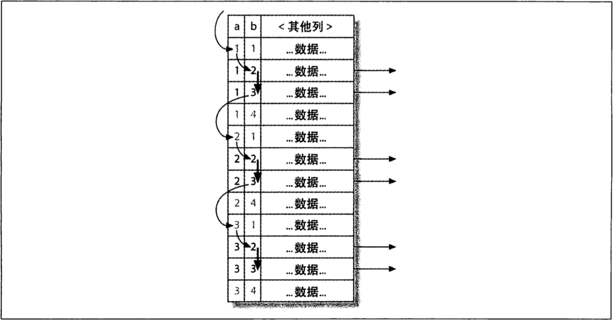

# 第六章 查询性能优化

如果查询写得很糟糕，即使库表结构设计得再合理、索引再合适，也无法实现高性能。

## 6.2慢查询基础：优化数据访问

 查询性能低下最基本的原因是访问的数据太多。**大部分性能低下的查询都可以通过减少访问的数据量的方式进行优化**。对于低效的查询， 我们发现通过下面两个步骤来分析总是很有效：

* 确认应用程序是否在检索大量超过需要的数据。这通常意味着访问了太多的行， 但有时候也可能是访问了太多的列。
* 确认MySQL服务器层是否在分析大量超过需要的数据行。


### 是否向数据库请求了不需要的数据

**有些查询会请求超过实际需要的数据， 然后这些多余的数据会被应用程序丢弃**。这会给MySQL服务器带来额外的负担， 并增加网络开销。另外也会消耗应用服务器的CPU 和内存资源。

一些经典案例：

* 查询不需要的记录：一个常见的错误是常常误以为 MySQL 会只返回需要的数据，实际上 MySQL 是先返回全部结果集在进行计算。（考虑使用LIMIT）
* 多表关联时返回全部列（只取需要的列，避免使用 SELECT  *）
* 总是取出全部列：每次看到 SELECT * 的时候都需要用怀疑的验光审视，是不是真的需用返回全部的列？大概率上不是必需的。取出全部列，会让优化器无法完成索引覆盖扫描这类优化，还会为服务器带来额外的 I/O、内存和 CPU 开销。
* 重复查询相同数据（使用缓存，避免多次查询同样数据）

### MySQL 是否在扫描额外的记录。

在确定查询只返回需要的数据以后，接下来应该看看查询为了返回结果是否扫描了过多 的数据。对于MySQL, 最简单的衡量查询开销的三个指标如下：

* 响应时间

* 扫描的行数

* 返回的行数

**MySQL能够使用如下三种方式应用WHERE条件， 从好到坏依次为** ：

* 在索引中使用WHERE条件来过滤不匹配的记录。 这是在存储引擎层完成的。

* 使用索引覆盖扫描（在Extra列中出现了Using index) 来返回记录， 直接从索引中过滤不需要的记录并返回命中的结果。 这是在MySQL服务器层完成的， 但无须再回表查询记录。

* 从数据表中返回数据，然后过滤不满足条件的记录（在Extra列中出现Using Where)。这在MySQL服务器层完成，MySQL需要先从数据表读出记录然后过滤。

 **如果发现查询需要扫描大量的数据但只返回少数的行， 那么通常可以尝试下面的技巧去优化它：**

* 使用索引覆盖扫描， 把所有需要用的列都放到索引中， 这样存储引擎无须回表获取对应行就可以返回结果了（在前面的章节中我们已经讨论过了）。

* 改变库表结构。例如使用单独的汇总表（这是我们在第4章中讨论的办法）。

* 重写这个复杂的查询， 让MySQL优化器能够以更优化的方式执行这个查询（这是本章后续需要讨论的问题）。

## 6.3 重构查询的方式

### 切分查询

有时候对于一个大查询我们需要 “分而治之”，将大查询切分成小查询， 每个查询功能完全一样， 只完成一小部分， 每次只返回一小部分查询结果。

删除旧的数据就是一个很好的例子。定期删除大量数据时，如果用一个大的语句一次完成，可能需要锁住很多数据、占满整个事务日志、耗尽系统资源、阻塞很多小的但是重要的查询。将一个大的DELETE语句切分成多个较小的查询可以尽可能小的影响mysql性能，还可以减少mysql复制的延迟。

#### 分解关联查询

很多高性能的应用都会对关联查询进行分解。简单地， 可以对每一个表进行一次单表查询， 然后将结果在应用程序中进行关联。

话说 Django 的**prefetch_related**就是分解关联查询的一个例子吧

prefetch_related是通过分表，先获取各个表的数据，存放在内存中，然后通过Python处理他们之间的关联。

## 6.4  查询执行的基础

当希望MySQL能够以更高的性能运行查询时， 最好的办法就是弄清楚MySQL是如何优化和执行查询的，一且理解这一点，很多查询优化工作实际上就是遵循一些原则让优化器能够按照预想的合理的方式运行。


1.	客户端发送一条查询给服务器。

2.	服务器先检查查询缓存， 如果命中了缓存， 则立刻返回存储在缓存中的结果。 否则进入下一阶段。

3.	服务器端进行SQL解析、 预处理， 再由优化器生成对应的执行计划。

4.	MySQL根据优化器生成的执行计划， 调用存储引擎的API来执行查询。

5.	将结果返回给客户端。

#### 查询优化器

下面是一些MySQL能够处理的优化类型：

* 重新定义关联表的顺序

  数据表的关联井不总是按照在查询中指定的顺序进行。决定关联的顺序是优化器很重要的一部分功能，本章后面将深入介绍这一点。

* 将外连接转化成内连接

  并不是所有的OUTER JOIN语句都必须以外连接的方式执行。诸多因素，例如WHERE条件、库表结构都可能会让外连接等价于一个内连接。MySQL能够识别这点并重写查询，让其可以调整关联顺序。

* 使用等价变换规则

  MySQL可以使用一些等价变换来简化并规范表达式。它可以合并和减少一些比较，还可以移除一些恒成立和一些恒不成立的判断。这些规则对于我们编写条件语句很有用，我们将在本章后续继续讨论。

* 优化COUNT()、MIN()和MAX()

  索引和列是否可为空通常可以帮助MySQL优化这类表达式。例如，要找到某一列的最小值，只需要查询对应B-Tree索引最左端的记录，MySQL可以直接获取索引的第一行记录。在优化器生成执行计划的时候就可以利用这一点，在B-Tree索引中，优化器会将这个表达式作为一个常数对待。类似的，如果要查找一个最大值，也只需读取B-Tree索引的最后一条记录。

* 预估并转化为常数表达式

   当MySQL检测到一个表达式可以转化为常数的时候，就会一直把该表达式作为常数进行优化处理。

  有时候甚至一个查询也能够转化为一个常数。一个例子是在索引列上执行MIN()函数。甚至是主键或者唯一键查找语句也可以转换为常数表达式。如果WHERE子句中使用了该类索引的常数条件，MySQL可以在查询开始阶段就先查找到这些值，这样优化器就能够知道井转换为常数表达式。

* 覆盖索引扫描

  **当索引中的列包含所有查询中需要使用的列的时候，MySQL就可以使用索引返回需要的数据， 而无须查询对应的数据行**， 在前面的章节中我们已经讨论过这点了。

* 子查询优化

  MySQL在某些情况下可以将子查询转换一种效率更高的形式， 从而减少多个查询多次对数据进行访问。

* 提前终止查询

  在发现已经满足查询需求的时候，MySQL总是能够立刻终止查询。一个典型的例子就是当使用了LIMIT子句的时候。除此之外，MySQL还有几类情况也会提前终止查询， 例如发现了一个不成立的条件， 这时MySQL可以立刻返回一个空结果。

* 等值传播

  如果两个列的值通过等式关联，那么MySQL能够把其中一个列的WHERE条件传递到另一列上。

  ```sql
  mysql>SELECT film.film_id 
  	From film
  		INNER JOIN film_actor USING(fild_id)
  	WHERE fild.film_id > 500;
  ```

  这里，MySQL 知道 WHERE 子句不仅适用于 film 表，而且对于 film_actor 表同样适用。

  注：当两个要关联表的字段名是一样的，我们可以使用  **USING** ，可减少 SQL 语句的长度，其中 USING() 内为两个表都均存在的列，而**ON** 就没那么智能，你必须指明要关联的表和字段名。

  当然，还有一种古老的写法：

  ```sql
  SELECT * FROM film, film_actor WHERE film.film_id = film_actor.film_id;
  ```

* 列表IN()的比较

  在很多数据库系统中，IN()完全等同于多个OR条件的子句， 因为这两者是完全等价的。 在MySQL中这点是不成立的，MySQL将 IN()列表中的数据先进行排序，然后通过二分查找的方式来确定列表中的值是否满足条件，这是一个 O(log n)复杂度的操作，等价地转换成OR查询的复杂度为 O(n), 对千IN()列表中有大量取值的时候，MySQL的处理速度将会更快。

需要注意的是，上面列举的远不是MySQL优化器的全部，MySQL还会做大量其他的优化。


#### 关联查询优化器

MySQL优化器最重要的一部分就是关联查询优化， 它决定了多个表关联时的顺序。 通常多表关联的时候， 可以有多种不同的关联顺序来获得相同的执行结果。 关联查询优化器则通过评估不同顺序时的成本来选择一个代价最小的关联顺序，然后返回一个最优的执行计划。

不过，如果有超过 n(> optimizer_search_depth) 个表的关联，那么需要检查 n 的阶乘种关联顺序。这时，优化器不可能逐一评估每一种关联顺序的成本，这时，优化器选择使用“贪婪”搜索的方式查找“最优”的关联顺序。

#### 排序优化

无论如何排序都是一个成本很高的操作，所以从性能角度考虑，应尽可能避免排序或者尽可能避免对大量数据进行排序。

**如果需要排序的数据量小于 “排序缓冲区", MySQL使用内存进行 “快速排序” 操作**。 如果内存不够排序，那么MySQL会先将数据分块， 对每个独立的块使用 “快速排序” 进行排序，并将各个块的排序结果存放在磁盘上，然后将各个排好序的块进行合并 最后返回排序结果。

**在关联查询的时候，如果需要排序，有两种情况：**

- 如果 ORDER BY字句中的所有列都来自第一个表，那么MySQL会在处理第一个表的时候就进行排序，如果是这样，MySQL 的执行计划的EXTRA列会有 `using filesort`的标识。

- 如果不是都来自己第一张表，那么MySQL会将每一步关联的结果放入临时表，在所有关联执行完之后，在这个临时表进行排序，如果是这样，MySQL的执行计划的EXTRA列会有`using temporary;using filesort`的标识。如果查询中有 LIMIT 的话，LIMIT也会在排序之后应用，所以即使需要返回较少的数据，临时表和需要排序的数据量仍然会非常大。

  MySQL 5.6在这里做了改进，使用 LIMIT 后，不再对所有结果排序，而是根据情况，抛弃不满足条件的结果，再进行排序。

## 6.5 MySQL 查询优化器的局限性

### 关联子查询的局限性

MySQL 的子查询实现非常糟糕，最糟糕的一类查询是 WHERE 条件中包含 IN()的子查询语句。如 

```sql
SELECT * FROM film 
WHERE film_id IN(
  SELECT fild_id FROM flim_actor WHERE actor_id = 1
);
```

因为 MySQL 对 IN()列表中的选项有专门的优化，一般会误以为 MySQL 会先执行子查询返回包含 actor_id 为1的 film_id。但很不幸，MySQL 会将相关的外层表压到子查询中，即会将查询改成下面这样：

```sql
SELECT * FROM film 
WHERE EXISTS(
  SELECT * FROM flim_actor WHERE actor_id = 1
  	AND flim_actor.film_id = film.film_id
);
```

根据 EXPLAIN 的输出我们可以看到，MySQL 先选择对 film 表进行全表扫描，然后根据返回的 film_id 逐个执行子查询。如果外层的表是一个非常大的表，那么这个查询的性能将会很糟糕。当然，可以通过重写此查询：

```sql
SELECT film.* FROM film 
	INNER JOIN film_actor USING(film_id)
WHERE actor_id = 1;
```

另一个优化的方法是使用函数 GROUP_CONTACT()在 IN()中构造一个由逗号分隔的列表。有时这比上面的使用关联改写更快。

#### UNION的限制

有时，MySQL无法将限制条件从外层 “下推” 到内层，这使得原本能够限制部分返回结果的条件无法应用到内层查询的优化上。

如果希望UNION的各个子句能够根据LIMIT只取部分结果集，或者希望能够先排好序再合并结果集的话，就需要在UNION的各个子句中分别使用这些子句。

```sql
(SELECT first_name,last_name from actor ORDER BY last_name LIMIT 20)
UNION ALL
(SELECT first_name,last_name from customer ORDER BY last_name LIMIT 20)
LIMIT 20;
```

如上，得在UNION的每条子句上也加上 LIMIT 限制，否则，查询会将 actor 、customer 表满足条件的所有行都取出存放在一个临时表中，再从临时表中取出前20条。

不过上例还有缺陷，从临时表中取出数据的顺序并不是一定的，所以还需要加上一个全局的 ORDER BY 操作。

#### 并行执行的限制

MySQL无法利用多核特性来井行执行查询。 很多其他的关系型数据库能够提供这个特性，但是MySQL做不到。 这里特别指出是想告诉读者**不要花时间去尝试寻找并行执行查询的方法**。

#### 松散索引扫描

MySQL 并不支持松散索引扫描。通常，MySQL 的索引扫描需要先定义一个起点和终点，即使需要的数据只是这段索引中很少数的几个。

例子如下：假设我们有索引(a, b)，有下面的查询：

```sql
mysql>SELECT ... FROM tb1 WHERE b BETWEEN 2 AND 3;
```

该查询无法使用索引，只能通过全表扫描匹配到的行。但是，不难发现还可以用一种更快的办法执行上面的查询，索引的物理结构使得可以先扫描 a 列的第一个值对应的 b 列的范围，然后再跳到 a 列第二个不同值扫描对应 b 列的范围，如下：



这样就无须再使用 WHERE 子句过滤，因为松散索引扫描已经跳过了所有不需要的记录。

#### 最大值和最小值优化的限制

对于 MIN()和 MAX() 查询，MySQL 的优化做得并不够好。一个例子：

```sql
mysql> SELECT MIN(actor_id) FROM actor WHERE first_name = 'xx'；
```

因为 first_name 字段没有索引，所以 MySQL 将会进行全表扫描。如果 MySQL 能够进行主键扫描，那么理论上，当 MySQL 读到第一个满足条件的记录的时候，就是我们需要找到的最小值了！👍🏿👍🏿 因为主键是严格按照 actor_id 字段的大小顺序排列的。但是 实际上MySQL这时只会做全表扫描。一个曲线救国的方法是移除 MIN()，然后使用 LIMIT 来将查询重写如下：

```sql
mysql> SELECT actor_id FROM actor USE INDEX(PRIMARY) 
WHERE first_name = 'xx' LIMIT 1;
```

好处是它让 MySQL扫描尽可能少的记录数，缺点是这个 SQL 已经无法表达出它的本意了。

## 6.7优化特定类型的查询

#### 优化COUNT()查询

COUNT ()是一个特殊的函数， 有两种非常不同的作用：**它可以统计某个列值的数量**， 也 可以统计行数。 在统计列值时要求列值是非空的（不统计 NULL)。如果在 COUNT() 的括号中指定了列或者列的表达式， 则统计的就是这个表达式有值的结果数。

**COUNT ()的另一个作用是统计结果集的行数**。 当MySQL确认括号内的表达式值不可能为空时， 实际上就是在统计行数。 最简单的就是当我们使用 COUNT(*) 的时候， 这种情况下通配符＊井不会像我们猜想的那样扩展成所有的列，实际上，它会忽略所有的列而直接统计所有的行数。

例子1：

​	在某些情况下能遇到这样的问题：如何在同一个查询中统计同一个列不同值的数量，以减少查询的语句量。例如，假设可能需要通过一个查询返回各种不同颜色的商品数量，此时不能使用 OR 语句(如 SELECT COUNT(color='bule' OR corlor='red' FROM items;)，因为这样做就无法区分不同颜色的商品数量；也不能在 WHERE 条件中指定颜色（比如 SELECT COUNT(*） FROM items WHERE color='blue' AND color='red';)。而下面的查询可以在一定程度上解决这个问题：

```sql
mysql>SELECT SUM(IF(color='blue', 1, 0)) AS blue, SUM(IF(color='red', 1, 0)) AS red FROM items;
```

也可以使用 COUNT() 而不是 SUM() 实现同样的目的，只需要将满足条件设置为真，不满足为 NULL 即可：

```sql
mysql>SELECT COUNT(color='blue' OR NULL) AS blue, COUNT(color='red' OR NULL) AS red FROM items;
```


一个最常见的错误是在括号里指定了一个列却希望统计所有结果集的行数。如果希望知道的是结果集的行数，最好使用 COUNT(*) 这样写意义清晰，性能也会很好。

#### 使用近似值

有时候某些场景并不要求完全精确的 CONNT 值，此时可用近似值来替代。EXPLAIN 出来的优化器估算的行数就是一个不错的近似值，执行 EXPLAIN 并不需要真正地去执行查询，所以成本很低。

#### 优化关联查询

​	确保 ON 或者USING子句中的列上有索引。在创建索引的时候就要考虑到关联的顺序。当表A和表B用列c关联的时候， 如果优化器的关联顺序是B、A, 那么就不需要在 B表的对应列上建上索引。 没有用到的索引只会带来额外的负担。 一般来说， 除非有其他理由， 否则只需要在关联顺序中的第二个表的相应列上创建索引。

补充一下为什么"只需要在关联顺序中的第二个表的相应列上创建索引"：

```mysql
SELECT A.*, B.name
FROM A JOIN B
ON A.xx = B.xx
/*
相当于:
outer_rows = SELECT * from A
for row in outer_rows:
	SELECT name from B where B.xx = row.xx
	...
*/
可以看到，最外层的查询是根据A.*列来查询的，再看内层的查询，很明显B.xx上如果有索引的话，能够加速查询
```

​	**确保任何的GROUP BY和ORDER BY中的表达式只涉及到一个表中的列， 这样MySQL才有可能使用索引来优化这个过程**。


#### 优化LIMIT分页

优化此类分页查询的一个最简单的办法就是尽可能地使用**索引覆盖**（如果一个索引包含（或者说覆盖）所有需要查询的字段的值，我们就称之为“覆盖索引”）扫描， 而不是查询所有的列。 然后根据需要做一次关联操作再返回所需的列。 对于偏移量很大的时候， 这样做的效率会提升非常大。考虑下面的查询：

```sql
mysql>SELECT fild_id, description FROM film ORDER BY title LIMIT 50, 5;
```

如果该表非常大，那么这个查询最好改写成下面的样子(前提是 fild_id、title 上有联合索引吧??)：

```sql
mysql > SELECT film.film_id, film.description FROM film 
	INNER JOIN (
    SELECT film_id FROM film 
    ORDER BY title LIMIT 50, 5
 ) AS lim USING(film_id);
```

这里的延迟关联将大大提升查询效率，它让MySQL扫描尽可能少的页面，获取需要访问的记录后再根据关联列回原表查询需要的所有列。这个技术也可以用于优化关联查询中的LIMIT子句。👍🏿👍🏿👍🏿

LIMIT 和 OFFSET 的问题，其实是 OFFSET 的问题，它会导致 MySQL 扫描大量不需要的行然后抛弃掉，如果可以记录上次取数据的位置，那么下次就可以直接从记录的位置开始扫描，这样就可以避免使用 OFFSET。比如：

```sql
mysql>SELECT * FROM tb1 WHERE id < 1000 ORDER BY id DESC LIMIT 20;
```

该技术的好处是无论翻页到多么后面，其性能都会很好。

另一种设计是将翻页的具体页数换成“下一页”按钮，假设每页显示20条记录，那么我们每次查询都用 LIMIT 返回21条记录并只显示20条，如果第21条存在，那么就显示“下一页”按钮。

另一种做法是先获取并缓存较多的数据，比如1000条，然后每次分页都从这个缓存中获取。这样做可以让应用程序根据结果集的大小采取不同的策略，如果结果集少于1000，就可以在页面上显示所有的分页链接，因为数据都在缓存中，所以这样不会影响性能。如果结果集大于1000，则可以在页面上设计一个额外的“找到的结果集多余1000条”之类的按钮，这两种策略都比每次生成全部结果集再抛弃掉不需要的数据的效率高很多。

有时候也可以考虑使用 EXPLAIN 的结果中的 rows 列的值来作为结果集总数的近似值(Google 搜索的结果总数也是个近似值)，再需要精确结果的时候，再使用 COUNT(*)来满足需求。

#### 使用用户自定义变量

在长训中混合使用过程化和关系化逻辑的时候，自定义变量可能会非常有用。

自定义变量是一个用来存储内容的临时容器，在链接 MySQL 的整个过程中都存在，可以使用下面的 SET 和 SELECT 语句来定义它们：

```SQL
mysql> SET @ONE					:1;
mysql> SET @last_week		: CURRENT_DATA-INTERVAL 1 WEEK;
```

然后就可以在任何可以使用表达式的地方使用这些自定义变量：

```mysql
SELECT ... WHERE col <=@lask_week;
```

哪些场景不能使用自定义的变量： 

* 使用自定义变量的查询，不能使用查询缓存。
* 不能在使用常量或标识符的地方使用自定义变量，如表名、列名和 LIMIT 子句中。
* 自定义的变量的生命周期在一个连接中有效，所以不能用他们来做连接间的通信
* 如果使用连接池会有变量污染的情况
* 自定义变量在 mysql 5.0之前是 大小写敏感，注意版本兼容问题。
* 不能显式的声明自定义变量，因此定义的时候，如果整数类型最好就赋值为 0，浮点型 0.0 ，字符型 ''。
* ：= 优先级很低，在与其他sql 同个连接中执行时最好加 ()。
* 使用未定义的变量不会产生任何语法错误！

### 6.9总结

​		如果把创建高性能应用程序比作是一个环环相扣的“难题”， 除了前面介绍的schema、索引和查询语句设计之外， 查询优化应该是解开“难题” 的最后一步了。要想写一个好的查询， 你必须要理解schema设计、索引设计等， 反之亦然。

​        理解查询是如何被执行的以及时间都消耗在哪些地方， 这依然是前面我们介绍的响应时间的一部分。再加上一些诸如解析和优化过程的知识， 就可以更进一步地理解上一章讨论的MySQL如何访问表和索引的内容了。这也从另一个维度帮助读者理解MySQL在访问表和索引时查询和索引的关系。

​        **优化通常都需要三管齐下：不做、少做、快速地做**。我们希望这里的案例能够帮助你将理论和实践联系起来。

​        除了这些基础的手段， 包括查询、表结构、索引等， MySQL还有一些高级的特性可以帮助你优化应用， 例如分区， 分区和索引有些类似但是原理不同。MySQL还支持查询缓存，它可以帮你缓存查询结果，当完全相同的查询再次执行时，直接使用缓存结果（回想一下， “不做")。我们将在下一章中介绍这些特性。

