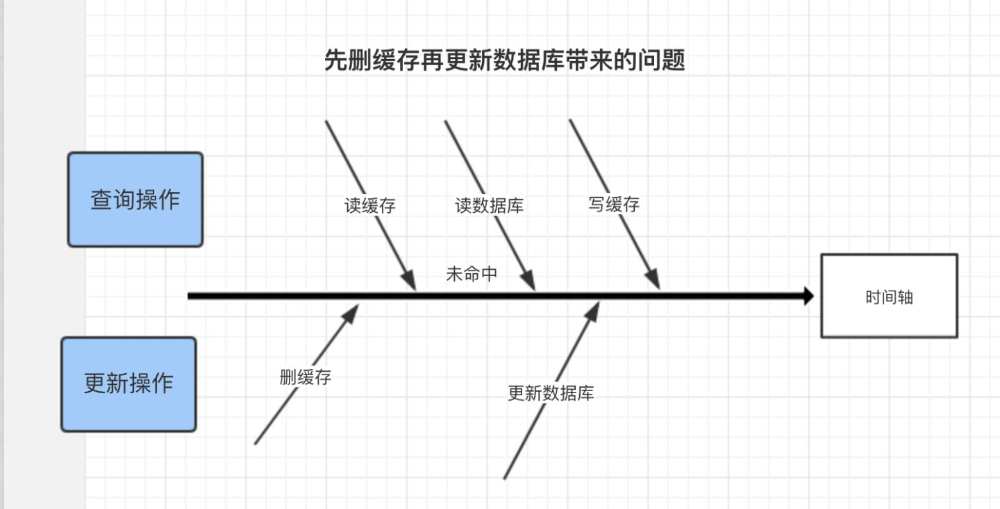
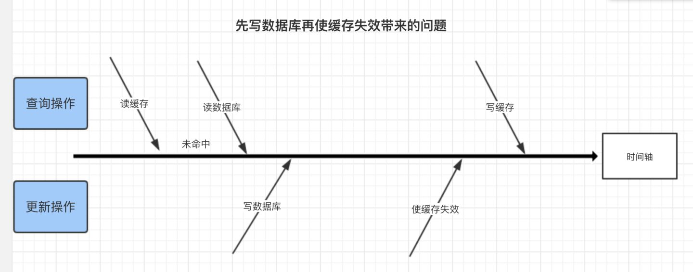

缓存从本质上来说，是一种牺牲数据的实时性以换取效率的方式。

**错误方式**:

​	更新缓存数据代码:**先删除缓存,然后再更新数据库**。

​	比如:试想，两个并发操作，一个是更新操作，另一个是查询操作，更新操作删除缓存后，查询操作	没有命中缓存，先把老数据读出来后放到缓存中，然后更新操作更新了数据库。于是，在缓存中的	数据还是老的数据，导致缓存中的数据是脏的，而且还一直这样脏下去了

更新缓存的Design Pattern有四种：Cache aside, Read through, Write through, Write behind caching，我们下面一一来看一下这四种Pattern。**

* **Cache Aside Pattern(这是业界最常用的方案)**

  * **失效**:应用程序先从cache取数据，没有得到，则从数据库中取数据，成功后，放到缓存中。

  * **命中:**应用程序从cache中取数据，取到后返回。

  - **更新：**先把数据存到数据库中，成功后，**再让缓存失效**。（为什么不是写完数据库后更新缓存？主要是怕两个并发的写操作导致脏数据。）

  注意，我们的更新是先更新数据库，成功后，让缓存失效, 关于前面那个问题:

  	一个是查询操作，一个是更新操作的并发，首先，没有了删除cache数据的操作了，而是先更新了数据库中的数据，此时，缓存依然有效，所以，并发的查询操作拿的是没有更新的数据，但是，更新操作马上让缓存的失效了，后续的查询操作再把数据从数据库中拉出来。而不会像文章开头的那个逻辑产生的问题，后续的查询操作一直都在取老的数据。
  
  那么，是不是Cache Aside这个就不会有并发问题了？不是的，比如，一个是读操作，但是没有命中缓存，然后就到数据库中取数据，此时来了一个写操作，写完数据库后，让缓存失效，然后，之前的那个读操作再把老的数据放进去，所以，会造成脏数据。
  
  
  
  但，这个case理论上会出现，不过，实际上出现的概率可能非常低，因为这个条件需要发生在读缓存时缓存失效，而且并发着有一个写操作。而实际上数据库的写操作会比读操作慢得多，而且还要锁表，而读操作必需在写操作前进入数据库操作，而又要晚于写操作更新缓存，所有的这些条件都具备的概率基本并不大。
  
  

* **Read/Write Through Pattern**

  ​	我们可以看到，在上面的Cache Aside套路中，我们的应用代码需要维护两个数据存储，一个是缓存（Cache），一个是数据库（Repository）。所以，应用程序比较啰嗦。而Read/Write Through套路是把更新数据库（Repository）的操作由缓存自己代理了，所以，对于应用层来说，就简单很多了。可以理解为，应用认为后端就是一个单一的存储，而存储自己维护自己的Cache。

  * Read Through

    Read Through 套路就是在查询操作中更新缓存，也就是说，当缓存失效的时候（过期或LRU换出），Cache Aside是由调用方负责把数据加载入缓存，而Read Through则用缓存服务自己来加载，从而对应用方是透明的。

  * Write Through

    Write Through 套路和Read Through相仿，不过是在更新数据时发生。当有数据更新的时候，如果没有命中缓存，直接更新数据库，然后返回。如果命中了缓存，则更新缓存，然后再由Cache自己更新数据库（这是一个同步操作）

* **Write Behind Caching Pattern**

  ​	Write Back(**Linux文件系统的Page Cache的算法就是这个**)套路，一句说就是，在更新数据的时候，只更新缓存，不更新数据库，而我们的缓存会异步地批量更新数据库。这个设计的好处就是让数据的I/O操作飞快无比（因为直接操作内存嘛），因为异步，write back 还可以合并对同一个数据的多次操作，所以性能的提高是相当可观的。

  ​	但是，其带来的问题是，数据不是强一致性的，而且可能会丢失（我们知道Unix/Linux非正常关机会导致数据丢失，就是因为这个事）。在软件设计上，我们基本上不可能做出一个没有缺陷的设计，就像算法设计中的时间换空间，空间换时间一个道理，有时候，强一致性和高性能，高可用和高性性是有冲突的。软件设计从来都是取舍Trade-Off。

  ​	另外，Write Back实现逻辑比较复杂，因为他需要track有哪数据是被更新了的，需要刷到持久层上。操作系统的write back会在仅当这个cache需要失效的时候，才会被真正持久起来，比如，内存不够了，或是进程退出了等情况，这又叫lazy write。

上面讲的这些Design Pattern，其实并不是软件架构里的mysql数据库和memcache/redis的更新策略，这些东西都是计算机体系结构里的设计，比如CPU的缓存，硬盘文件系统中的缓存，硬盘上的缓存，数据库中的缓存。**基本上来说，这些缓存更新的设计模式都是非常老古董的，而且历经长时间考验的策略**

