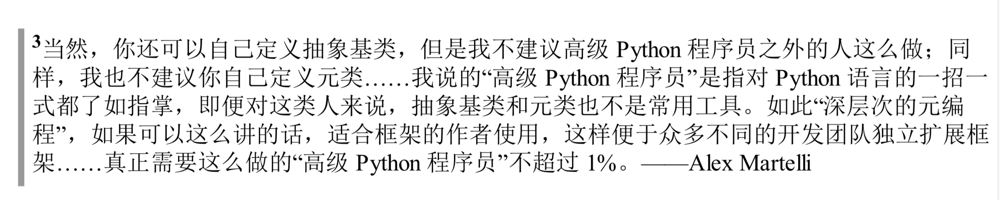

### 2.4.4 给切片赋值
如果赋值的对象是一个切片，那么赋值语句的右侧必须是个可迭代对象。即使只有一个单独的值，也要把它转换成可迭代的序列。
```Python
a = [1, 2, 3, 4]
a[1:3] = [99] # 不能写成 a[1:3] = 99
```

### 2.4 对序列使用+和*

建立由列表组成的列表

```Python
a = [[''] * 3] * 3
a # [['', '', ''], ['', '', ''], ['', '', '']]
a[1][1] = 2
a # [['', 2, ''], ['', 2, ''], ['', 2, '']]
```
错误的原因是外面的列表其实包含3个指向同一个列表的引用，一旦修改其第一行第一列的元素，就立马暴露了列表内3个引用指向同一个对象的事实。
上面的代码错误的本质根下面的代码犯的错误一样：
```Python
row = [''] * 3
res = []
for i in range(3):
    res.append(row)
```
而正确的做法应该是：
```Python
a = [[''] * 3 for i in range(3)]
a[1][1] = 1
a # [['', '', ''], ['', 1, ''], ['', '', '']]
```
相反，上面的方法等同于：
```Python
res = []
for i in range(3):
    temp = [''] * 3
    res.append(temp)
```
别忘了我们还有 `+=` 和 `*=`。随着目标序列可变性的变化，这两个运算符的结果也大相径庭。

### 2.6 序列的增量赋值
```Python
t = (1, 2, [3, 4])
t[2] += [5, 6]
```
到底会发生下面情况的哪一种：
* a. t 变成 (1, 2, [3, 4, 5, 6])
* b. 因为 tuple 不支持对它的元素赋值，所以会抛出 TypeError 异常。
* c. 以上两个都不是。
* d. a 和 b 都是 对的。

答案是 d，其运行的初始状态和最终状态如下：

显然，对内列表进行就地赋值没有问题，但对 tuple 的元素赋值却会引发异常，而后内列表的值已经更改，所以....

由上可推断，使用 t[2].extend([5, 6])不会报错，来验证一下：
```Python
t = (1, 2, [3, 4])
t[2].extend([5, 6])
t # (1, 2, [3, 4, 5, 6])
```
至此，我们应该知晓：
* 尽量不要把可变对象放在元组里。
* 增量赋值不是一个原子操作。上例虽然抛出了异常，但还是完成了操作。

### 2.9 当列表不是首选时
列表实在是太方便了，所以Python程序员可能会过度使用它。 在面对各类需求时，我们可能会有更好的选择，比如，要存放1000万个浮点数的话，数组(array)的效率要高得多；如果需要频繁对序列做先进先出的操作，deque(双端队列)的速度更快；如果包含操作的频率很高，那么使用 set(集合)会更合适，set 专为检查元素是否存在做过优化，虽然它并不是序列。


**数组**
如果我们需要一个只包含数字的列表，那么array.array 比 list 更高效。数组支持所有可变序列有关的操作，包括.pop、.insert 和 .extend。另外，数组还提供从文件读取和存入文件的更快的方法，如 .frombytes 和 .tofile。
Python 数组跟 C 语言数组一样精简。创建数组需要一个表示在底层的 C 语言应该存放怎样的数据类型的类型码，这样在序列很大的时候，能节省很多空间，而且 Python 不允许你在数组里存放除指定类型之外的数据。

**队列**
利用.append() 和.pop 方法，我们可以把列表当做栈和队列来用，但这样效率并不高。
collection.deque 类(双向列队)是一个线程安全、可以快速从两端增删的数据类型。
```Python
from collections import deque

dq = deque(range(5), maxlen=5)
dq.rotate(3)
dq # deque([2, 3, 4, 0, 1])
dq.appendleft(-1)
dq # deque([-1, 2, 3, 4, 0])
dq.extendleft([-3, -2]) # 注意
dq # deque([-2, -3, -1, 2, 3])
```
当试图对一个已满的队列做尾部添加操作时，它头部的元素会被删除掉。
extendleft(iter) 方法会把迭代器里的元素逐个添加倒双向列队的左边，因此迭代器里的元素会逆序出现在队列里。

### 3.9 dict 和 set 的背后
* 为什么 dict 的键和 set 元素的顺序是根据它们被添加的次序而定的，以及为什么在映射对象的生命周期中，这个顺序并不是一成不变的?(注 Python3.6开始(PEP468)dict 一定是 insertion ordered,[延伸阅读](https://stackoverflow.com/questions/50872498/will-ordereddict-become-redundant-in-python-3-7/50872567#50872567) )
* 为什么不应该在迭代循环dict或者set的同时添加元素?

无论何时往字典里添加新的键，Python 解释器都可能做出为字典扩容的决定。因此，如果你在迭代一个字典的过程的同时对字典进行删除、添加操作时就可能会跳过一些键——甚至是跳过那些字典中已经有的键。
因此，如果想要迭代并修改(指更改字典长度的操作)，最好分成两步来进行：首先对其迭代，以得到需要添加或删除的内容，结束后再对原有字典进行更新。

另外，dict 和 set 背后的散列表效率很高，同时其效率是以牺牲空间为代价换来的：
```Python
import sys

sz = sys.getsizeof
sz({i for i in range(100)}) / sz([i for i in range(100)]) # 9.2
sz({i for i in range(100000)}) / sz([i for i in range(100000)]) # 5.1

nt = namedtuple('Container', ['name', 'date', 'foo', 'bar'])
my_nt = nt('name', 'date', 'foo', 'bar')
my_dict = {k:k for k in ['name', 'date', 'foo', 'bar']}
sz(my_dict) / sz(my_nt) # 3
```

## 第五章 一等函数

在 Python 中，函数是一等对象。编程语言理论家把"一等对象"定义为满足下述条件的程序实体：
* 在运行时创建
* 能赋值给变量或数据结构中的元素
* 能作为参数传给函数
* 能作为函数的返回结果

有了一等函数，就可以使用函数式风格编程。其特点之一是使用高阶函数(接受函数为参数，或者把函数作为结果返回的函数是高阶函数。例如 map 函数、sorted 函数))。

巧遇：
```Python
all([]) == all('') == all({}) == True # True: Return True if all elements of the iterable are true (or if the iterable is empty).
any([]) # False: Return True if any element of the iterable is true. If the iterable is empty, return False

all([{}]) # False
```
特别注意上面的 all([]) 为真。

### 5.10.1 operator 模块

在函数式编程中，经常需要把算术运算符当作函数使用。例如，求积运算，我们可以使用 reduce 函数，但这样一般需要一个函数计算序列中两个元素的积。如下：
```Python
from functools import reduce

def fact(n):
    return reduce(lambda a,b: a*b, rang(1, n+1))
```
operator 模块为多个运算符提供了对应的函数，从而避免写 lambda a, b: a*b 这种平凡的匿名函数。使用算数运算符函数，可以把上面改为：
```Python
from operator import mul

def fact(n):
    return reduce(mul, range(1, n+1))
```
当然，operator 中还有一类能替代从序列中取出元素或读取对象属性的 lambda 表达式——itemgetter 和 attrgetter；暂且不表。

最后说一下 operator 模块中的 methodcaller。它的作用与 attrgetter、itemgetter 类似，它会自行创建函数。该函数会在对象上调用参数指定的方法：
```Python
from operator import  methodcaller

s = 'The time has come'
upcase = methodcaller('upper') # callable
upcase(s) # 'THE TIME HAS COME'

hiphenate = methodcaller('replace', ' ', '-')
hiphenate(s) # 'The-time-has-come'
```

### 5.10.2 使用 functools.partial 冻结参数
使用这个函数可以把接受一个或多个参数的函数改编成需要会调的 API：
```Python
from operator import mul
from functools import partial

triple = partial(mul, 3)
triple(7) # 21
```
partial 的第一个参数是一个可调用对象，后面跟着任意个要绑定的定位参数和关键字参数。

[Python: Why is functools.partial necessary?](https://stackoverflow.com/questions/3252228/python-why-is-functools-partial-necessary)


## 第七章 函数装饰器和闭包

nonlocal 是 Python3.0引入的保留关键字，如果想要了解闭包的方方面面，必须知道 nonlocal。

除了在装饰器中有用处之外，闭包还是回调式异步编程和函数式编程风格的基础。本章的最终目标是解释清楚函数装饰器的工作原理，包括最简单的注册装饰器和较复杂的参数化装饰器。但是，在实现这一目标之前，我们要讨论下述话题：

* Python如何计算装饰器句法
* Python如何判断变量是不是局部的 
* 闭包存在的原因和工作原理
* nonlocal能解决什么问题

掌握这些基础知识后，我们可以进一步探讨装饰器：

* 实现行为良好的装饰器
* 标准库中有用的装饰器
* 实现一个参数化装饰器

### 7.5 闭包

其实，闭包指延伸了作用域的函数，其中包含函数定义中引用、但是不在定义体中定义的非全局变量，它能访问定义体之外的非全局变量。

示例，你要计算不断增加的某系列产品价格的均值，你可能会定义这样一个类：

```Python
class Averager:
    def __init__(self):
        self.goods_price = []
    
    def __call__(self, price):
        self.goods_price.append(price)
        total_price = sum(self.goods_price)
        return total_price / len(self.goods_price)

avg = Averager()
avg(10) # 10.0
avg(20) # 15.0
```

使用闭包能用一个函数实现上述需求：

```Python
def make_averager():
    goods_price = []
    
    def averager(price):
        goods_price.append(price)
        total = sum(goods_price)
        return total / len(goods_price)
    return averager
        
avg = make_averager()
avg(20) # 20.0
avg(30) # 25.0
```

这里，goods_price 是make_averager 的局部变量， 调用`make_averager() `返回值，此时它的本地作用域也不在了。但在其返回的`averager`函数中却保留了这个自由变量。

注意，只有镶套在其他函数中的函数才可能需要处理不在全局作用域中的外部变量。


### 7.6 nonlocal 声明

前面的 make_averager 函数的效率不高，更好的实现方式是只存储目前的总值和元素个数。

```Python
def make_averager():
    cnt = 0
    total = 0
    
    def averager(price):
        cnt += 1
        total += price
        return total / cnt
    return averager
        
avg = make_averager()
avg(20) # UnboundLocalError: local variable 'cnt' referenced before assignment
```

问题在于，当 cnt 为不可变类型时，cnt += 1 语句的作用于`cnt = cnt + 1`一样，这会把 cnt 变成局部变量，total 也类似，这样 count 就不是自由变量了，因此也不会保存在闭包中。而前一个例子没报错是因为我们并未给 goods_price 赋值，只是为其 .append，利用了列表是可变对象的这以事实。

而 nonlocal 则会把变量标记为自由变量，即使在函数中为变量赋予新值了，也会变成自由变量，因此闭包中保存的绑定会更新：

```Python
def make_averager():
    cnt = 0
    total = 0
    
    def averager(price):
        nonlocal cnt, total
        cnt += 1
        total += price
        return total / cnt
    return averager
        
avg = make_averager()
avg(20) # 20.0
```


### 7.8 标准库中的装饰器

#### 使用functools.lru_cache(Least Recently Used) 做备忘

生成第 n 个斐波拉契数这种慢速递归函数适合用 lru_cache，如下：

```Python
from functools import lru_cache

@lru_cache() # 注意
def fib(n):
    if n < 2:
        return n
    return fib(n-2) + fib(n-1)
```

结果如下(前者未经 lru_cache)，非常惊人的差距！！：

```Python
In [21]: %time fib(35)
CPU times: user 4.79 s, sys: 32.9 ms, total: 4.82 s
Wall time: 4.91 s
Out[21]: 9227465

In [25]: %time fib(35)
CPU times: user 22 µs, sys: 0 ns, total: 22 µs
Wall time: 26 µs
Out[25]: 9227465
```

需要注意的是，必须像常规函数那样调用 lru_cache, 上面是 `@lru_cache()`，因为 lru_cache  可以接受配置参数:

`lru_cache(maxsize=128, typed=False)`

maxsize 参数指定储存多少个调用结果，缓存满了后会扔掉最旧的结果；typed 若为 True，会把不同参数类型得到的结果分开保存，即将浮点和整数参数(如 1 和 1.0)区分开。另外，该函数使用字典存储结果，而且间根据调用时传入的定位参数和关键字参数创建，所以**被 lru_cache 装饰的函数，它的所有参数必须是可散列的。**

此外，lru_cache 不仅可用于优化递归算法，在 Web 中获取信息的应用中也能发挥巨大的作用。

#### 7.8.2 单分派泛函数

有时，我们对函数需要做扩展，让其使用特别的方式显示某些类型。因为 Python 不支持重载方法或函数，因此一种常见的做法将该函数变成分派函数，使用一串 if/elif/elif，调用专门的函数。这样不便于模块的用户扩展，且显得笨拙：时间一长，该分派函数会变得很大，而且它与各个专门函数之间的耦合也很紧密。

而 `functools.singledispatch`装饰器可以把整体方案拆分成多个模块，甚至可以为你无法修改的类提供专门的函数。使用`@singledispatch` 装饰的普通函数会变成泛函数(generic function)：根据第一个参数的类型，以不同方式执行相同操作的一组函数：

```Python
import numbers
from functools import singledispatch
    
@singledispatch
def my_function(other_type_val):
    print(1)

@my_function.register(str)
def _(str_val):
    print(2)

@my_function.register(numbers.Integral) # 延伸：与 int 的区别
def _(int_val):
    print(3)
my_function([1, 2, 3]) # 1
my_function('a string') # 2
my_function(222) # 3
```

延伸：numbers.Integral与 int 的区别:

```Python
In [37]: type(numbers.Integral)
Out[37]: abc.ABCMeta

In [38]: type(int)
Out[38]: type

In [40]: issubclass(int, numbers.Integral)
Out[40]: True
```

* `@singledispatch` 标记处理 object 类型的基函数。
* 各个专门函数使用`@<base_function>.register(<type>)` 装饰。
* 专门函数名称随意
* 注册的专门的函数尽可能处理抽象基类(如 numbers.Integral 和 abc.MutableSequence) 而不是 int 和 list，这样代码支持的兼容类型更广。

singledispatch 机制的一个显著特征是 支持模块化扩展: 你可以在系统的任何地方和任何模块中注册专门函数。如果后来在新函数的模块中定义了新的类型，可以轻松地添加一个新的函数来处理那个类型，此外还可以为不是自己编写的或不能修改的类添加自定义函数。


## 第八章 对象引用、可变性和垃圾回收

### 8.4.2 防御可变参数

如果定义的函数接受可变参数，应该谨慎考虑调用方是否期望修改传入的参数。

```Python
class Bus:
    """让乘客销声匿迹的校车"""
    def __init__(self, passengers=None):
        if passengers is None:
            self.passengers = []
        else:
            self.passengers = passengers
    
    def pick(self, name):
        self.passengers.append(name)
    
    def drop(self, name):
        self.passengers.remove(name)
```

```Python
team = ['Sue', 'Tina', 'Maya']
bus = Bus(team)
bus.drop('Tina')
team # ['Sue', 'Maya']
```

看似没问题的一个类，可当 Tina 下车后，该乘客却消失了！ 究其原因是校车为传给构造方法的列表创建了别名。正确的做法是，校车自己维护乘客列表(如`self.passengers = list(passengers)`)

除非这个方法确实想修改通过参数传入的对象，否则在类中直接把参数赋值给实例变量之前一定要三思，因为这样会为参数对象创建别名。

###  第十一章 接口：从协议到抽象基类



日常使用中，我们与抽象基类的联系应该是创建现有抽象基类的子类，或者使用现有抽象基类注册。此外，可能还会在 isinstance 检查中使用抽象基类。

抽象方法用`@abstractmethod`装饰器标记，而且定义体中通常只有文档字符串。不过，抽象方法也可以有代码实现，即便实现了，子类也必须覆盖抽象方法，但是在子类中可以使用 super()函数调用抽象方法，为它添加功能，而不是从头开始实现。

另外，Python 是一门强类型、动态类型的语言:

```Python
# 强类型
'1' + 2 # TypeError: can only concatenate str (not "int") to str

# 动态类型
a = 1
type(a) # int
a = 's'
type(a) # str
```

### 第12章 继承的优缺点

#### 12.1 子类化内置类型很麻烦

内置类型(使用 C 语言编写)不会调用用户定义的类覆盖的特殊方法。例如，dict 的子类覆盖的`__getitem__()`方法不会被内置类型 `get()`方法调用。

示例：内置类型 dict 的`__init__` 和 `__update__`方法会忽略我们覆盖的`__setitem__`方法

```Python
class DoppelDict(dict):
    def __setitem__(self, key, value):
        super().__setitem__(key, [value] * 2)

dd = DoppelDict(one=1)
dd # {'one': 1}
dd['two'] = 2
dd # {'one': 1, 'two': [2, 2]}
dd.update(three=3)
dd # {'one': 1, 'two': [2, 2], 'three': 3}
```

不只实例内部的调用有这个问题(self.get()不能调用 `self.__getitem__()`)，内置类型的方法调用的其他类的方法，如果被覆盖了，也不会被调用：

```Python
class AnswerDict(dict):
    def __getitem__(self, key):
        return 42

ad = AnswerDict(a='foo')
ad # {'a': 42}

d = {}
d.update(ad)
d # {'a': 'foo'}
```

* 上例中，不管传入什么键，`AnswerDict.__getitem__()`方法始终返回42。
* d 是 dict 的实例，使用 ad 中的值更新 d。
* dict.update 方法忽略了`AnswerDict.__getitem__`方法。

直接子类化内置内型（如 dict、list 或 str）容易出错，因为内置类型的方法通常会忽略用户覆盖的方法。不要子类化内置类型，用户自定的类应该继承 collections 模块。例如 [`UserDict`](https://docs.python.org/3/library/collections.html#collections.UserDict)、[`UserList`](https://docs.python.org/3/library/collections.html#collections.UserList)、[`UserString`](https://docs.python.org/3/library/collections.html#collections.UserString)等。如果将上例继承自 UserDict 则bu'h不会存在上面诡异的现象。


### 第十五章 上下文管理器和 else 块

Python 用户往往会忽略或没有充分使用 for、while 和 try 语句的 else 子句。

**for**

​	仅当 for 循环运行完毕时(即 for 循环没有被 break 语句中止)才运行 else 块。

**while**

​	仅当 while 循环因为条件为假值而退出时(即 while 循环没有被 break 语句中止) 才运行 else 块。

**try**

​	仅当 try 块中没有异常抛出时才运行 else 块。

在所有情况下，如果异常或者 return、break 或 continue 语句导致控制权跳到了复合语句的主块之外，else 子句也会被跳过。

> 我觉得除了 if 语句之外，其他语句选择使用 else关键字是个错误。else 蕴含着“排他性”这层意思，在上例中却说不通，因此，使用 then 关键字更好，可是，添加新关键字属于语言的重大变化，而 Guido 唯恐避之不及。

在循环中使用 else 子句 的方式如下代码片段所示：

```Python
for item in my_list:
    if item.flavor == 'banana':
        break
else:
    raise ValueError('No banana flavor found!')
```

可能，你觉得没有必要在 try/except 块中使用 else 子句：

```Python
try:
    dangerous_call()
    after_call()
except OSError:
    log('OSError!...')
```

然而，after_call() 不应该放在 try 块中，为了清晰和准确，try 块中应该只抛出预期异常的语句。因此，像下面这样写更好：

```Python
try:
    dangerous_call()
except OSError:
    log('OSError!...')
else:
    after_call()
```

现在很明确，try 防守的是 dangerous_call() 可能出现的错误，而不是 after_call()。而且很明显，只有 try 块不抛出异常，才会执行 agfter_call()。

### 第十六章 协程

第七章讨论闭包时，我们使用闭包 + nonlocal 的方式计算平均价格，若使用协程，则 total 和 cnt 声明为局部变量即可，无需使用实例属性或闭包在多次调用之间保持上下文。

```Python
def averager():
    total, cnt, average = 0, 0, None
    while True:
        term = yield average
        total += term
        cnt += 1
        average = total / cnt
```

```Python
In [42]: coro_avg = averager()

In [43]: next(coro_avg) # 预激协程

In [44]: coro_avg.send(10)
Out[44]: 10.0

In [45]: coro_avg.send(20)
Out[45]: 15.0
```

**终止协程和异常处理**

客户代码可以在生成器对象上调用 throw 和 close 方法显示地把异常发给协程。

```Python
class DemoException(Exception):
    """pass"""

def demo_exc_handling():
    print("--> coroutine started")
    while True:
        try:
            x = yield
        except DemoException:
            print("DemoException handled.")
        else:
            print(f"-->coroutine received {x}")
    raise RuntimeError("This should never happen")
```

```Python
In [47]: exc_coro = demo_exc_handling()

In [48]: next(exc_coro)
--> coroutine started

In [49]: exc_coro.send(10)
-->coroutine received 10

In [50]: exc_coro.send(20)
-->coroutine received 20

In [51]: exc_coro.close()

In [52]: from inspect import  getgeneratorstate

In [53]: getgeneratorstate(exc_coro)
Out[53]: 'GEN_CLOSED'
```

如果把 DemoException 异常传入 demo_exc_handling 协程，它会处理，然后继续运行：
```Python
In [54]: exc_coro = demo_exc_handling()

In [55]: next(exc_coro)
--> coroutine started

In [56]: exc_coro.send(10)
-->coroutine received 10

In [57]: exc_coro.throw(DemoException)
DemoException handled.

In [58]: getgeneratorstate(exc_coro)
Out[58]: 'GEN_SUSPENDED'
```

但是，如果传入协程的异常没有处理，协程会停止，即状态变成'GEN_CLOSED':

```Python
In [59]: exc_coro = demo_exc_handling()

In [60]: next(exc_coro)
--> coroutine started

In [61]: exc_coro.send(10)
-->coroutine received 10

In [62]: exc_coro.throw(ZeroDivisionError)
-----------------------------------------------------------------
ZeroDivisionError
......


In [63]: getgeneratorstate(exc_coro)
Out[63]: 'GEN_CLOSED'
```

