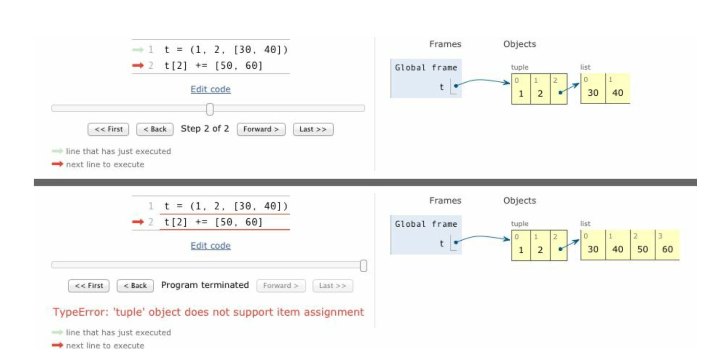

### 2.4.4 给切片赋值
如果赋值的对象是一个切片，那么赋值语句的右侧必须是个可迭代对象。即使只有一个单独的值，也要把它转换成可迭代的序列。
```Python
a = [1, 2, 3, 4]
a[1:3] = [99] # 不能写成 a[1:3] = 99
```

### 2.4 对序列使用+和*

建立由列表组成的列表

```Python
a = [[''] * 3] * 3
a # [['', '', ''], ['', '', ''], ['', '', '']]
a[1][1] = 2
a # [['', 2, ''], ['', 2, ''], ['', 2, '']]
```
错误的原因是外面的列表其实包含3个指向同一个列表的引用，一旦修改其第一行第一列的元素，就立马暴露了列表内3个引用指向同一个对象的事实。
上面的代码错误的本质根下面的代码犯的错误一样：
```Python
row = [''] * 3
res = []
for i in range(3):
    res.append(row)
```
而正确的做法应该是：
```Python
a = [[''] * 3 for i in range(3)]
a[1][1] = 1
a # [['', '', ''], ['', 1, ''], ['', '', '']]
```
相反，上面的方法等同于：
```Python
res = []
for i in range(3):
    temp = [''] * 3
    res.append(temp)
```
别忘了我们还有 `+=` 和 `*=`。随着目标序列可变性的变化，这两个运算符的结果也大相径庭。

### 2.6 序列的增量赋值
```Python
t = (1, 2, [3, 4])
t[2] += [5, 6]
```
到底会发生下面情况的哪一种：
* a. t 变成 (1, 2, [3, 4, 5, 6])
* b. 因为 tuple 不支持对它的元素赋值，所以会抛出 TypeError 异常。
* c. 以上两个都不是。
* d. a 和 b 都是 对的。

答案是 d，其运行的初始状态和最终状态如下：

显然，对内列表进行就地赋值没有问题，但对 tuple 的元素赋值却会引发异常，而后内列表的值已经更改，所以....

由上可推断，使用 t[2].extend([5, 6])不会报错，来验证一下：
```Python
t = (1, 2, [3, 4])
t[2].extend([5, 6])
t # (1, 2, [3, 4, 5, 6])
```
至此，我们应该知晓：
* 尽量不要把可变对象放在元组里。
* 增量赋值不是一个原子操作。上例虽然抛出了异常，但还是完成了操作。

### 2.9 当列表不是首选时
列表实在是太方便了，所以Python程序员可能会过度使用它。 在面对各类需求时，我们可能会有更好的选择，比如，要存放1000万个浮点数的话，数组(array)的效率要高得多；如果需要频繁对序列做先进先出的操作，deque(双端队列)的速度更快；如果包含操作的频率很高，那么使用 set(集合)会更合适，set 专为检查元素是否存在做过优化，虽然它并不是序列。


**数组**
如果我们需要一个只包含数字的列表，那么array.array 比 list 更高效。数组支持所有可变序列有关的操作，包括.pop、.insert 和 .extend。另外，数组还提供从文件读取和存入文件的更快的方法，如 .frombytes 和 .tofile。
Python 数组跟 C 语言数组一样精简。创建数组需要一个表示在底层的 C 语言应该存放怎样的数据类型的类型码，这样在序列很大的时候，能节省很多空间，而且 Python 不允许你在数组里存放除指定类型之外的数据。

**队列**
利用.append() 和.pop 方法，我们可以把列表当做栈和队列来用，但这样效率并不高。
collection.deque 类(双向列队)是一个线程安全、可以快速从两端增删的数据类型。
```Python
from collections import deque

dq = deque(range(5), maxlen=5)
dq.rotate(3)
dq # deque([2, 3, 4, 0, 1])
dq.appendleft(-1)
dq # deque([-1, 2, 3, 4, 0])
dq.extendleft([-3, -2]) # 注意
dq # deque([-2, -3, -1, 2, 3])
```
当试图对一个已满的队列做尾部添加操作时，它头部的元素会被删除掉。
extendleft(iter) 方法会把迭代器里的元素逐个添加倒双向列队的左边，因此迭代器里的元素会逆序出现在队列里。

### 3.9 dict 和 set 的背后
* 为什么 dict 的键和 set 元素的顺序是根据它们被添加的次序而定的，以及为什么在映射对象的生命周期中，这个顺序并不是一成不变的?(注 Python3.6开始(PEP468)dict 一定是 insertion ordered,[延伸阅读](https://stackoverflow.com/questions/50872498/will-ordereddict-become-redundant-in-python-3-7/50872567#50872567) )
* 为什么不应该在迭代循环dict或者set的同时添加元素?

无论何时往字典里添加新的键，Python 解释器都可能做出为字典扩容的决定。因此，如果你在迭代一个字典的过程的同时对字典进行删除、添加操作时就可能会跳过一些键——甚至是跳过那些字典中已经有的键。
因此，如果想要迭代并修改(指更改字典长度的操作)，最好分成两步来进行：首先对其迭代，以得到需要添加或删除的内容，结束后再对原有字典进行更新。

另外，dict 和 set 背后的散列表效率很高，同时其效率是以牺牲空间为代价换来的：
```Python
import sys

sz = sys.getsizeof
sz({i for i in range(100)}) / sz([i for i in range(100)]) # 9.2
sz({i for i in range(100000)}) / sz([i for i in range(100000)]) # 5.1

nt = namedtuple('Container', ['name', 'date', 'foo', 'bar'])
my_nt = nt('name', 'date', 'foo', 'bar')
my_dict = {k:k for k in ['name', 'date', 'foo', 'bar']}
sz(my_dict) / sz(my_nt) # 3
```

## 第五章 一等函数

在 Python 中，函数是一等对象。编程语言理论家把"一等对象"定义为满足下述条件的程序实体：
* 在运行时创建
* 能赋值给变量或数据结构中的元素
* 能作为参数传给函数
* 能作为函数的返回结果

有了一等函数，就可以使用函数式风格编程。其特点之一是使用高阶函数(接受函数为参数，或者把函数作为结果返回的函数是高阶函数。例如 map 函数、sorted 函数))。

巧遇：
```Python
all([]) == all('') == all({}) == True # True: Return True if all elements of the iterable are true (or if the iterable is empty).
any([]) # False: Return True if any element of the iterable is true. If the iterable is empty, return False

all([{}]) # False
```
特别注意上面的 all([]) 为真。

### 5.10.1 operator 模块

在函数式编程中，经常需要把算术运算符当作函数使用。例如，求积运算，我们可以使用 reduce 函数，但这样一般需要一个函数计算序列中两个元素的积。如下：
```Python
from functools import reduce

def fact(n):
    return reduce(lambda a,b: a*b, rang(1, n+1))
```
operator 模块为多个运算符提供了对应的函数，从而避免写 lambda a, b: a*b 这种平凡的匿名函数。使用算数运算符函数，可以把上面改为：
```Python
from operator import mul

def fact(n):
    return reduce(mul, range(1, n+1))
```
当然，operator 中还有一类能替代从序列中取出元素或读取对象属性的 lambda 表达式——itemgetter 和 attrgetter；暂且不表。

最后说一下 operator 模块中的 methodcaller。它的作用与 attrgetter、itemgetter 类似，它会自行创建函数。该函数会在对象上调用参数指定的方法：
```Python
from operator import  methodcaller

s = 'The time has come'
upcase = methodcaller('upper') # callable
upcase(s) # 'THE TIME HAS COME'

hiphenate = methodcaller('replace', ' ', '-')
hiphenate(s) # 'The-time-has-come'
```

### 5.10.2 使用 functools.partial 冻结参数
使用这个函数可以把接受一个或多个参数的函数改编成需要会调的 API：
```Python
from operator import mul
from functools import partial

triple = partial(mul, 3)
triple(7) # 21
```
partial 的第一个参数是一个可调用对象，后面跟着任意个要绑定的定位参数和关键字参数。

[Python: Why is functools.partial necessary?](https://stackoverflow.com/questions/3252228/python-why-is-functools-partial-necessary)


## 第七章 函数装饰器和闭包

nonlocal 是 Python3.0引入的保留关键字，如果想要了解闭包的方方面面，必须知道 nonlocal。

除了在装饰器中有用处之外，闭包还是回调式异步编程和函数式编程风格的基础。本章的最终目标是解释清楚函数装饰器的工作原理，包括最简单的注册装饰器和较复杂的参数化装饰器。但是，在实现这一目标之前，我们要讨论下述话题：

* Python如何计算装饰器句法
* Python如何判断变量是不是局部的 
* 闭包存在的原因和工作原理
* nonlocal能解决什么问题

掌握这些基础知识后，我们可以进一步探讨装饰器：

* 实现行为良好的装饰器
* 标准库中有用的装饰器
* 实现一个参数化装饰器

