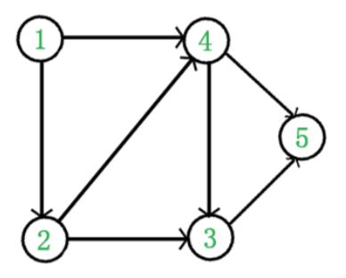
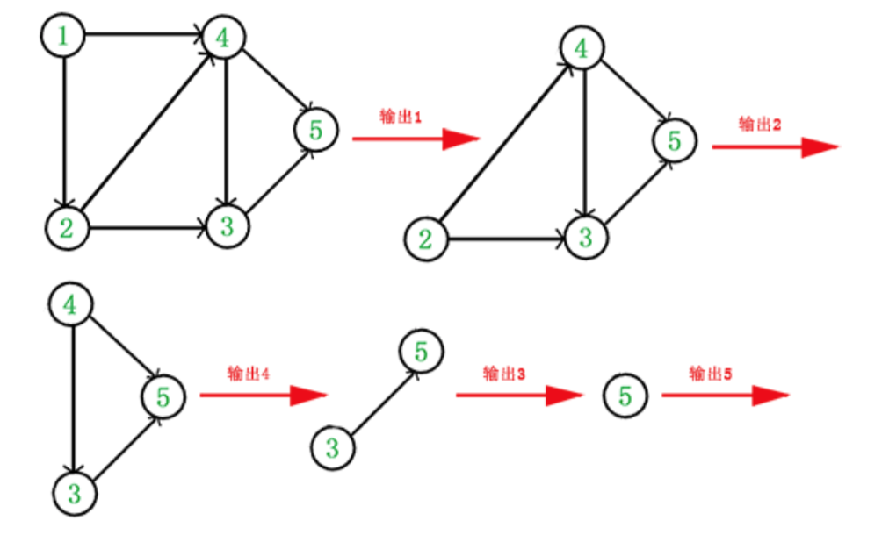

## 一: 拓扑排序

`拓扑排序(Topological Sorting)` 是一个 `有向无环图(DAG,Directed Acyclic Graph) `的所有顶点的线性序列。且该序列必须满足下面两个条件:

* 每个顶点出现且只出现一次。
* 若存在一条从顶点A到顶点B的路径，那么在序列中顶点A出现在顶点B 的前面。

例如:



​		
那么如何写出它的拓扑顺序呢?这里说一种比较常用的 方法:

* 从DAG途中选择一个没有前驱(即入度为0)的顶点并输出

* 从图中删除该顶点和所有以它为起点的有向边。

* 重复1和2直到当前DAG图为空或当前途中不存在无前驱的顶点为止。 后一种情况说明有向图中必然存在环。

  

于是，得到拓扑排序后的结果是{1,2,4,3,5}

## 二: Python 多重继承

```python
class A(object):
    def foo(self):
        print('A foo')

    def bar(self):
        print('A bar')


class B(object):
    def foo(self):
        print('B foo')

    def bar(self):
        print('B bar')


class C1(A, B):
    pass


class C2(A, B):
    def bar(self):
        print('C2-bar')


class D(C1, C2):
    pass


print(D.__mro__)
d = D()
d.foo() # A foo
```

解决如下：

* 找到入度为0的点，只有一个D，把D拿出来，把D相关的边剪掉
* 现在有两个入度为0的点(C1,C2)，取最左原则，拿C1，剪掉C1相关的 边，这时候的排序是{D,C1}
* 现在我们看，入度为0的点(C2),拿C2,剪掉C2相关的边，这时候排序是 {D,C1,C2}
* 接着看，入度为0的点(A,B),取最左原则，拿A，剪掉A相关的边，这时 候的排序是{D,C1,C2,A}
* 继续，入度哦为0的点只有B，拿B，剪掉B相关的边，最后只剩下object
* 所以最后的排序是{D,C1,C2,A,B,object}

发现`print(D.__mro__)`的结果也正是这样，而这也就是多重继承所使用的C3算法。


再来一个：

```python

class A(object):
    def foo(self):
        print('A foo')

    def bar(self):
        print('A bar')


class B(object):
    def foo(self):
        print('B foo')
    def bar(self):
        print('B bar')


class C1(A):
    pass


class C2(B):
    def bar(self):
        print('C2-bar')


class D(C1, C2):
    pass


print(D.__mro__)# (<class '__main__.D'>, <class '__main__.C1'>, <class '__main__.A'>, <class '__main__.C2'>, <class '__main__.B'>, <class 'object'>)
d = D()
d.foo() # A foo
d.bar() # A bar
```

