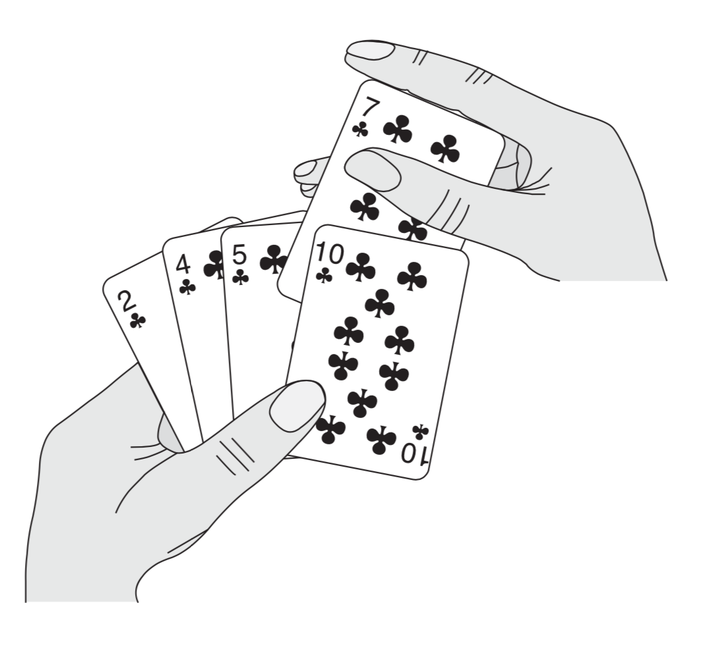

# 第一部分 基础知识
这一部分将引导读者开始思考算法的设计和分析问题，简单介绍算法的表达方法、了解本书中用到的一些设计策略以及算法分析中用到的许多基本思想。
第1章是对算法及其在现代计算系统中地位的一个综述。本章给出了算法的定义和一些算法的例子。此外，本章还说明了算法是一项技术，就像快速的硬件、图形用户界面、面向对象系统和网络一样。

在第2章中，我们给出了书中的第一批算法，它们解决的是对n个数进行排序的问题。这些算法是用一种伪代码形式给出的，这种伪代码尽管不能直接翻译为任何常规的程序设计语言，但是足够清晰地表达了算法的结构，以便任何一位能力比较强的程序员都能用自己选择的语言将算法实现出来。我们分析的排序算法是插入排序，它采用了一种增量式的做法；另外还分析了归并排序，它采用了一种递归技术，称为“分治法”。尽管这两种算法所需的运行时间都随n的值而增长，但增长的速度是不同的。我们在第2章分析了这两种算法的运行时间，并给出了一种有用的表示方法来表达这些运行时间。

第3章给出了这种表示法的准确定义，称为渐近表示。在第3章的一开始，首先定义几种渐近符号，它们主要用于表示算法运行时间的上界和下界。第3章余下的部分主要给出了一些数学表示方法。这一部分的作用更多的是为了确保读者所用的记号能与本书的记号体系相匹配，而不是教授新的数学概念。

第4章更深入地讨论了第2章引入的分治法，给出了更多分治法的例子，包括用于两方阵相乘的Strassen方法。第4章包含了求解递归式的方法。递归式用于描述递归算法的运行时间。“主方法”是一种功能很强的技术，通常用于解决分治算法中出现的递归式。虽然第4章中的相当一部分内容都是在证明主方法的正确性，但是如果跳过这一部分证明内容，也没有什么太大的影响。

第5章介绍概率分析和随机化算法。概率分析一般用于确定一些算法的运行时间，在这些算法中，由于同一规模的不同输入可能有着内在的概率分布，因而在这些不同输入之下，算法的运行时间可能有所不同。在有些情况下，我们假定算法的输入服从某种已知的概率分布，于是，算法的运行时间就是在所有可能的输入之下，运行时间的平均值。在其他情况下，概率分布不是来自于输入，而是来自于算法执行过程中所做出的随机选择。如果一个算法的行为不仅由其输入决定，还要由一个随机数生成器生成的值来决定，那么它就是一个随机化算法。我们可以利用随机化算法强行使算法的输入服从某种概率分布，从而确保不会有某一输入会始终导致算法的性能变坏；或者，对于那些允许产生不正确结果的算法，甚至能够将其错误率限制在某个范围之内。


## 第1章　算法在计算中的作用
简单来说，`算法(algorithm)`就是定义良好的计算过程，它取一个或一组值作为`输入`，并产生出一个或一组值作为输出。亦即，算法就是一系列的计算步骤，用来将输入数据转换成输出结果。

`数据结构(data structure)`指计算机中存储、组织数据的一种方式。


## 第2章　算法入门

### 2.1 插入排序
这是一个对少量元素进行排序的有效算法。插入排序的工作机理与很多人打扑克牌时整理手中的牌做法类似。在开始摸牌时，我们左手为空，接着，右手摸起第一张牌并将其插入到左手一把牌中的正确的位置。为了找到这张牌的正确位置，需要将它与左手的每一张牌比较(从右往左，或者说从大到小)，无论何时，左手上的牌都是排好序的。



```python
def insortion_sort(A):
    for i in range(1, len(A)):
        while i > 0 and A[i - 1] > A[i]:
            A[i - 1], A[i] = A[i], A[i - 1]
            i -= 1
```
