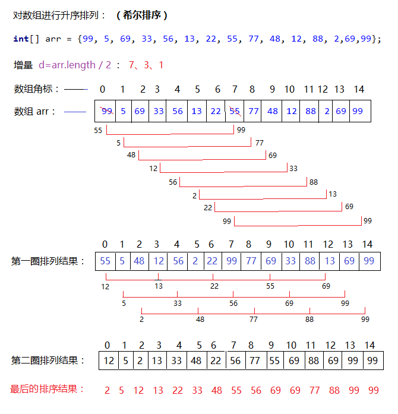
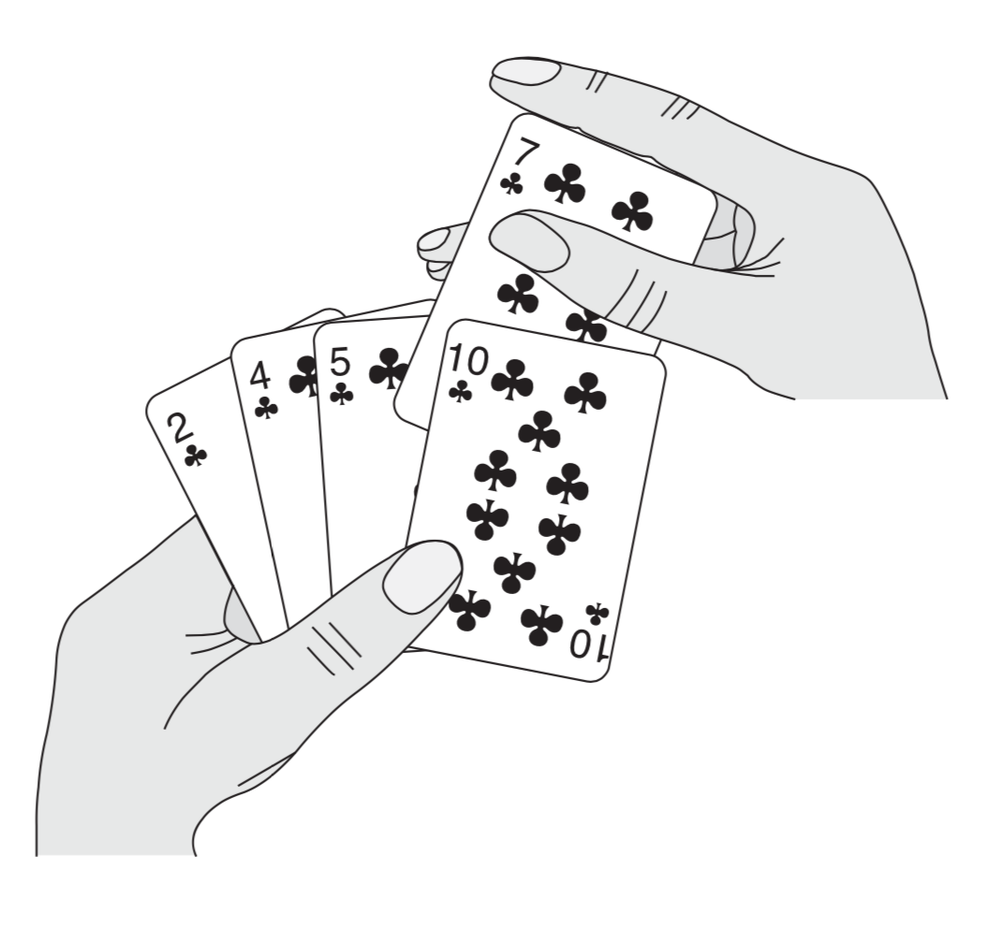

# 第一部分 基础知识
这一部分将引导读者开始思考算法的设计和分析问题，简单介绍算法的表达方法、了解本书中用到的一些设计策略以及算法分析中用到的许多基本思想。
第1章是对算法及其在现代计算系统中地位的一个综述。本章给出了算法的定义和一些算法的例子。此外，本章还说明了算法是一项技术，就像快速的硬件、图形用户界面、面向对象系统和网络一样。

在第2章中，我们给出了书中的第一批算法，它们解决的是对n个数进行排序的问题。这些算法是用一种伪代码形式给出的，这种伪代码尽管不能直接翻译为任何常规的程序设计语言，但是足够清晰地表达了算法的结构，以便任何一位能力比较强的程序员都能用自己选择的语言将算法实现出来。我们分析的排序算法是插入排序，它采用了一种增量式的做法；另外还分析了归并排序，它采用了一种递归技术，称为“分治法”。尽管这两种算法所需的运行时间都随n的值而增长，但增长的速度是不同的。我们在第2章分析了这两种算法的运行时间，并给出了一种有用的表示方法来表达这些运行时间。

第3章给出了这种表示法的准确定义，称为渐近表示。在第3章的一开始，首先定义几种渐近符号，它们主要用于表示算法运行时间的上界和下界。第3章余下的部分主要给出了一些数学表示方法。这一部分的作用更多的是为了确保读者所用的记号能与本书的记号体系相匹配，而不是教授新的数学概念。

第4章更深入地讨论了第2章引入的分治法，给出了更多分治法的例子，包括用于两方阵相乘的Strassen方法。第4章包含了求解递归式的方法。递归式用于描述递归算法的运行时间。“主方法”是一种功能很强的技术，通常用于解决分治算法中出现的递归式。虽然第4章中的相当一部分内容都是在证明主方法的正确性，但是如果跳过这一部分证明内容，也没有什么太大的影响。

第5章介绍概率分析和随机化算法。概率分析一般用于确定一些算法的运行时间，在这些算法中，由于同一规模的不同输入可能有着内在的概率分布，因而在这些不同输入之下，算法的运行时间可能有所不同。在有些情况下，我们假定算法的输入服从某种已知的概率分布，于是，算法的运行时间就是在所有可能的输入之下，运行时间的平均值。在其他情况下，概率分布不是来自于输入，而是来自于算法执行过程中所做出的随机选择。如果一个算法的行为不仅由其输入决定，还要由一个随机数生成器生成的值来决定，那么它就是一个随机化算法。我们可以利用随机化算法强行使算法的输入服从某种概率分布，从而确保不会有某一输入会始终导致算法的性能变坏；或者，对于那些允许产生不正确结果的算法，甚至能够将其错误率限制在某个范围之内。


## 第1章　算法在计算中的作用
简单来说，`算法(algorithm)`就是定义良好的计算过程，它取一个或一组值作为`输入`，并产生出一个或一组值作为输出。亦即，算法就是一系列的计算步骤，用来将输入数据转换成输出结果。

`数据结构(data structure)`指计算机中存储、组织数据的一种方式。


## 排序补充

### 冒泡排序
冒泡排序算法的运作如下:
- 比较相邻的元素。如果第一个比第二个大（升序），就交换他们两个。
- 对每一对相邻元素作同样的工作，从开始第一对到结尾的最后一对。这步做完后，最后的那个元素会是最大的数。
- 针对所有的元素重复以上的步骤，除了最后一个。
- 持续每次对越来越少的元素重复上面的步骤，直到没有任何一对数字需要比较。

```python
def bubble_sort(array):
    for i in range(0, len(array) - 1):
        for j in range(0, len(array) - 1 - i):
            if array[j] > array[j + 1]:
                array[j], array[j + 1] = array[j + 1], array[j]
```


```python
def bubble_sort_2(array):
    for i in range(0, len(array) - 1):
        is_change = False
        for j in range(0, len(array) - 1 - i):
            if array[j] > array[j + 1]:
                array[j], array[j + 1] = array[j + 1], array[j]
                is_change = True
        if not is_change:
            return
```

- 最优时间复杂度：O(n) （表示遍历一次发现没有任何可以交换的元素，排序结束。bubble_sort_2）
- 最坏时间复杂度：O(n**2)
- 平均时间复杂度：O(n**2)
- 稳定性：稳定
- 辅助存储O(1): 即为原址排序(不需要借助辅助空间)


### 选择排序
选择排序算法的运作如下:
- 首先在未排序序列中找到最小元素，存放到排序序列的起始位置
- 再从剩余未排序元素中继续寻找最小元素， 然后放到已排序序列的末尾。
- 以此类推，直到所有元素均排序完毕。

```python
def select_sort(array):
    for i in range(0, len(array) - 1):
        min_index = i
        for j in range(i+1, len(array) - 1):
            if array[min_index] > array[j]:
                min_index = j
        array[i], array[min_index] = array[min_index], array[i]
```

- 最优时间复杂度：O(n**2)
- 最坏时间复杂度：O(n**2)
- 稳定性：不稳定（比如[4, 4, 3]）


### 希尔排序
希尔排序是优化过后的插入排序

希尔排序算法的运作如下:
- 对要排序的列表根据一定间隔（初始间隔一般设为列表长度的一半）进行分组
- 对各列表之间相同位置（下标）的元素进行插入排序
- 间隔减半，再次分组并对各列表之间相同位置（下标）的元素进行插入排序
- 如此循环，最终间隔为1，即为正常的插入排序

```python
def shell_sort(array):
    gap = len(array) // 2
    while gap > 0:
        for i in range(gap, len(array)):
            j = i
            # 下面while块即为插入排序
            while j >= gap and array[j - gap] > array[j]:
                array[j - gap], array[j] = array[j], array[j - gap]
                j -= gap
        gap //= 2
```

- 平均时间复杂度：O(nlgn)
- 最坏时间复杂度：O(n**2)
- 稳定性：不稳定




## 第2章　算法入门

### 2.1 插入排序(Insertion Sort)
这是一个对少量元素进行排序的有效算法。插入排序的工作机理与很多人打扑克牌时整理手中的牌做法类似。在开始摸牌时，我们左手为空，接着，右手摸起第一张牌并将其插入到左手一把牌中的正确的位置。为了找到这张牌的正确位置，需要将它与左手的每一张牌比较(从右往左，或者说从大到小)，无论何时，左手上的牌都是排好序的。



```Python
def insertion_sort(A):
    for i in range(1, len(A)):
        while i >= 1 and A[i - 1] > A[i]:
            A[i - 1], A[i] = A[i], A[i - 1]
            i -= 1
```
### 2.2 算法分析
算法分析指对一个算法所需要的资源进行预测。内存、通信带宽或计算机硬件等资源偶尔会是我们关心的，但通常，资源指我们希望测度的计算时间。

**插入排序算法的分析**
一般来说，算法所需时间是与输入规模同步增长的，因而通常将一个程序的运行时间表示为其输入的函数。
增长的量级:
为了简化分析，我们忽略每条语句的真实代价，而用常量来表示，另外，我们只考虑公式中的最高次项(也忽略其常数系数)，因为当 n 很大时，低阶项相对来说可以忽略。这样的话，插入排序的最坏情况时间代价是 O(n^2)

- 最优时间复杂度：O(n) （升序排列，序列已经处于升序状态）
- 最坏时间复杂度：O(n2)
- 稳定性：稳定

### 2.3算法设计
算法设计有很多种。插入排序使用的是`增量(incremental)`方法:在排好子数组后，将新元素插入，以形成新的排好序的数组。

**分治法**
有有多算法在结构上是递归的：为了解决一个给定的问题，算法要一次或多次地递归调用其自身来解决相关的子问题。这些算法通常采用`分治策略`：将原问题划分成 n 个规模较小而结构与原问题相似的子问题；递归地解决这些子问题，然后再合并其结果得到原问题的解。
分治模式在每一层递归上都有三个步骤：

* `分解(Divide)`：将原问题分解成一系列子问题

* `解决(Conquer)`：递归地解决各个子问题。若子问题足够小，则直接求解

* `合并(Combine)`：将子问题的结果合并成原问题的解。

递归的形象比喻：

  看到过查字典的比喻挺好的。假如你有一句话(比如'你好')不认识，这时你需要用词典查单词比如先查'你'，翻到这个单词时，看解释，发现解释中有一个单词不认识，所以，无法明白这个要查的单词是什么意思；这时，再用这本词典（函数本身）查那个不认识的单词，又发现查的第2个单词的解释中又有一个单词不认识，那么，又再用这本词典查第3个不认识的单词，这样，一个一个查下去，直到解释中所有单词都认识，这样就到底了，然后一层一层倒回来，就知道"你"是什么意思了，然后再查"好"是什么意思，这样，问题就解决了。


### 2.3 归并排序(Merge Sort)
`归并排序(merge sort)`算法完全依照了上述模式，直观地操作如下:

* 分解：将 n 个元素分成各含 n/2 个元素的子序列
* 解决：用合并排序算法对两个子序列递归地排序
* 合并：合并两个已排序的子序列以得到排序结果

```Python
def merge(left, right):
    result = [] # 消耗额外的空间
    while left and right:
        if left[0] <= right[0]:
            result.append(left.pop(0))
        else:
            result.append(right.pop(0))
    result += left # 将left余下的大元素添上，此时left和right最多仅有一个不为空
    result += right
    return result


def merge_sort(A):
    if len(A) <= 1:
        return A
    mid = len(A) // 2
    # divide until len(A) <= 1:
    left = merge_sort(A[: mid])
    right = merge_sort(A[mid: ])
    # conquer sub-problem recursively
    return merge(left, right)
```


**归并排序算法的分析**
显然，在`分解(merge_sort 函数)`部分，其复杂度为 O(lg(n)),  每一个 sub-problem 的`解决、合并(merge 函数)`部分，其复杂度为 O(n)， 因此，归并排序算法总的复杂度为 O(nlg(n))。

- 最优时间复杂度：O(nlogn)
- 最坏时间复杂度：O(nlogn)
- 稳定性：稳定


## 第4章
### 使用分治策略求解最大子数组
比如你获得了一个投资某个股票的机会，并且已经准确知道了将来几天这一只股票的相对于前一天的差值，比如为[-2, 1, -3, 4, -1, 2, 1, -5, 4]，那么就有一个问题，从哪一天买入，哪一天卖出获益最大？

分治法求解最大字数组的思想是把每一个数组一分为二，每次考虑最大子数组所在的三种可能情况：跨中点[i,j]其中`i<=mid<j`，完全位于中点左侧[low,mid]，完全位于中点右侧[mid+1,high]。(对于跨中点的情况，其中包括左半部分最后一个元素的情形，需要挨个往前遍历，更新最大值。包含右半部分的第一个元素的情况类似。) 我们可以递归地求解 A[low,mid]和 A[mid+1,high]的最大子数组，因为这两个子问题仍然是最大子数组问题，只是规模更小而已。因此，剩下的全部工作就是寻找跨越终点的最大子数组，然后在这三种情况中选取最大者。
对于跨中点的情况，我们只需要找出形如[i,mid]和[mid+1,j]的最大子数组，然后将其合并即可。


```Python
def find_max_crossing_subarray(A, low, mid, high):
    '''对于跨中点的最大子数组， 返回一个下标元组划定跨中点的最大子数组的边界，并返回最大子数组的和'''
    left_max_sum = A[mid] # line 1
    left_sum = A[mid]
    max_left_index = mid
    for i in range(mid - 1, low - 1, -1): # line 4
        left_sum += A[i]
        if left_sum > left_max_sum: # line 6
            left_max_sum = left_sum
            max_left_index = i # line 8

    right_max_sum = 0
    right_sum = 0
    max_right_index = mid
    for j in range(mid + 1, high + 1):
        right_sum += A[j]
        if right_sum > right_max_sum:
            right_max_sum = right_sum
            max_right_index = j

    return max_left_index, max_right_index, left_max_sum + right_max_sum
```
该函数1~8行求出数组A的左半部分的最大子数组(因为该最大子数组必须包含 A[mid]), 4~6行的 `for` 循环所考察的是每个子数组都具有 A[i,mid]的形式。
有了这个线性时间的find_max_crossing_subarray函数在手，便可以设计使用分治策略求解最大子数组的问题了:

```Python
def find_max_subarray(A, low, high):
    if high == low:
        return (low, high, A[low])
    mid = (low + high) // 2
    # left_low, left_high, left_sum
    Left = find_max_subarray(A, low, mid) # 4
    Right = find_max_subarray(A, mid+1, high)

    Cross = find_max_crossing_subarray(A, low, mid, high) # 7
    return max(Left, Right, Cross, key=lambda x: x[2]) # 8

a = [-2, 1, -3, 4, -1, 2, 1, -5, 4] # [4, -1, 2, 1]
print(find_max_subarray(a, 0, len(a) - 1)) # （3, 6, 6）
```
该函数中第4、5两行分别递归地求解左右子数组中的最大子数组，然后第7~8行完成合并工作。注意，第7行求解的子问题并非原问题的规模更小的实例。
显然，其复杂度为 O(nlgn)，效率优于暴力求解(O(n^2))的算法，但有时，我们不用分治甚至能做到更好，最大子数组问题实际存在一个线性时间的算法：
使用以下思想设计一个非递归的、线性时间的算法：从数组的左边界开始，由左至右处理，记录到目前为止已经处理过的最大子数组。若已知 A[1,j]的最大子数组，基于如下性质将解扩展为 A[1,j+1]的最大子数组: A[1,j+1]的最大子数组要么是 A[1,j]的最大子数组，要么一定含A[j+1]，根据A[j+1]往前查找。在已知A[1,j] 的最大子数组的情况下，可以在线性时间内找出形如 A[i, j+1]的最大子数组。

```Python
def sum_of_max_subarray(A):
    '''线性时间内找出最大子数组的和--O(n)'''
    temp_max_sum = 0 # 记录到目前为止已经处理过的最大子数组的和
    maxsum = A[0]
    for i in A:
        temp_max_sum += i
        if maxsum < temp_max_sum:
            maxsum = temp_max_sum
        #出现temp_max_sum<0的情况(比如[2]再添加一个元素 -3，那么显然，最大子数组可以扔弃掉[2, -3, ...]这种情况)，重新累积和
        if temp_max_sum < 0:
            temp_max_sum = 0
    return maxsum
a = [-2, 1, -3, 4, -1, 2, 1, -5, 4]
print(sum_of_max_subarray(a))
```


还有线性时间的动态规划的解决方法（其实上面那个本质上和这样是一样的吧）：

```python
def maxSubArray(nums: 'List[int]') -> 'int':
    n = len(nums)
    curr_sum = max_sum = nums[0]

    for i in range(1, n):
        curr_sum = max(nums[i], curr_sum + nums[i]) # 包含第i个元素的最大子序和的值
        max_sum = max(max_sum, curr_sum)

    return max_sum

a = [-2, 1, -3, 4, -1, 2, 1, -5, 4]
print(maxSubArray(a))
```

