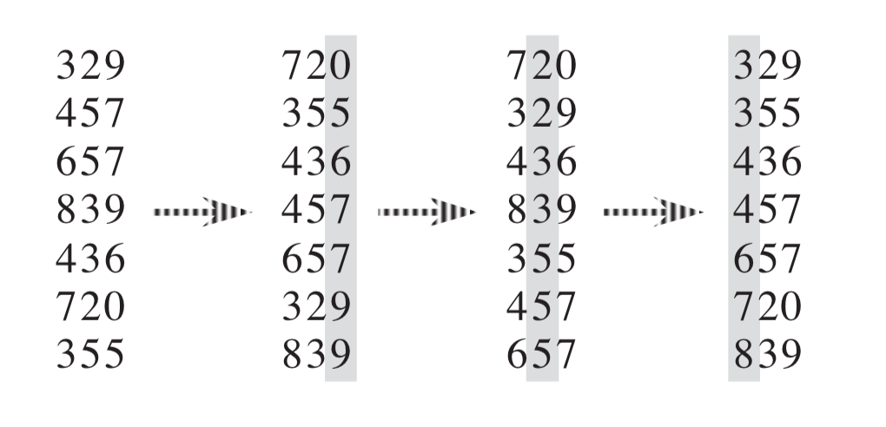

# 第二部分 排序和顺序统计量

第二章已经介绍了两种排序算法：`插入排序`和`归并排序`。插入排序最坏情况下可以在 O(n^2)时间内将 n 个数排好序。由于其内层循环紧凑，对于小规模输入，插入排序是一种非常快的`原址(in place)`排序算法。归并排序有更好的渐进运行时间O(nlgn)，但其所使用的 Merge 过程并非原址的。


在这一部分中，将介绍两种新的排序算法。第6章将介绍`堆排序`，这是一种 O(nlgn)时间的原址排序算法。它使用了一种被称为堆的重要数据结构，堆还可以用来实现优先队列。

第7章介绍`快速排序`，它也是一种原址排序算法，但最坏情况运行时间为O(n^2)，然而它的期望运行时间为 O(nlgn)，而且在实际运用中通常比堆排序快。与插入排序类似，快速排序带代码也很紧凑，因此运行时间中隐含的常数系数很小。快速排序是排序大数组的最常用算法。
插入、归并、堆以及快速排序都是比较排序算法：它们都是通过对元素进行比较操作来确定输入数组的有序次序。

第8章首先介绍了`决策树模型`，可用来研究比较排序算法的性能局限。使用决策树模型，我们可以证明任意比较排序算法排序 n 个元素的最坏情况运行时间的下界为 Ω(nlgn)，从而证明堆排序和归并排序是渐进最优的比较排序算法。
第8章接下来展示了：如果通过比较操作之外的方法来获得输入序列有序次序的信息，就有可能打破 Ω(nlgn) 的下界。第8章介绍的第三种算法是`桶排序`算法，它需要了解输入数组中数据的概率分布。对于半开区间[0,1)内服从均匀分布的 n 个实数，桶排序的平均情况运算时间为 O(n)。

一个 n 个数的集合的第 i 个`顺序统计量`就是集合中第 i 小的数。当然，我们可以通过将输入集合排序，取输出的第 i 个元素来选择第 i 个顺序统计量。当不知道输入数据的分布时，这种方法的运行时间为 Ω(nlgn)，即第8章中所证明的比较排序算法的下界。
第9章展示了即使输入数据是任意实数，也可以在 O(n)时间内找到第 i 小的元素。


## 第6章 堆排序(Heapsort)
堆是一类特殊的树，**堆的通用特点就是父节点会大于或小于所有子节点**。
在堆排序算法中，我们使用的是最大堆；最小堆通常用于构造优先队列。
先将数组 A[0...n] 转化为最大堆，因为数组中的最大元素总是在 A[0]中，通过把 A[0] 与 A[n] 互换，我们可以让该元素放到正确的位置。 这时候，如果我们从堆中去掉节点n(通过减小 heap_size 实现),剩余结点中，原来根的孩子结点仍然是最大堆，而新的根节点可能违背最大堆的性质。所以这时需要调用 max_heapify(A, 0),从而在 A[0...n-1]上构造一个新的最大堆。然后不断重复这一过程，直到堆的大小减小到2。

```Python
def max_heapify(A, root_index):
    '''维护最大堆: 对于一个树高为 h 的节点来说，其复杂度为 O(h)
      [1, 3, 15, 2, 8, 1, 13]:
    		1
      3		 15
    2	 8  1  13
    '''
    l_index, r_index = 2 * root_index + 1, 2 * root_index + 2
    largest_v_index = root_index
    if l_index < heap_size and A[l_index] > A[largest_v_index]:
        largest_v_index = l_index
    if r_index < heap_size and A[r_index] > A[largest_v_index]:
        largest_v_index = r_index
    if largest_v_index != root_index:
        A[root_index], A[largest_v_index] = A[largest_v_index], A[root_index]
        # 交换值后，下标为 largest 的节点的值是原来的 root_index 的值
        # 于是以 largest 为根的子树又有可能违反最大树的性质，需递归调用
        max_heapify(A, largest_v_index)


def build_max_heap(A):
    '''自底向上建堆: 将一个数组转换为最大堆'''
    # 先将该列表画成2叉树，以便理解,root_index为其所有根节点的index(自底向上)
    for root_index in range(len(A) // 2 - 1, -1, -1):
        max_heapify(A, root_index)


def heap_sort(A):
    build_max_heap(A)
    global heap_size
    for i in range(len(A) - 1, -1, -1):
        A[i], A[0] = A[0], A[i]
        heap_size -= 1
        max_heapify(A, 0)

a = [1, 3, 15, 2, 8, 1, 13]
heap_size = len(a)
build_max_heap(a)
print(a)
heap_sort(a)
print(a)
```
使用 Python 自带模块来实现一个堆排序(min-heap)：
```Python
from heapq import heappush, heappop

def heapsort(iterable):
    h = []
    for value in iterable:
        heappush(h, value)
    return [heappop(h) for i in range(len(h))]

a = [1, 3, 15, 2, 8, 1, 13]
heapsort(a)
```
上面代码在不在乎原数据 a 的情况下，也可直接先`heapify(a)`, 然后`[heappop(a) for i in range(len(a))]` (最后a 会为空堆)

视频演示:[点我](https://www.bilibili.com/video/av18980178)

### 优先队列
堆排序是一个优秀的算法，但在实际应用中，快速排序的性能一般会优于堆排序。尽管如此，堆这一数据结构仍然有很多应用。如：作为高效的优先队列，和堆一样，优先队列也有两种形式: 最大优先队列和最小优先队列。
`优先队列(priority queue)`是一种用来维护由一组元素构成的集合 S 的数据结构，其中的每一个元素都有一个相关的值，称为`关键字(key)`。一个`最大优先队列`支持以下操作:
* INSERT(S,x): 把元素 x 插入集合 S 中。
* MAXIMUM(S): 返回其最大键值的元素。
* EXTRACT-MAX(S): 去掉并返回 S 中的具有最大键值的元素。
* INCREASE-KEY(S,x,k): 将元素 x 的关键字值增加到 k(k 不小于 x的原来值)


## 第7章 快速排序(Quicksort)

快排是一种最坏情况时间复杂度为 O(n^2) 的排序算法，虽然其最坏情况的时间复杂度挺差，但是快速排序通常是实际应用中最好的选择，因为它的平均性能非常好：它的期望时间复杂度是 O(nlgn)，而且其隐含的常数因子非常小，另外，它还能进行原址排序。
与归并排序一样，快排也使用了分治的思想，下面是对一个典型的子数组 A[p..r]进行快速排序的三步分治过程：
* 分解: 数组 A 被划分为两个(可能为空)子数组 A[p..q-1]和 A[q+1..r]，使得前者中的每一个元素都小于等于后者，而 A[q]也小于等于 A[q+1..r]中的每个元素。
* 解决：通过递归调用快排，对子数组 A[p..q-1]和 A[q+1..r]进行排序, 一直递归到左右子数组仅只有一个值时。
* 合并：因为子数组都是原址排序的，所以不需要合并。


注: *图片中的 i 相当于下面函数的 pointer，j~r 无限制的情况只存在于 for 循环未完全完成时*


```Python
def partition(A, left, right):
    '''以 pivot 为主元将 A 划分(原址)为3部分:其中(左部分<=x<右部分), 并返回 x 的index'''
    pivot = A[right]
    i = left
    for j in range(left, right):
        if A[j] < pivot:
            A[i], A[j] = A[j], A[i] # 将比pivot小的值(A[j])从最左边(i)依次放置
            i += 1
    A[i], A[right] = A[right], A[i] # 将最右边的pivot值放在正确位置
    return i


def quick_sort(A, left, right):
    if left < right:
        pivot_index = partition(A, left, right)
        quick_sort(A, left, right=pivot_index - 1)
        quick_sort(A, pivot_index + 1, right)


a = [1, 3, 4, 2]
quick_sort(a, left=0, right=len(a) - 1)
print(a)
```

视频演示:[点我](https://www.bilibili.com/video/av18980345)

补充一个非递归调用的快速排序(该方法效率比较低下)：
```Python
def quicksort(arr):
    if len(arr) <= 1:
        return arr
    pivot = arr[-1]
    left = [x for x in arr if x < pivot]
    middle = [x for x in arr if x == pivot]
    right = [x for x in arr if x > pivot]
    return quicksort(left) + middle + quicksort(right)
```

**快速排序的性能**

快速排序的运行时间依赖于划分是否平衡，如果划分均衡，其性能与归并排序相同(nlgn)，而最坏情况(划分的子问题分别包含了了n-1个元素和0个元素)，如果后面的递归每一次都是这种情况，其复杂度为 O(n^2)。而在最好情况下(每次划分均为 n/2、n/2 -1)，其复杂度为nlgn。快排的平均运行时间更接近其最好情况，而非最坏情况。事实上，任何一种`常数`比例(哪怕是看起来很吓人的9999:1)的划分都会产生深度为 O(lgn)的递归树，其中每一层的时间代价均为 O(n)。**因此，只要划分是常数比例的，算法的运行时间总是 O(nlgn)。**


## 第8章 线性时间排序
目前为止，我们已经介绍了几种能在 Ω(nlgn)时间内排序 n 个数的算法。
* 归并排序和堆排序达到了最坏情况下的上界
* 快速排序在平均情况下达到该上界
这些算法都有一个共同点：`在排序的最终结果中，各元素的次序依赖于它们之间的比较`。我们把这类排序算法称为`比较排序`。本章将证明对包含 n 个元素的输入序列来说，任何比较排序在最坏情况下都要经过 Ω(nlgn) 次比较。因此，归并排序和堆排序是渐进最优的，并且任何已知的比较排序最多就是在常数因子上优于它们。
本章将介绍3种线性时间复杂度的排序算法：计数排序、基数排序和桶排序。当然，这3种算法是用运算而不是比较来确定排序顺序的，因此，下界 Ω(nlgn) 对它们是不适用的。

### 计数排序(Counting sort)
`计数排序`假设 n 个输入元素中的每一个都是在**0到 k 区间内的一个整数**，其中 k 为某个整数。当 k=O(n)时，排序的运行时间为O(n)。
计数排序的基本思想是：对每一个输入元素 x，确定小于 x 的元素个数。利用这一信息，就可以直接把 x 放到它输出数组中的位置上了。
在计数排序算法的代码中，假设输入的是一个数组 A(长度为 n)，我们还需要两个数组:res(长度为 n)用于存放排序的输出，C(长度为 k)用于临时存储空间。

```Python
def counting_sort(A, k):
    res, temp = [0] * len(A), [0] * (k + 1)
    for el in A:
        temp[el] += 1 # temp[i] now contains the numreser of elements  == i
    for i in range(1, k + 1):
        temp[i] += temp[i - 1] # temp[i] now contains the number of elements <= i
    for i in A:
        res[temp[i] - 1] = i # 共有temp[i]个元素 <= i, 所以i在res中的正确位置应该是temp[i] - 1
        temp[i] -= 1
    return res

a = [1, 3, 4, 2, 3]
print(counting_sort(a, max(a)))
```
在上面代码的最后一个 for 循环部分，把每个元素 A[j]放到它在输出数组 res 中的正确位置，如果所有元素都是互异的，那么当一次执行第7行时，对每一个A[j]值来说，**C[A[j]]就是 A[j]在输出位置中的最终正确位置。这是因为共有 C[A[j]]个元素 <= A[j]**。而因为所有元素并非互异，所以，我们需要将一个值 A[j]放入数组 res 中后，都要将 C[A[j]]的值减1.这样，当遇到下一个值等于 A[j]的输入元素(如果存在)时，该元素可以直接被放到输出数组中 A[j]的前一个位置上。

视频演示:[点我](https://www.bilibili.com/video/av18980575)

显然，计数排序的复杂度为O(n)，另外，计数排序的一个重要性质就是它是`稳定的`：具有相同值的元素在输出数组中的相对次序与它们在输入数组中的相对次序相同。计数排序的稳定性很重要的另一个原因是：计数排序经常会被用作基数排序算法的一个子过程。具体如何，请看下回分解。
另外，计数排序只适用于自然数的排序。


### 基数排序(Radix sort)
基数排序的使用范围仅限于有基数(数字)的东西(而许多需要排序的东西没有基数，比如带结构的数据)。
与人们直观感受相悖的是，基数排序是按`最低有效位`进行排序来解决卡片排序问题的：



```Python
def radix_sort(A, digit, base=10):
    for d in range(digit):
        bucket = [[] for d in range(base)]
        for el in A:
            # 下行取某位数上的数字(比如d=0时，radix 为个位的数字)
            radix = el // (10 ** d) % 10
            # 下行仅仅将某位数上相同的放在一个列表里，且位数低的在前面，以为了 A = 那行
            bucket[radix].append(el)
        A = [el for els in bucket for el in els]
    return A

a = [14, 33, 11, 21]
print(radix_sort(a, 2))
```
基数排序的代码很直观：每一轮外层for 循环按照由低到高的有效位(此例中为`个位-->十位`)将数组 A 进行排序，比如此例中按个位排序后 A 数组为`[11, 21, 33, 14]`, 然后在此排序的基础上再将其按十位排序后得到最终结果：`[11, 14, 21, 33]`

视频演示:[点我](https://www.bilibili.com/video/av18980653)

**基数排序的复杂度**
基数排序的复杂度依赖于所使用的稳定的排序算法，对 n 个 digit 位数来说，每一轮排序耗时 O(n+base),共有 digit 轮，因此其排序的总时间代价为 O(digit * (n+base))，当 digit 为常数且 base = O(n)时， 基数排序具有线性的时间代价。

即便如此，基数排序是否比基于比较的排序算法(比如快速排序)更好呢？ 通常情况，基数排序的运行时间为 O(n)，这一结果看上去要比快速排序的期望运行时间代价 O(nlgn)更好一些。但是，在这两个表达式中，隐含在 O 符号背后的常数项因子是不同的。在处理 n 个数据时，尽管基数排序执行的循环轮数会比快速排序少，但每一轮其耗费的时间要长得多。哪一个排序算法更合适依赖于具体实现和底层硬件的特性(例如，快速排序通常可以比基数排序更有效地使用硬件的缓存)、输入数据的特征，以及是否额外占用空间等因素。此外，使用计数排序作为中间稳定排序的基数排序不是原址排序，而很多 O(nlgn)的比较排序算法是原址排序。


### 桶排序( Bucket sort)
桶排序假设输入数据服从正态分布，平均情况下它的时间代价为O(n)，与计数排序类似，因为对输入数据作了某种假设，桶排序的速度也很快。具体来说，**计数排序假设输入数据都属于一个小区间内的整数，而桶排序则假设输入是由一个随机过程产生，该过程将元素均匀、独立地分布在[0,1)区间上。**
桶排序将[0,1)区间划分为 n 个相同大小的子区间，或称为`桶`。然后，将 n 个输入分别放到各个桶中，因为输入数据是均匀、独立地分布在[0,1)区间上，所以一般不会出现很多数落在同一个桶中的情况，为了得到输入结果，我们先对每个桶中的数进行排序，然后遍历每个桶，按照次序把各个桶中的元素列出来即可。
在桶排序中，我们假定输入是一个包含 n 个元素的数组 A，且每个元素 A[i]满足0 <= A[i] < 1。此外，算法还需要一个临时数组 bucket[0..n-1]来存放链表(即桶)，并假定存在一种用于维护这些链表的机制。

```Python
def insertion_sort(A):
    for i in range(1, len(A)):
        while i >= 1 and A[i - 1] > A[i]:
            A[i - 1], A[i] = A[i], A[i - 1]
            i -= 1

def bucket_sort(A):
    bucket = [[] for x in range(10)] # 注意：这儿不能[[]] * 10 (append方法)
    res = []
    for el in A:
        bucket[int(el * 10)].append(el)
    for bck in bucket:
        insertion_sort(bck)
        res += bck
    return res

a = [0.14, 0.33, 0.11, 0.21, 0.20, 0.111]
print(bucket_sort(a))
```
视频演示:[点我](https://www.bilibili.com/video/av17940595)

**桶排序的复杂度**
显然，除了将各个桶中的链表进行排序外的操作复杂度均为O(n), 经验证(🤪)：即是输入数据不服从均匀分布，桶排序也仍然可以线性时间内完成。只要输入数据满足以下性质：所有桶的大小的平方和与总的元素呈线性关系。


## 排序补充(各种排序算法一览)

| 排序方法 | 类别 | 平均复杂度 | 最差 | 最好 | 稳定性 | 空间复杂度 |
| -------- | ---- | ------ | ---- | ---- | ------ | ---- |
| 冒泡排序 | 交换类 | O(n^2) | O(n^2) | O(n) | 稳定 | O(1)(即原址) |
| 选择排序 | 选择类 | O(n^2) | O(n^2) | O(n) | 不稳定 | O(1) |
| 插入排序 | 插入类 | O(n^2) | O(n^2) | O(n) | 稳定 | O(1) |
| 希尔排序 | 插入类 | O(nlogn) | O(nlog^2n) | O(nlog^2n) | 不稳定 | O(1) |
| 归并排序 |  | O(nlogn) | O(nlogn) | O(nlogn) | 稳定 | O(n) |
| 快速排序 | 交换类 | O(nlogn) | O(n^2) | O(nlogn) | 不稳定 | O(1) |
| 堆排序   | 选择类 | O(nlogn) | O(nlogn) | O(nlogn) | 不稳定 | O(1) |
| 计数排序 |      | O(n+k) | O(n+k) | O(n+k) | 稳定 | O(n+k) |
| 基数排序 |      | O(n*base) | O(n*base) | O(n*base) | 稳定 | O(n*base) |
| 桶排序 |      | O(n+k) | O(n+k) | O(n+k) | 稳定 | O(n+k) |


## 第9章 中位数和顺序统计量

本章将讨论从一个由 n 个互异的元素构成的集合中选择第 i 个顺序统计量的问题。为了方便起见，假设集合中的元素都是互异的，但实际上我们所做的都可以推广到集合中包含重复元素的情形。我们将这一问题形式化定义为如下的`选择问题：`

* 输入：一个包含 n 个(互异)数的集合 A 和一个整数 i，1 <= i <= n。
* 输出：元素 x ⊂ A，且 A 中恰好有 i -1个其它元素小于它。

我们可以在O(nlgn)时间内解决这个问题，因为我们可以同堆排序或归并排序对输入数据进行排序，然后在输出数组中根据下标找出第 i 个元素即可。本章将介绍一些更快的算法。

本章中，我们将讨论从一个集合中选择最小元素和最大元素的问题。本章将分析一个适用的随机算法，它在元素互异的假设条件下可以达到 O(n)的期望运行时间。后面也将给出一个更具理论意义的算法，它在最坏情况下的运行时间为 O(n)。


### 最大值和最小值

在一个有 n 个元素的集合中，显然，最低需要做 n-1次比较来确定最小(或最大)的元素：依次遍历集合中的每个元素，并记录下当前的最小元素，例如：

```Python
def minimun(A):
    min = A[0]
    for el in A: # A[1:]
        if min > el:
            min = el
    return min
```

**那么假如要同时找到最大值和最小值呢？**

按上面代码的思路：只需要分别独立地找出最大值和最小值，这各需要 n-1次比较，共需2n-2次比较。

实际上，我们只需要最多`3n/2`次比较就可以同时找出最大值和最小值，具体方法是记录已知的最小值和最大值。但我们并不是将每一个输入元素与当前的最小值和最大值进行比较——这样做的代价是每个元素需要2次比较，而是对输入元素成对地进行处理。首先，我们将一对输入元素相互进行比较，然后把较小的与当前最小值进行比较，把较大的与当前最大值进行比较。这样，对每两个元素共需3次比较。

```Python
def min_and_max(A):
    min_, max_ = A[0], A[0]
    for i in range(len(A) % 2, len(A), 2): # n/2 * 3
        temp_min, temp_max = A[i], A[i + 1]
        if A[i] > A[i + 1]:
            temp_min, temp_max = A[i + 1], A[i]
        if temp_min < min_:
            min_ = temp_min
        if temp_max > max_:
            max_ = temp_max
    return min_, max_

print(min_and_max([2, 0.1, 3, 5]))
```

```Python
def min_and_max_2(A):
    min_, max_ = A[0], A[0]
    for el in A:
        if min_ > el:
            min_ = el
        if max_ < el:
            max_ = el
    return min_, max_
```
但事实上`min_and_max`根本没有`min_and_max_2`快，即使把min_and_max_2中的 for 循环改为 range 的方式也比 min_and_max快！毕竟前者有更多的赋值等操作 🤢


### 期望时间为线性时间的选择算法

一般选择问题(比如，在不排序的情况下，在一个无序数组中找到第 k 小的数)看起来要比找最小/最大值问题要更难，但令人惊奇的是这两个问题的渐进运行时间却是相同的：O(n)。本节介绍一种解决选择问题的分治算法: Ramdomized-select。其以快速排序算法为模型，与快速排序一样，我们仍然将输入数组进行递归划分，但与快速排序不同的是：快速排序会递归处理划分的两边，而 Ramdomized-select只处理划分的一边。这一差异会在性能分析中体现出来：快速排序的期望运行时间是O(nlgn)，而Ramdomized-select的期望运行时间为 O(n)。这里，假设输入数据都是互异的。


```Python
def partition(A, p, r):
    '''以 x 为主元将 A 划分为3部分:左部分，x，右部分；其中(左<=x<右)'''
    x, i = A[r], p
    for j in range(p, r):
        if A[j] < x:
            A[i], A[j] = A[j], A[i]
            i += 1 # 下标 i 左边的数均比 x 小
    A[i], A[r] = A[r], A[i]
    return  i

def randomized_select(A, p, r, rank):
    if p == r:
        return A[p]
    i = partition(A, p, r) # i 左边的数均比主元小(A[i]即是主元)
    k = i - p + 1
    if rank == k:
        return A[i]
    elif rank < k:
        return randomized_select(A, p, i - 1, rank)
    else:
        return randomized_select(A, i + 1, r, rank - k)

a = [2, 3, 1, 5, 4]
print(randomized_select(a, 0, len(a) - 1, 3))
```
**复杂度**
Ramdomized-select 的最坏情况运行时间为 O(n^2)，即使是找最小元素也是如此。我们也将看到该算法有线性的期望运行时间，又因为它是随机化的，所以不存在一个特定的会导致其最坏情况发生的输入数据。经验证：假设所有元素是互异的，使用Ramdomized-select可以在线性时间内找到任意顺序统计量，特别是中位数。


### 最坏情况为线性时间的选择算法
现在来看一个在最坏情况为O(n)时间的选择算法。像 Ramdomized-select 一样，Select 算法通过对输入数组的递归划分来找出所需元素，但是，在该算法中能够保证得到对数组的一个好的划分。Select 使用的也是来自快速排序的确定性划分算法 partition，但做了修改，把划分的主元也作为输入参数。
思路如下：

* 将输入数组的n个元素划分为n/5组，每组5个元素，最后一组由剩下的 n mod 5个元素组成。
* 寻找每组的中位数：首先对魅族元素进行插入排序，然后确定每组有序元素的中位数。
* 对第二步中找出的 n/5 个中位数，递归调用 select 以找出其中位数(上中位数)。
* 经过修改后的版本，按中位数的中位数 x 对输入数组进行划分，让 k 比划分的低区中的元素数目多1，因此 x 是第 k 小的元素，并且有 n-k 个元素在划分的高区。
* 如果 i=k，则返回 x，如果 i < k，则在低区递归调用 select 来找出第 i 小的元素。如果 i > k，则在高区递归查找第 i - k 小的元素。

代码实现略。
