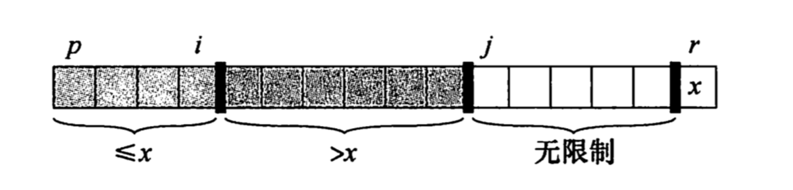

# 第二部分 排序和顺序统计量

第二章已经介绍了两种排序算法：`插入排序`和`归并排序`。插入排序最坏情况下可以在 O(n^2)时间内将 n 个数排好序。由于其内层循环紧凑，对于小规模输入，插入排序是一种非常快的`原址(in place)`排序算法。归并排序有更好的渐进运行时间O(nlgn)，但其所使用的 Merge 过程并非原址的。


在这一部分中，将介绍两种新的排序算法。第6章将介绍`堆排序`，这是一种 O(nlgn)时间的原址排序算法。它使用了一种被称为堆的重要数据结构，堆还可以用来实现优先队列。
第7章介绍`快速排序`，它也是一种原址排序算法，但最坏情况运行时间为O(n^2)，然而它的期望运行时间为 O(nlgn)，而且在实际运用中通常比堆排序快。与插入排序类似，快速排序带代码也很紧凑，因此运行时间中隐含的常熟系数很小。快速排序是排序大数组的最常用算法。
插入、归并、堆以及快速排序都是比较排序算法：它们都是通过对元素进行比较操作来确定输入数组的有序次序。第8章首先介绍了`决策树模型`，可用来研究比较排序算法的性能局限。使用决策树模型，我们可以证明任意比较排序算法排序 n 个元素的最坏情况运行时间的下界为 Ω(nlgn)，从而证明堆排序和归并排序是渐进最优的比较排序算法。
第8章接下来展示了：如果通过比较操作之外的方法来获得输入序列有序次序的信息，就有可能打破 Ω(nlgn) 的下界。第8章介绍的第三种算法是`桶排序`算法，它需要了解输入数组中数据的概率分布。对于半开区间[0,1)内服从均匀分布的 n 个实数，桶排序的平均情况运算时间为 O(n)。

一个 n 个数的集合的第 i 个`顺序统计量`就是集合中第 i 小的数。当然，我们可以通过将输入集合排序，取输出的第 i 个元素来选择第 i 个顺序统计量。当不知道输入数据的分布时，这种方法的运行时间为 Ω(nlgn)，即第8章中所证明的比较排序算法的下界。
第9章展示了即使输入数据是任意实数，也可以在 O(n)时间内找到第 i 小的元素。


## 第6章 堆排序(Heapsort)
堆是一类特殊的树，堆的通用特点就是父节点会大于或小于所有子节点。
在堆排序算法中，我们使用的是最大堆；最小堆通常用于构造优先队列。
先将数组 A[0...n] 转化为最大堆，因为数组中的最大元素总是在 A[0]中，通过把 A[0] 与 A[n] 互换，我们可以让该元素放到正确的位置。 这时候，如果我们从堆中去掉节点n(通过减小 heap_size 实现),剩余结点中，原来根的孩子结点仍然是最大堆，而新的根节点可能违背最大堆的性质。所以这时需要调用 max_heapify(A, 0),从而在 A[0...n-1]上构造一个新的最大堆。然后不断重复这一过程，直到堆的大小减小到2。

```Python
def max_heapify(A, root_index):
    '''维护最大堆: 对于一个树高为 h 的节点来说，其复杂度为 O(h)'''
    l_index, r_index = 2 * root_index + 1, 2 * root_index + 2
    largest_index = root_index
    if l_index < hs and A[l_index] > A[largest_index]:
        largest_index = l_index
    if r_index < hs and A[r_index] > A[largest_index]:
        largest_index = r_index
    if largest_index != root_index:
        A[root_index], A[largest_index] = A[largest_index], A[root_index]
        # 交换值后，下标为 largest 的节点的值是原来的 root_index 的值
        # 于是以 largest 为根的子树又有可能违反最大树的性质，需递归调用
        max_heapify(A, largest_index)


def build_max_heap(A):
    '''自底向上建堆: 将一个数组转换为最大堆'''
    # i 为该堆的所有根节点(自底向上)'
    for root_index in range(len(A) // 2 - 1, -1, -1):
        max_heapify(A, root_index)


def heap_sort(A):
    build_max_heap(A)
    global hs
    for i in range(len(A) - 1, -1, -1):
        A[i], A[0] = A[0], A[i]
        hs -= 1
        max_heapify(A, 0)

a = [1, 3, 15, 2, 8, 1, 13]
hs = len(a)
build_max_heap(a)
print(a)
heap_sort(a)
print(a)
```

### 优先队列
堆排序是一个优秀的算法，但在实际应用中，快速排序的性能一般会优于堆排序。尽管如此，堆这一数据结构仍然有很多应用。如：作为高效的优先队列，和堆一样，优先队列也有两种形式: 最大优先队列和最小优先队列。
`优先队列(priority queue)`是一种用来维护由一组元素构成的集合 S 的数据结构，其中的每一个元素都有一个相关的值，称为`关键字(key)`。一个`最大优先队列`支持以下操作:
* INSERT(S,x): 把元素 x 插入集合 S 中。
* MAXIMUM(S): 返回其最大键值的元素。
* EXTRACT-MAX(S): 去掉并返回 S 中的具有最大键值的元素。
* INCREASE-KEY(S,x,k): 将元素 x 的关键字值增加到 k(k 不小于 x的原来值)


## 第7章 快速排序(Quicksort)

快排是一种最坏情况时间复杂度为 O(n^2) 的排序算法，虽然其最坏情况的时间复杂度挺差，但是快速排序通常是实际应用中最好的选择，因为它的平均性能非常号：它的期望时间复杂度是 O(nlgn)，而且其隐含的常数因子非常小，另外，它还能进行原址排序。
与归并排序一样，快排也使用了分治的思想，下面是对一个典型的子数组 A[p..r]进行快速排序的三步分治过程：
* 分解: 数组 A 被划分为两个(可能为空)子数组 A[p..q-1]和 A[q+1..r]，使得前者中的每一个元素都小于等于后者，而 A[q]也小于等于 A[q+1..r]中的每个元素。
* 解决：通过递归调用快排，对子数组 A[p..q-1]和 A[q+1..r]进行排序。
* 合并：因为子数组都是原址排序的，所以不需要合并。



注: *图片中的 i 相当于下面函数的 pointer，j~r 无限制的情况只存在于 for 循环未完全完成时*


```Python
def partiton(A, p, r):
    '''以 x 为主元将 A 划分为3部分:左部分，x，右部分；其中(左<=x<右)'''
    x = A[r]
    i = p
    for j in range(p, r):
        if A[j] < x:
            A[i], A[j] = A[j], A[i]
            i += 1
    A[i], A[r] = A[r], A[i]
    return  i


def quick_sort(A, p, r):
    if p < r:
        i = partiton(A, p, r)
        quickSort(A, p, i - 1)
        quickSort(A, i + 1, r)


a = [1, 3, 4, 2]
quick_sort(a, 0, len(a) - 1)
print(a)
```
**快速排序的性能**

快速排序的运行时间依赖于划分是否平衡，如果划分均衡，其性能与归并排序相同(nlgn)，而最坏情况(划分的子问题分别包含了了n-1个元素和0个元素)，如果后面的递归每一次都是这种情况，其复杂度为 O(n^2)。而在最好情况下(每次划分均为 n/2、n/2 -1)，其复杂度为nlgn。快排的平均运行时间更接近其最好情况，而非最坏情况。事实上，任何一种`常数`比例(哪怕是看起来很吓人的9999:1)的划分都会产生深度为 O(lgn)的递归树，其中每一层的时间代价均为 O(n)。**因此，只要划分是常数比例的，算法的运行时间总是 O(nlgn)。**

