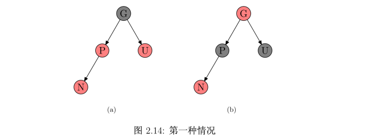
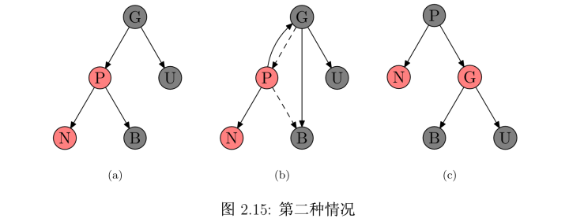
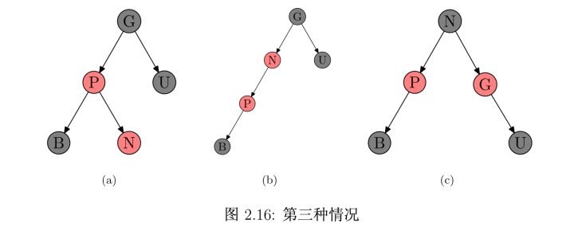

# 第三部分 数据结构
集合作为计算机科学的基础，就如同它们在数学中所起的作用。不同的是，数学中的集合是不变的，而由算法操作的集合却是动态的。下面的几章将介绍在计算机上表示和操作有限动态集合的一些基本技术。

第10~14章描述能够用于实现动态集合的几种数据结构，本书后面将是同其中多种构造解决各种不同问题的有效算法。

第10章给出一些简单数据结构的使用基础，如栈、列队、链表和有根树。
第11章介绍散列表，最坏情况下，散列表完成一次search 操作需要 O(n)时间，但散列表上操作的期望时间为O(1)。
第12章介绍二叉搜索树，它支持常见的所有的动态集合操作。最坏情况下，在有 n 个元素的一棵树上，一次操作需要 O(n)时间；然而在随机构建的一棵二叉搜索树上，其一次操作的期望时间为 O(lgn)。
第13章介绍红黑树，这是二叉搜索树的一个变种。与普通的二叉搜索树不同，红黑树保证了较好的性能：最坏情况下各种操作只需要 O(lgn)时间，一棵红黑树是一种平衡搜索树，第5部分的第18章将涉及另一种平衡搜索树，称为 B 树。
第14章给出如何将红黑树进行扩张，使其支持一些基本操作以外的操作。


## 第10章 基本数据结构

### 栈和列队
栈和列队都是动态集合，且在其上进行 delete 操作所移除的元素是预先设定的。在`栈(stack)`中，被删除的是最近插入的元素：栈实现的是一种`后进后出(last-in,first-out,LIFO)`策略。相应地，在`列队(queue)`中，被删去的总是在集合中存在时间最长的那个元素：队列实现的是一种`先进先出(first-in, first-out,FIFO)`策略。

### 链表
`链表(linked list)`是一种这样的数据结构，其中各对象按线性顺序排列。数组的线性顺序是由数组下标决定的，然而与数组不同的是，链表的顺序是由各个对象里的指针决定的。
链表可以有多种形式，它可以是单链接的或者是双链接的，可以是已排序的或者未排序的，可以是循环的或非循环的。在本节余下的部分中，所处理的链表都是未排序的且是双链接的。

### 二叉树
`二叉树(Binary tree)`是每个节点最多只有两个分支的树结构。通常分支被称作“左子树(左孩子)”或“右子树(右孩子)”。
二叉树的表示方法可以推广到每个结点的孩子数至多为常数 k 的任意类型的数：只需要将 left 和 right 属性用 child1, child2 ... childk代替，当孩子的节点数无限时，该方法就失效了。此外，即是将 k 限制在一个大的常数以内，若多数结点只有少量孩子时，也会浪费大量储存空间。
所幸的是，有一个巧妙的方法可以用来表示孩子数任意的树(当然，树的表示方法很多)。该方法的优势在于，对于任意 n 个结点的有根树，只需要O(n)的存储空间: `左孩子右兄弟表示法(left-child, right-sibling representation)`。其每个节点都包含了一个父节点指针 p，且 T.root 指向树 T 的根节点，然而每个结点中不是包含指向2个孩子的指针：


## 第11章 散列表

`散列表(Hash table，也叫哈希表)`，是根据键（Key）而直接访问在内存存储位置的数据结构。也就是说，它通过计算一个关于键值的函数，将所需查询的数据映射到表中一个位置来访问记录，这加快了查找速度。
这个映射函数称做散列函数，存放记录的数组称做散列表。


## 第12章 二叉搜索树

二叉搜索树指一棵空树或者具有下列性质的二叉树：
* 若任意节点的左子树不空，则左子树上所有节点的值均不大于它的根节点的值；
* 若任意节点的右子树不空，则右子树上所有节点的值均不小于它的根节点的值；
* 任意节点的左、右子树也分别为二叉查找树；
* 没有键值相等的节点。

二叉搜索树允许我们通过一个简单的递归算法来按序输出二叉搜索树中的所有关键字，这种算法称为`中序遍历(inorder tree walk)`算法，这样命名的原因是输出的子树根的关键字位于其左子树的关键字值和右子树的关键值之间。类似地，还有`先序遍历(preorder tree walk)`和`后序遍历(postorder tree walk)`。
```Python
class Node(object):
    """节点类"""
    def __init__(self, val):
        self.val = val
        self.lchild = None
        self.rchild = None


class Tree:
    """完全二叉树"""
    def __init__(self):
        self.root = None # 根节点

    def add(self, val):
        '''向二叉树中添加数据'''
        node = Node(val) # 构造节点
        if self.root is None:
            self.root = node
            return
        queue = [self.root]
        while queue:
            # 只要queue不为空,则按队列的形式来取出元素处理判断
            current_node = queue.pop(0)
            if current_node.lchild is None:
                current_node.lchild = node
                break
            elif current_node.rchild is None:
                current_node.rchild = node
                break
            else:
                queue.append(current_node.lchild)
                queue.append(current_node.rchild)

    def breadth_first_search(self):
        '''广度遍历:
        		搜索二叉树:
                  6
               3	 8
             1   5 7  9
           0  2 4
        '''
        # 思路和add方法类似
        if self.root is None:
            return
        queue = [self.root]
        while queue:
            current_node = queue.pop(0)
            print(current_node.val, end=' ') # 6 3 8 1 5 7 9 0 2 4
            if current_node.lchild:
                queue.append(current_node.lchild)
            if current_node.rchild:
                queue.append(current_node.rchild)

    def depth_first_search(self, root):
        '''
            深度遍历按照根节点相对于左右子节点的访问先后来划分为：先序遍历、中序遍历、后序遍历
            下面展示为先序遍历
        '''
        if root is None:
            return
        print(root.val, end=' ')
        if root.lchild:
            self.depth_first_search(root.lchild)
        if root.rchild:
            self.depth_first_search(root.rchild)


    def preinorder_traversal(self, node):
        '''先序遍历: root -> left ->right'''
        if node is None:
            return
        print(node.val, end=' ')
        self.preinorder_traversal(node.lchild)
        self.preinorder_traversal(node.rchild)

    def inorder_traversal(self, node):
        '''中序遍历: left -> root ->right'''
        if node is None:
            return
        self.inorder_traversal(node.lchild)
        print(node.val, end=' ')
        self.inorder_traversal(node.rchild)

    def postorder_traversal(self, node):
        '''后序遍历: left -> right ->root'''
        if node is None:
            return
        self.postorder_traversal(node.lchild)
        self.postorder_traversal(node.rchild)
        print(node.val, end=' ')

t = Tree()
[t.add(i) for i in [6, 3, 8, 1, 5, 7, 9, 0, 2, 4]]

print('广度遍历:')
t.breadth_first_search()
print('\n深度遍历(先序遍历):')
t.depth_first_search(t.root)
print('\n先序遍历:')
t.preinorder_traversal(t.root)
print('\n中序遍历:')
t.inorder_traversal(t.root)
print('\n后序遍历:')
t.postorder_traversal(t.root)
```
遍历一棵有 n 个结点的二叉搜索树需要耗费 O(n)的时间。

**二叉搜索树的查找**
```Python
def tree_search(self, x, k):
    '''在二叉搜索树中查找一个具有给定关键字的节点： 输入一个指向树根的指针和一个关键字 k'''
    if x is None or k == x.key:
        return x
    if k < x.key:
        return self.tree_search(x.lchild, k)
    else:
        return self.tree_search(x.rchild, k)

t = Tree()
for i in [6, 3, 8, 1, 5, 7, 9]:
    t.add(i)
print('\n', t.tree_search(t.root, 5))
```
而对于 搜索二叉树的查找(tree_search)，从树根节点开始递归(也可改为效率更高的迭代)，期间遇到的结点就形成了一条向下的简单路径，所以 tree_search 的运行时间为 O(h)，其中 h 是这棵树的高度。

**二叉搜索树的最大关键字元素和最小关键字元素**

通过从树根开始沿着 lchild 指针直到遇到一个 None, 我们总能在一颗二叉搜索树中找到其最大关键字元素和最小关键字元素，这两个过程均能在一棵树高为 h 的树上 O(h)的时间内完成。

**二叉搜索树的插入**

和二叉搜索树的查找类似，不同的是插入需要额外记录当前指针的位置


**二叉搜索树的删除**

从一棵二叉搜索树中删除一个结点 z的整个策略分为3种基本情况：
* 如果 z 没有孩子节点，那么只是简单地将它删除，并修改它的父节点
* 如果 z 只有一个孩子，那么将这个孩子提升到树中 z 的位置上，并修改z 的父节点
* 如果 z 有2个孩子，那么找 z 的右子树的最小值(或左子树的最大值)，用该值替代 z 结点。

在一棵高度为 h 的二叉搜索树上，实现动态集合操作的 insert 和 delete 运算时间均为 O(h)。

**随机构建二叉搜索树**
我们已经知道二叉搜索树上的每个基本操作都能在 O(h)的时间内完成，其中 h 为这棵树的高度。然后，随着元素的插入和删除，二叉搜索树的高度是变化的(如，n 个关键字按严格递增的次序被插入，则该树的高度一定为 n-1的一条链，而一棵有 n 个不同关键字的随机构建的二叉搜索树的期望高度为 O(lgn))，和快速排序类似，我们可以证明其平觉情形性能更接近最好情形，而不是坏最情形时的性能。


## 第13章 红黑树(red-black tree)

前一章介绍了二叉搜索树，当二叉搜索树的高度较低时，其基本动态操作会执行得较快，然而，如果树的高度较高时，这些操作可能并不比直接在链表上得快。`红黑树(red-black tree)`是许多“平衡”搜索树中的一种，可以保证在最坏情况下基本动态集合操作的时间复杂度为 O(lgn)。

**红黑树的性质**

红黑树首先是一棵二叉搜索树，它在每个结点上增加了一个储存位来表示结点的颜色，通过对任何一条从根到叶子的 简单路径上各个结点的颜色进行约束，红黑树确保没有一条路径会比其它路径长出2倍，因而是近似于平衡的。其牺牲了部分平衡性以换取插入/删除操作时少量的旋转操作。

树中的每个结点有5个属性：color、key、left、right 和 p，如果一个结点没有子结点或父结点，则该结点相应指针属性的值为 NIL。
一棵红黑树是满足下面`红黑性质`的二叉搜索树：
* 每个结点是红色或黑色的。
* 根结点是黑色的。
* 所有叶结点(NIL)都是黑色。
* 如果一个结点是红色的，则它的两个子结点是黑色的。
* 从任一节点到其每个叶结点的所有简单路径都包含相同数目的黑色节点。

**红黑树的基本操作：左旋和右旋**

红黑树结构的修改是通过旋转(rotation)来完成的，这是一种能保持二叉搜索树性质的局部操作。
对x进行左旋，意味着"将x变成一个左节点":

代码实现：
```Python
def left_rotate():
    """对节点 y 进行左旋"""
    y = x.right
    x.right = y.left # 将 y 的左子树变为 x 的右子树
    if y.left != T.nil:
        y.left.p = x
    y.p = x.p # 将 x 的父结点赋值为 y 的父结点
    if x.p == T.nil:
        T.root = y
    elif x == x.p.left:
        x.p.left = y
    else:
        x.p.right = y
    y.left = x # 将 x 置为 y 的左子树
    x.p = y
```

**红黑树的插入**

向红黑树中插入新的结点。具体做法是，将新结点的 color 赋为红色，然后以二叉排序树的插入方法插入到红黑树中去。之所以将新插入的结点的颜色赋为红色，是因为：如果设为黑色，就会导致根到叶子的路径上有一条路上，多一个额外的黑结点，这个是很难调整的。但是设为红色结点后，可能会导致出现两个连续红色结点的冲突，那么可以通过颜色调换和树旋转来调整，这样简单多了。
接下来，讨论一下插入以后，红黑树的情况。设要插入的结点为N，其父结点为P，其 祖父结点为G，其父亲的兄弟结点为U（即P和U 是同一个结点的两个子结点）。如果P是黑色的，则整棵树不必调整就已经满足了红黑树的所有性质。如果P是红色的（可知，其父结点G一定是黑色的），则插入N后，违背了红色结点只能有黑色孩子的性质，需要进行调整。
调整时分以下三种情况：
第一、N的叔叔U是红色的。将P和U重绘为黑色并重绘结点G为红色。现在新结点N有 了一个黑色的父结点P，因为通过父结点P或叔父结点U的任何路径都必定通过祖父结点G， 在这些路径上的黑结点数目没有改变。但是，红色的祖父结点G的父结点也有可能是红色 的，这就违反了性质3。为了解决这个问题，我们在祖父结点G递归向上调整颜色。如图2.14:



第二、N的叔叔U是黑色的，且N是左孩子。对祖父结点G 的一次右旋转; 在旋转产生的树中，以前的父结点P现在是新结点N和以前的祖父节点 G 的父结点，然后交换以前的父结点P和祖父结点G的颜色，结果仍满足红黑树性质。如图 2.15。在(b)中，虚线代表原来的指针，实线代表旋转过后的指针。所谓旋转就是改变图中所示的两个指针的值即可。当然，在实际应用中，还有父指针p也需要修改，这里为了图示的简洁而省略掉了。



第三、N的叔叔U是黑色的，且N是右孩子。我们对P进行一次左旋转调换新结点和其父 结点的角色，就把问题转化成了第二种情况。如图 2.16所示:


**红黑树的删除**

......

