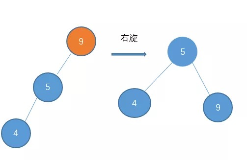
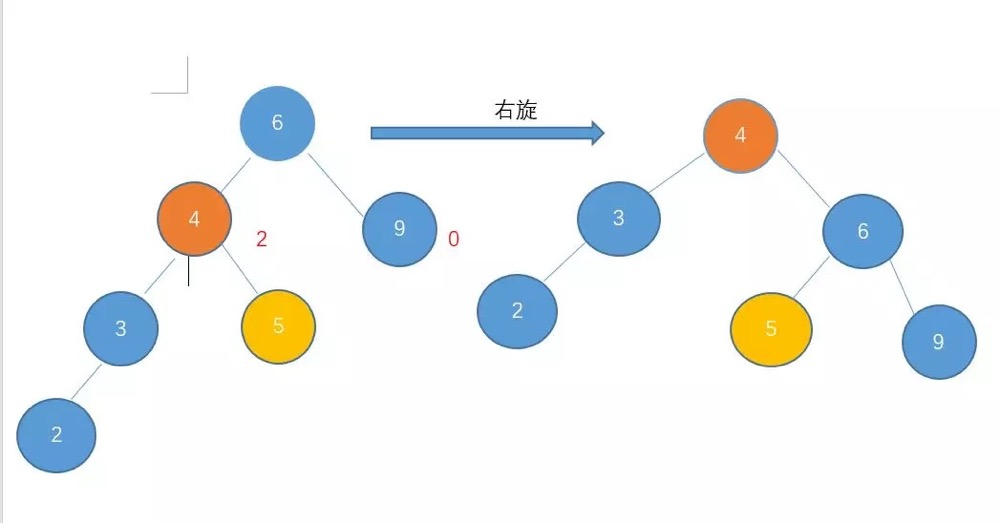
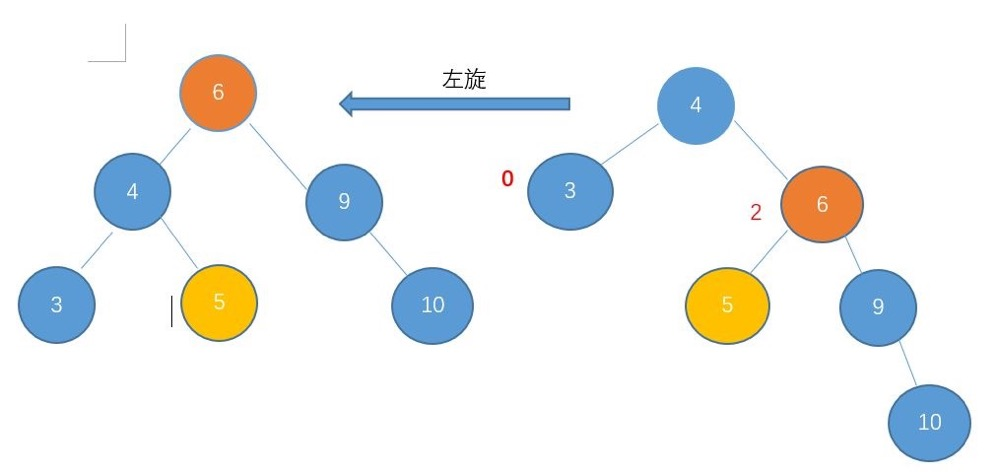
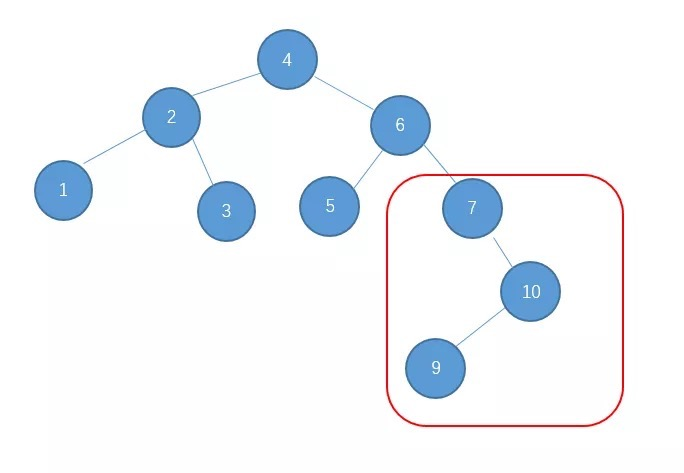
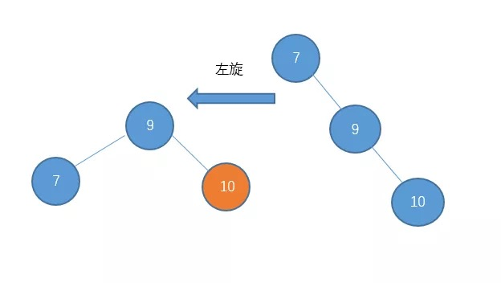
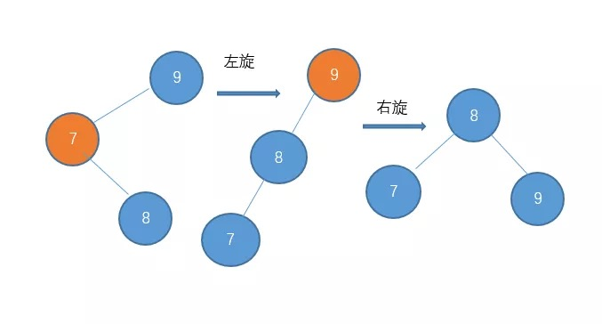
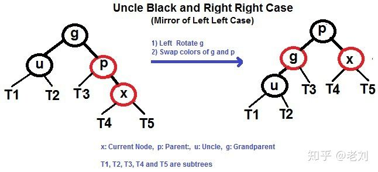
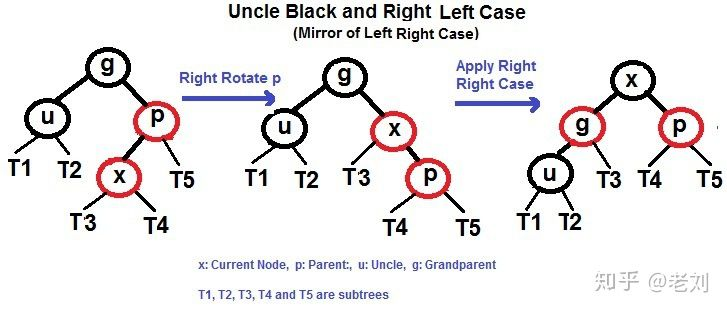

# 第三部分 数据结构
集合作为计算机科学的基础，就如同它们在数学中所起的作用。不同的是，数学中的集合是不变的，而由算法操作的集合却是动态的。下面的几章将介绍在计算机上表示和操作有限动态集合的一些基本技术。

第10~14章描述能够用于实现动态集合的几种数据结构，本书后面将是同其中多种构造解决各种不同问题的有效算法。

第10章给出一些简单数据结构的使用基础，如栈、列队、链表和有根树。
第11章介绍散列表，最坏情况下，散列表完成一次search 操作需要 O(n)时间，但散列表上操作的期望时间为O(1)。
第12章介绍二叉搜索树，它支持常见的所有的动态集合操作。最坏情况下，在有 n 个元素的一棵树上，一次操作需要 O(n)时间；然而在随机构建的一棵二叉搜索树上，其一次操作的期望时间为 O(logn)。
第13章介绍红黑树，这是二叉搜索树的一个变种。与普通的二叉搜索树不同，红黑树保证了较好的性能：最坏情况下各种操作只需要 O(logn)时间，一棵红黑树是一种平衡搜索树，第5部分的第18章将涉及另一种平衡搜索树，称为 B 树。
第14章给出如何将红黑树进行扩张，使其支持一些基本操作以外的操作。


## 第10章 基本数据结构

### 栈和列队
栈和列队都是动态集合，且在其上进行 delete 操作所移除的元素是预先设定的。在`栈(stack)`中，被删除的是最近插入的元素：栈实现的是一种`后进后出(last-in,first-out,LIFO)`策略。相应地，在`列队(queue)`中，被删去的总是在集合中存在时间最长的那个元素：队列实现的是一种`先进先出(first-in, first-out,FIFO)`策略。

### 链表
`链表(linked list)`是一种这样的数据结构，其中各对象按线性顺序排列。数组的线性顺序是由数组下标决定的，然而与数组不同的是，链表的顺序是由各个对象里的指针决定的。
链表可以有多种形式，它可以是单链接的或者是双链接的，可以是已排序的或者未排序的，可以是循环的或非循环的。在本节余下的部分中，所处理的链表都是未排序的且是双链接的。

例子1: 链表反转
```python
class SingleLinkNode:
    def __init__(self, x):
        self.val = x
        self.next = None

    def __str__(self):
        s = f'{self.val}'
        next_ = self.next
        while next_:
            s += f' -> {next_.val}'
            next_ = next_.next
        s += f' -> None'
        return s


def reverse_single_link(head: SingleLinkNode) -> SingleLinkNode:
    new_head = None

    while head:
        tmp = head.next # 备份原来head节点的next地址
        head.next = new_head
        new_head = head
        head = tmp

    return new_head

Head_node = SingleLinkNode(1)
Second_node = SingleLinkNode(2)
Third_node = SingleLinkNode(3)

Second_node.next = Third_node
Head_node.next = Second_node

print(Head_node) # 1 -> 2 -> 3 -> None
print(reverse_single_link(Head_node)) # 3 -> 2 -> 1 -> None
```


### 二叉树
`二叉树(Binary tree)`是每个节点最多只有两个分支的树结构。通常分支被称作“左子树(左孩子)”或“右子树(右孩子)”。
二叉树的表示方法可以推广到每个结点的孩子数至多为常数 k 的任意类型的数：只需要将 left 和 right 属性用 child1, child2 ... childk代替，当孩子的节点数无限时，该方法就失效了。此外，即是将 k 限制在一个大的常数以内，若多数结点只有少量孩子时，也会浪费大量储存空间。
所幸的是，有一个巧妙的方法可以用来表示孩子数任意的树(当然，树的表示方法很多)。该方法的优势在于，对于任意 n 个结点的有根树，只需要O(n)的存储空间: `左孩子右兄弟表示法(left-child, right-sibling representation)`。其每个节点都包含了一个父节点指针 p，且 T.root 指向树 T 的根节点，然而每个结点中不是包含指向2个孩子的指针：


## 第11章 散列表

`散列表(Hash table，也叫哈希表)`，是根据键（Key）而直接访问在内存存储位置的数据结构。也就是说，它通过计算一个关于键值的函数，将所需查询的数据映射到表中一个位置来访问记录，这加快了查找速度。
这个映射函数称做散列函数，存放记录的数组称做散列表。


## 第12章 二叉查找树(也叫二叉搜索树)

二叉搜索树指一棵空树或者具有下列性质的二叉树：
* 若任意节点的左子树不空，则左子树上所有节点的值均不大于它的根节点的值；
* 若任意节点的右子树不空，则右子树上所有节点的值均不小于它的根节点的值；
* 任意节点的左、右子树也分别为二叉查找树；
* 没有键值相等的节点。

二叉搜索树允许我们通过一个简单的递归算法来按序输出二叉搜索树中的所有关键字，这种算法称为`中序遍历(inorder tree walk)`算法，这样命名的原因是输出的子树根的关键字位于其左子树的关键字值和右子树的关键值之间。类似地，还有`先序遍历(preorder tree walk)`和`后序遍历(postorder tree walk)`。
```Python
class Node(object):
    """节点类"""
    def __init__(self, val):
        self.val = val
        self.lchild = None
        self.rchild = None


class Tree:
    """该例子仅以二叉树来展示"""
    def __init__(self):
        self.root = None # 根节点

    def add(self, val):
        '''向二叉树中添加数据'''
        node = Node(val) # 构造节点
        if self.root is None:
            self.root = node
            return
        queue = [self.root]
        while queue:
            # 只要queue不为空,则按队列的形式来取出元素处理判断
            current_node = queue.pop(0)
            if current_node.lchild is None:
                current_node.lchild = node
                break
            elif current_node.rchild is None:
                current_node.rchild = node
                break
            else:
                queue.append(current_node.lchild)
                queue.append(current_node.rchild)

    def breadth_first_search(self):
        '''广度遍历:
        		二叉树:
                  6
               3	 8
             1   5 7  9
           0  2 4
        '''
        # 思路和add方法类似
        if self.root is None:
            return
        queue = [self.root]
        while queue:
            current_node = queue.pop(0)
            print(current_node.val, end=' ') # 6 3 8 1 5 7 9 0 2 4
            if current_node.lchild:
                queue.append(current_node.lchild)
            if current_node.rchild:
                queue.append(current_node.rchild)

    def depth_first_search(self, root):
        '''
            深度遍历按照根节点相对于左右子节点的访问先后来划分为：先序遍历、中序遍历、后序遍历
            下面展示为先序遍历
        '''
        if root is None:
            return
        print(root.val, end=' ')
        self.depth_first_search(root.lchild)
        self.depth_first_search(root.rchild)


    def preorder_traversal(self, node):
        '''先序遍历: root -> left ->right'''
        if node is None:
            return
        print(node.val, end=' ')
        self.preinorder_traversal(node.lchild)
        self.preinorder_traversal(node.rchild)

    def inorder_traversal(self, node):
        '''中序遍历: left -> root ->right'''
        if node is None:
            return
        self.inorder_traversal(node.lchild)
        print(node.val, end=' ')
        self.inorder_traversal(node.rchild)

    def postorder_traversal(self, node):
        '''后序遍历: left -> right ->root'''
        if node is None:
            return
        self.postorder_traversal(node.lchild)
        self.postorder_traversal(node.rchild)
        print(node.val, end=' ')

t = Tree()
[t.add(i) for i in [6, 3, 8, 1, 5, 7, 9, 0, 2, 4]]

print('广度遍历:')
t.breadth_first_search()
print('\n深度遍历(先序遍历):')
t.depth_first_search(t.root)
print('\n先序遍历:')
t.preinorder_traversal(t.root)
print('\n中序遍历:')
t.inorder_traversal(t.root)
print('\n后序遍历:')
t.postorder_traversal(t.root)
```


对于普通的树而言，插入很方便，但是查找起来就麻烦了，遍历一棵有 n 个结点的二叉树需要耗费 O(n)的时间。
而对于二叉查找树，因为其性质，在一棵 n 个结点的二叉搜索树中查找一个元素仅需要log(n)的时间(其本质为**二分法查找**)。见下例:

```Python
def tree_search(root, k):
    '''在二叉搜索树中查找一个具有给定关键字的节点： 输入一个指向树根的指针和一个关键字 k'''
    if root is None or k == root.value:
        return root
    if k < root.value:
        return tree_search(root.lchild, k)
    else:
        return tree_search(root.rchild, k)


# 而二分查找为:
def binary_search_recursion(key, arr, start, end):
    '''要求 arr 必须是排好序的'''
    if start > end:
        return False
    mid = (start + end) // 2
    if arr[mid] == key:
        return mid
    elif arr[mid] > key:
        return binary_search_recursion(key, arr, start, mid - 1)
    else:
        return binary_search_recursion(key, arr, mid + 1, end)


def binary_search_while(key, arr):
    '''要求 arr 必须是排好序的'''
    start = 0
    end = len(arr) - 1
    while start <= end:
        mid = (start + end) // 2
        if arr[mid] == key:
            return mid
        elif arr[mid] > key:
            end = mid - 1
        else:
            start = mid + 1
    return False
```

而对于 搜索二叉树的查找(tree_search)，从树根节点开始递归(也可改为效率更高的迭代)，期间遇到的结点就形成了一条向下的简单路径，所以 tree_search 的运行时间为 O(h)，其中 h 是这棵树的高度。
但是，若遇到极端情况，**如若对二叉查找树依次递增插入，则其形成对二叉查找树就'退化'成一条链表了**，这种形态的二叉查找树在查找的性能上就大打折扣了，此时为O(n)的复杂度。对于此，AVL树给出了解决办法，见后文。

**二叉搜索树的最大关键字元素和最小关键字元素**

通过从树根开始沿着 lchild 指针直到遇到一个 None, 我们总能在一颗二叉搜索树中找到其最大关键字元素和最小关键字元素，这两个过程均能在一棵树高为 h 的树上 O(h)的时间内完成。

**二叉搜索树的插入**

和二叉搜索树的查找类似。

**二叉搜索树的删除**

从一棵二叉搜索树中删除一个结点 z的整个策略分为3种基本情况：
* 如果 z 没有孩子节点，那么只是简单地将它删除，并修改它的父节点
* 如果 z 只有一个孩子，那么将这个孩子提升到树中 z 的位置上，并修改z 的父节点
* **如果 z 有2个孩子，那么找 z 的右子树的最小值(或左子树的最大值)**，用该值替代 z 结点。

在一棵高度为 h 的二叉搜索树上，实现动态集合操作的 insert 和 delete 运算时间均为 O(h)。

**随机构建二叉搜索树**
我们已经知道二叉搜索树上的每个基本操作都能在 O(h)的时间内完成，其中 h 为这棵树的高度。然后，随着元素的插入和删除，二叉搜索树的高度是变化的(如，n 个关键字按严格递增的次序被插入，则该树的高度一定为 n-1的一条链，而一棵有 n 个不同关键字的随机构建的二叉搜索树的期望高度为 O(logn))，和快速排序类似，我们可以证明其平均情形性能更接近最好情形，而不是坏最情形时的性能。


## 补充: AVL树

AVL树是一种特殊的二叉搜索树，有如下性质：
- 具有二叉查找树的全部特性
- 任意节点的左子树和右子树的高度差 <= 1

AVL是最先发明的一种自平衡二叉查找树，像普通二叉树一样组织数据。所不同的是，AVL的每一个节点都附带了一个`平衡因子`，其值代表了左子树和右子树的高度之差。对于每一次改变其平衡性的操作，AVL树都通过执行一次`旋转`操作来使其重新平衡。每一次插入和删除操作最多可能有`log n`个节点被旋转。

因此，平衡树基于这种特点就可以保证其不会出现大量节点偏向于一边的情况了，于是，通过平衡树，我们解决了二叉查找树递增(减)插入情况的缺陷。对于有 n 个节点的平衡树，查找、插入和删除在平均和最坏情况下的时间复杂度都是O(logn)。插入和删除元素的操作则可能需要借由一次或多次树旋转，以实现树的重新平衡。

**查找**
可以像普通二叉查找树一样的进行，所以耗费O(logn)时间。

**插入**

AVL树的插入操作和普通二叉树类似。只不过**在每一次插入后，需要重新计算子树高度**。如果这次插入操作改变了树的平衡性，就需要旋转节点以使树重新平衡，**所谓的左旋和右旋都是以子树为原点的**：如下例5是9的子树，那么旋转就围绕5来进行。有以下几种情况:

- **左-左型**

  注：树的高度不同的书有不同的定义，有的从-1开始，有的从0开始，我个人感觉从0开始更容易理解。

因为节点9的左子树的高度为2,右子树的高度为0。这种情况需要对节点5进行右旋操作：



还有下面这种情况，6节点对左子树4高度为3，右子树节点9的高度是1(图示的高度和我这定义不同)，高度相差大于1。由于是**左孩子的高度较高**，对其较高高度的子节点4进行右旋：



- **右-右型**

  左旋和右旋一样(对称而已)，就是用来解决当大部分节点都偏向右边的时候，通过左旋来还原。例如：

  

  

- **右-左型**

  对一棵AVL树依次插入1,4,5,6,7,10,9,8,前面会伴随着插入的频繁旋转，最后会形成这样的AVL树：

  

对于这种情况，单单一次左旋或右旋是不行的，处理的方法是**先对节点10进行右旋把它变成右-右型(图略)，然后再进行左旋。** 

 

- **左-右型**

  这种情况和右左型对称，解决方法类似：先对节点7进行左旋，然后在对节点9进行右旋。

  

总结一下AVL树的插入，在插入的过程中，会出现一下四种情况破坏AVL树的特性，我们可以采取如下相应的旋转。

- 左-左型：做右旋。

- 右-右型：做左旋转。

- 左-右型：先做左旋，后做右旋。

- 右-左型：先做右旋，再做左旋。

  

## 第13章 红黑树(red-black tree)

前一章介绍了二叉搜索树，当二叉搜索树的高度较低时，其基本动态操作会执行得较快，然而，如果树的高度较高时，这些操作可能并不比直接在链表上得快。

然后，补充了AVL树，虽然AVL树解决了二叉查找树退化为近似链表的缺点，能够把查找时间控制在 O(logn)，不过却不是最佳的，因为平衡树要求**每个节点的左子树和右子树的高度差至多等于1**，这个要求实在是太严了，导致每次进行插入/删除节点的时候，几乎都会破坏平衡树的第二个规则，进而我们都需要通过**左旋**和**右旋**来进行调整，使之再次成为一颗符合要求的平衡树。

显然，如果在那种插入、删除很频繁的场景中，平衡树需要频繁着进行调整，这会使平衡树的性能大打折扣，为了解决这个问题，于是有了**红黑树**：`红黑树(red-black tree)`是许多“平衡”搜索树中的一种，可以保证在最坏情况下基本动态集合操作的时间复杂度为 O(logn)。

**红黑树的性质**

红黑树首先是一棵二叉搜索树，它在每个结点上增加了一个储存位来表示结点的颜色，通过对任何一条从根到叶子的简单路径上各个结点的颜色进行约束，红黑树确保没有一条路径会比其它路径长出2倍，因而是**近似平衡的, **不会像平衡树那样，频繁着破坏红黑树的规则，所以不需要频繁地调整**。其牺牲了部分平衡性以换取插入/删除操作时少量的旋转操作。**

树中的每个结点有5个属性：color、key、left、right 和 p，如果一个结点没有子结点或父结点，则该结点相应指针属性的值为 NIL。
**一棵红黑树是满足下面`红黑性质`的二叉搜索树：**(虽说如此，但在可视化的网站上插入就发现，二叉搜索树不允许有相同值的节点，但红黑树可以啊！??)

* 每个结点是红色或黑色的。
* 根结点是黑色的(黑土地孕育黑树根)。
* 所有叶结点都是黑色的空节点（NIL）。
* 不能有相邻的两个红节点（红色节点不能有红色父节点或红色子节点，**并没有说不能出现连续的黑色节点**）。
* 从任一节点到其每个叶结点的所有简单路径都包含相同数目的黑色节点。

**红黑树的基本操作：recolor和rotation**

- recolor (重新标记黑色或红色)
- rotation (旋转，这是树达到平衡的关键)

我们会先尝试 recolor，如果 recolor 不能达到红黑树的 4 点要求，然后我们尝试 rotation，其实红黑树的关键玩法就是弄清楚 recolor 和 rotation 的规则

对x进行左旋，意味着"将x变成一个左节点":

代码实现：

```Python
def left_rotate():
    """对节点 y 进行左旋"""
    y = x.right
    x.right = y.left # 将 y 的左子树变为 x 的右子树
    if y.left != T.nil:
        y.left.p = x
    y.p = x.p # 将 x 的父结点赋值为 y 的父结点
    if x.p == T.nil:
        T.root = y
    elif x == x.p.left:
        x.p.left = y
    else:
        x.p.right = y
    y.left = x # 将 x 置为 y 的左子树
    x.p = y
```

**红黑树的插入**

向红黑树中插入新的结点。具体做法是，将新结点的 color 赋为红色，然后以二叉搜索树的插入方法插入到红黑树中去。**之所以将新插入的结点的颜色赋为红色，是因为：如果设为黑色，就会导致根到叶子的路径上有一条路上，多一个额外的黑结点，这个是很难调整的。但是设为红色结点后，可能会导致出现两个连续红色结点的冲突，那么可以通过颜色调换和树旋转来调整，这样简单多了。**
接下来，讨论一下插入以后，红黑树的情况。设要插入的结点为N，其父结点为P，其祖父结点为G，其父亲的兄弟结点为U（即P和U 是同一个结点的两个子结点）。如果P是黑色的，则整棵树不必调整就已经满足了红黑树的所有性质。如果P是红色的（可知，其祖父结点G一定是黑色的），则插入N后，违背了红色结点只能有黑色孩子的性质，需要进行调整。
调整时分以下三种情况：

- 第一、N的叔叔U是红色的。
  - 将P和U重绘为黑色并重绘结点G为红色。
  - 现在新结点N有 了一个黑色的父结点P，因为通过父结点P或叔父结点U的任何路径都必定通过祖父结点G， 在这些路径上的黑结点数目没有改变。**但是，红色的祖父结点G的父结点也有可能是红色的**，这就违反了性质3。为了解决这个问题，我们对祖父结点G重复(将G当成新插入的节点)插入规则(当然，如果G是跟节点，最后则把G调整为黑色)。如图2.14:


- 第二、N的叔叔U是黑色的，有4种情况：

  - 左-左情况

    这种情况很简单，想象这是一根绳子，手提起 P 节点，然后变色即可(实际上是对新插入节点的父节点(p)进行右旋)：

      

  - 左-右情况

    先对p进行左旋，再应用左-左情况(不看颜色的话，和AVL树是一样的)。

​      

  - 右-右情况

      


  - 右-右情况

      


**红黑树的删除**

相较于插入操作，红黑树的删除操作则要更为复杂一些。删除操作首先要确定待删除节点有几个孩子，如果有两个孩子，不能直接删除该节点。而是要先找到该节点的**前驱（该节点左子树中最大的节点）**或者**后继（该节点右子树中最小的节点）**，然后将前驱或者后继的值复制到要删除的节点中，最后再将前驱或后继删除。

由于前驱和后继至多只有一个孩子节点，这样我们就把原来要删除的节点有两个孩子的问题转化为只有一个孩子节点的问题，问题被简化了一些。我们并不关心最终被删除的节点是否是我们开始想要删除的那个节点，只要节点里的值最终被删除就行了，至于树结构如何变化，这个并不重要。

红黑树删除操作的复杂度在于删除节点的颜色，当删除的节点是红色时，直接拿其孩子节点补空位即可。因为删除红色节点，性质5（从任一节点到其每个叶子的所有简单路径都包含相同数目的黑色节点）仍能够被满足。

当删除的节点是黑色时，那么所有经过该节点的路径上的黑节点数量少了一个，破坏了性质5。如果该节点的孩子为红色，直接拿孩子节点替换被删除的节点，并将孩子节点染成黑色，即可恢复性质5。但如果孩子节点为黑色，处理起来就要复杂的多。分为6种情况：

...

实在是麻烦,参见：[链接](https://zhuanlan.zhihu.com/p/91960960)

配合红黑树可视化更佳：[可视化](https://www.cs.usfca.edu/~galles/visualization/RedBlack.html)


