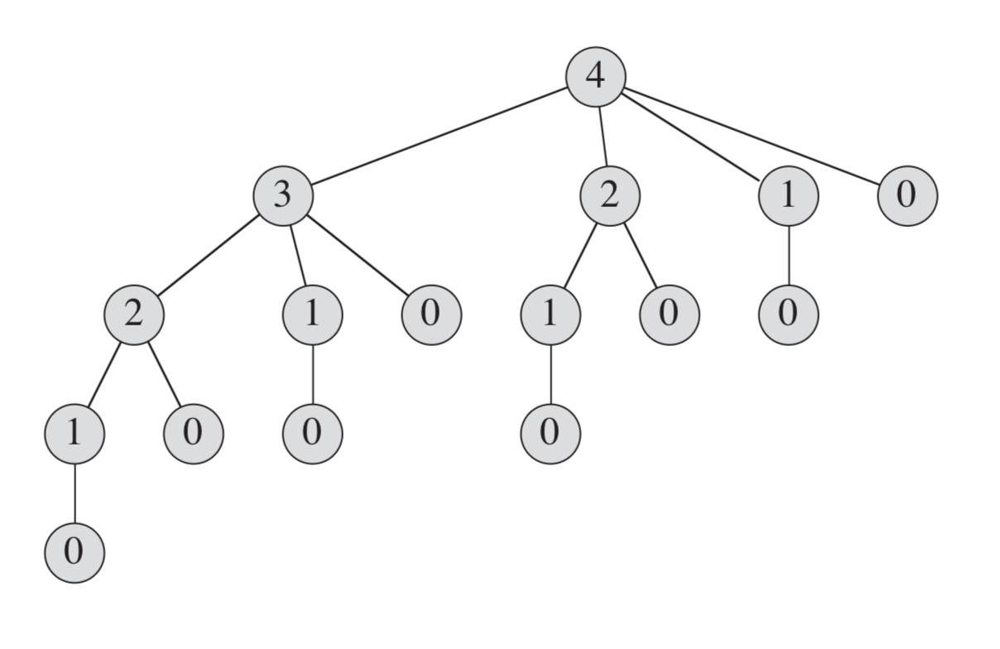
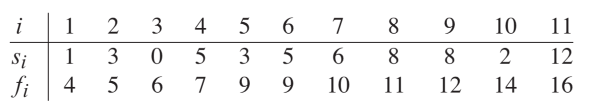

# 4 第四部分 高级设计和分析技术

这一部分介绍了设计和分析高校算法的三种中少技术：动态规划、贪心算法和摊还分析。

动态规划通常同来解决最优化问题，在这类问题中，我们通过做出一组选择来达到最优解。在做出每个选择的同时，通常会生成与原问题形式形同的子问题。当任意一个选择子集都生成相同的子问题时，动态规划技术通常就会很有效，其关键技术就是对每个这样的子问题都保存其解，当重复出现时即可避免重复求解。

贪心算法通常也用于最优化问题，我们做出一组选择来达到最优解。**贪心算法的思想是每步选择都追求局部最优**。一个简单的例子是找零问题：为了最小化找零的硬币数量，我们反复选择不大于剩余金额的最大面额的硬币。**贪心算法对很多问题都能求得最后解，而且速度比动态规划快得多。但是，我们并不能总是简单地判断出贪心算法是否有效**。

我们使用摊还分析方法分析一类特定的算法，这类算法执行一组相似的操作组成的序列。摊还分析并不是通过分别分析每个操作的实际代价的界来分析操作序列的代价的界，而是直接分析序列整体的实际代价的界。这种方法的一个好处是，虽然某些操作的代价可能很高，但其他操作的代价可能很低。换句话说，很多操作运行时间都会在最坏情况时间之内。


## 第15章 动态规划

`动态规划(dynamic programming)`与分治方法相似，都是通过组合子问题的解来求解原问题(这里的"programming"指的是一种表格法)，如前所述，分治方法将问题划分互不相交的子问题，递归地求解子问题，再将它们的解组合起来，求出原问题的解。与之相反，动态规划应用于子问题重叠的情况，即不同的子问题具有公共的子子问题。在这种情况下，分治算法会做许多不必要的工作，它会反复地求解那些公共子子问题。而动态规划算法对每个子子问题只求解一次，将其解保存在一个表格中，从而无需每次求解一个子子问题时都重新计算，避免了这种不必要的计算工作。


### 动态规划求解钢条切割问题

**钢条切割问题**是这样的：给定一段长度为 n 英寸的钢条和一个价格表 pi(i=1,2,...n)，求切割钢条的方案，使得销售收益 rn 最大。注意，如果长度为 n 英寸的钢条价格 pn 足够大，最优解可能就是不需要切割。

| 长度 i  | 1    | 2    | 3    | 4    |
| ------- | ---- | ---- | ---- | ---- |
| 价格 pi | 1    | 5    | 8    | 9    |

考虑 n=4 的情况：考虑所有切割方案可知，将长度为4的钢条切割成两段长度均为2的钢条所产生的收益最大为 10。

**分析：**
长度为 n 的钢条共有 2 ^(n-1)种不同的切割方案(因为在距离钢条左端 i(i=1,2,...n-1)英寸处，我们总是可以选择切割或不切割)。于是有：
$$ 收益rn = max(pn, r1+r(n-1), r2+r(n-2),...,r(n-1)+r1) $$

第一个参数 pn 对应不切割，直接出售长度为 n 的钢条的方案，其它 n-1个参数对应另外 n-1种方案，对于每个 i=1,2,...,n-1，首先将钢条切割成长度为 i 和 n-i 的两段，接着求解这两段的最优切割收益 ri 和 r(n-1)(每种方案的最优收益为两段的最优收益之和)

注意到，为了求解规模为 n 的原问题，我们先求解形式完全一样，但规模更小的子问题。即当完成某次切割后，我们将两段钢条看成两个独立的钢条切割问题实例，我们通过组合两个相关子问题的最优解，并在所有可能的两段切割方案中选取组合收益最大者，构成原问题的最优解。我们称这样的问题满足`最优子结构(optimal substructure)`性质：问题的最优解由相关子问题的最优解组合而成，而这些子问题可以独立求解。

除了上述求解方法外，钢条切割问题还存在一种相似的但更为简单的递归求解方法：我们将钢条从左边切割下长度为 i 的一段，只对右边剩下的长度为 n-i 的一段继续进行切割(递归求解)，对左边的一段则不再进行切割。于是得到更简化的版本：
$$ rn = max(pi + r(n-i))(1<=i<=n) $$

```Python
def cut_rod(p, n):
    if n == 0:
        return 0
    profit = 0
    for i in range(1, n + 1): # i 不能等于0，否值会无穷递归cut_rod(p, n)下去
        profit = max(profit, p[i] + cut_rod(p, n - i))
    return profit

price = {1: 1, 2: 5, 3: 8, 4: 9} # 价格表
print(cut_rod(price, 4))
```
上面几行代码即解决了此问题，但是，其效率并不高，当 n 较大的时候，所花费的时间明显增大，原因在于其反复地同相同的参数值对自身进行递归调用：



如果能做到在后面再次需要此子问题的解时直接查找保存的结果，而不必重新计算，那么就能得到一个更高效的动态规划算法。 因此，动态规划方法是付出额外的内存空间来节省计算时间。动态规划有两种等价的实现方法：

第一种方法称为**带备忘的自顶向下法(top-down with memoization)**。此方法仍按自然的递归形式编写过程，但过程中会保存每个子问题的解，当需要该解时，过程首先检查是否已经保存过此解，若是，则直接返回保存的值，从而节省了计算时间。

第二种方法称为**自底向上法(bottom-top method)**。这种方法一般需要恰当定义子问题“规模”的概念，使得任何子问题的求解都只依赖于“更小的”子问题的求解。因而我们可以将子问题按规模排序，按由小至大的顺序进行求解。当需要某个子问题时，它所依赖的那些更小的子问题都已求解完毕，结果已经保存，每个子问题只需要求解一次。

递归一般是自顶向下，依赖于子问题优化函数的结果，只有子问题完全求出，也就是子问题的递归返回结果，原问题才能求解。
自底向上一般为迭代法，就是巧妙的安排求解顺序，从最小的子问题开始，自下而上求解。每次求新的问题时，子问题的解已经计算出来了。

两种方法得到的算法具有相同的渐进运行时间，仅有的差异是在某些特殊的情况下，自顶向下方法并未真正递归地考察所有可能的子问题。由于没有频繁的递归函数调用的开销，自底向上方法的时间复杂性函数通常具有更小的系数。

```Python
def top_down_cut_rod(p, n, mem):
    """自顶向下方法:首先检查是否已经保存过此解，若是，则直接返回保存的值"""
    if mem.get(n):
        return mem[n]
    if n == 0:
        return 0
    profit = 0
    for i in range(1, n + 1): # 0~n
        profit = max(profit, p[i] + top_down_cut_rod(p, n - i, mem))
    mem[n] = profit
    return profit

price = {0:0, 1: 1, 2: 5, 3: 8, 4: 9} # 价格表
print(top_down_cut_rod(price, 4, {}))


def bottom_up_cut_rod(p, n, mem):
    """
    自底向下方法:
        想要求得n=4时的最大利润，我们从n=0开始，然后可求得n=1时的最大利润，再求2，这样一直下去就能求得n=4时的最大利润
    """
    mem[0] = 0
    for bigger in range(1, n + 1): # 1~n
        profit = 0
        for smaller in range(1, bigger + 1): # 1~bigger
            profit = max(profit, p[smaller] + mem[bigger - smaller])
        mem[bigger] = profit # 求得 n = bigger 时的最大利润
    print(mem)
    return profit # 或 return mem[bigger]

price = {1: 1, 2: 5, 3: 8, 4: 9} # 价格表
print(bottom_up_cut_rod(price, 4, {}))
```

### 动态规划原理
在上例中，我们关注适合用于动态规划方法求解的最优问题应该具备两个要素：最优子结构和子问题重叠。

**最优子结构：**
由前所述，注意到，长度为 n 的钢条的最优切割方案是由第一次切割后(需要切割的情况下)得到的两段钢条的最优切割方案组成的。
在动态规划的方法中，我们通常是同自底向上地使用最优子结构。也就是说，首先求得子问题的最优解，然后求得原问题的最优解。

**重叠子问题：**
适合动态规划方法求解的最优化问题应具备的第二个性质是子问题空间必须足够小，即问题的递归算法会反复地求解相同的子问题，而不是一直生成新的子问题。如果递归算法反复求解相同的子问题，我们就称最优化问题具有`重叠子问题(overlapping subproblems)`性质。与之相对，适合用分治方法求解的问题通常在递归的每一步都生成全新的子问题。动态规划算法通常这样利用重叠子问题性质：对每个子问题求解一次，将解存入一个表中，当在此需要这个子问题时直接查表，每次查表的代价为时间常量。


## 第16章 贪心算法
求解最优化问题的算法通常需要经过一系列的步骤，在每个步骤都面临多种选择。对于许多最优化问题，使用动态规划算法来求解最优解有些杀鸡用牛刀了，可以使用更简单、高效的算法：`贪心算法(greedy algorithm)`。它在每一步都做出当时看起来最佳的选择。也就是说，它总是做出局部最优的选择，寄希望于这样的选择能得出全局最优解。

贪心算法并不保证得到最优解，但对很多问题确实可以求得最优解。

### 活动选择问题
假设我们存在这样一个活动集合S={a1,a2,...,an},这些活动占用一个共同的资源(比如一个阶梯教室),其中每一个活动ai都有一个开始时间si和结束时间fi保证`(0≤si<fi)`,如果两个活动ai和aj的占用时间[si,fi),[sj,fj)不重叠，那么就说明这两个活动是兼容的。在活动选择问题中，我们希望选出一个最大兼容活动集。
假定在这个活动集合里面，都是按照结束时间fi进行升序排序的：


对于该例子，子集{a3,a9,a11}是一个相互兼容的活动集，但其并非一个最大集，{a1, a4,a8,a11}才是最大兼容活动集之一(还有个2,4,8,11)。

```Python
start_ = [1, 3, 0, 5, 3, 5, 6, 8, 8, 2, 12]
filish_ = [4, 5, 6, 7, 8, 9, 10, 11, 12, 14, 16]

def greedy_activity_selector(start, filish):
    selector, res = 1, '贪心算法最优解:活动1:[1, 4)'
    for j in range(2, len(filish)):
        if start[j] >= filish[selector]:
            res += f'-->活动{j + 1}[{start[j]}, {filish[j]})'
            selector = j
    print(res)

greedy_activity_selector(start_, filish_) # 1,4,8,11
```

### 贪心算法原理

一般地，我们可以按如下步骤设计贪心算法：
* 将最优化问题转化为这样的形式：对其做出一次选择后，只剩下一个子问题需要求解。
* 证明做出贪心选择后，原问题总是存在最优解，即贪心算法总是安全的。
* 证明做出贪心选择后，剩余子问题满足性质：其最优解与贪心选择组合即可得到原问题的最优解，这样就的得到了最优子结构。
如何证明一个贪心算法是否能求解一个最优化问题呢？并没有适合所有情况的方法，但贪心选择性质和最优子结构是两个关键要素。

**贪心选择性质(greedy-choice property)**
我们可以通过做出局部最优(贪心)选择来构造全局最优解。换句话说，当进行选择时，我们直接做出在当前问题中看起来最优的选择，而不必考虑子问题的解。
这也是贪心算法与动态规划的不同之处：在动态规划中，每个步骤都要进行一次选择，但选择通常依赖于子问题的解。因此，我们通常以一种自底向下的方式求解动态规划问题，先求出较小的子问题，然后是较大的子问题(也可自顶向下，但需要备忘机制)。而贪心算法进行选择时可能依赖之前做出的选择，但不依赖任何将来的选择或是子问题的解。因此，与动态规划先求解子问题才能进行第一次选择不同，贪心算法在进行第一次选择之前不求解任何子问题。

**贪心算法和动态规划**

0-1背包问题
> 一个正在抢劫商店的人发现商店里有 n 件物品，第i件物品价值是v[i]美元，重w[i]磅。但他的背包只能容纳 W(整数) 磅重的商品，求解将哪些物品装入背包可使价值总和最大。

分数背包问题
> 与0-1背包问题类似，但对每个商品，可只取走其一部分(价值按重量算)。

两个背包问题都具有最优子结构性质。对于0-1背包问题，考虑重量不超过 W 而价值最高的方案，如果将商品 j 拿走，则剩余商品必须是重量不超过 W - wj 的价值最高的方案。
虽然两个问题相似，但显然我们用贪心策略可以求解分数背包问题，却不能求解0-1背包问题。

比如：总3个商品，(商品1：10磅，60美元)，(商品2：20磅，100美元)，(商品3：30磅，120美元),背包容量50磅。
按贪心算法来分析：商品1单价最高，应拿走商品1，但实际最优解应该是拿取商品2和商品3。

