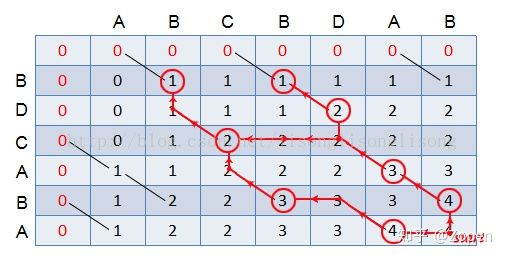
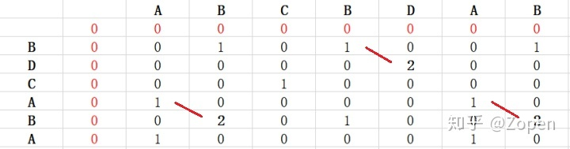

## 题目1: 编写一个函数来查找字符串数组中的最长公共前缀。

如果不存在公共前缀，返回空字符串 ""。

示例 1:
输入: ["flower","flow","flight"]
输出: "fl"


解题思路，很容易想到的是我们将第一个字符串A和第二个字符串B求公共前缀，然后在和第三个字符串C求公共前缀，最终得到最长公共前缀。解题重点是求两个字符串求公共前缀。比较常见的想法是如果这两个字符串的第一个字符相同则记录第一个字符，第二个相同则增加第二个，直到出现不同的字符串。但是在这个思路上有一个难点，我们在和C串求前缀的时候，会重新从第一个字符开始记录，增加不必要的计算。第二个思路就是将A串作为前缀，如果与B串前面字符不同，则去掉最后一个字符重新和B串匹配，直到字符完全匹配B串，在python中，s = s[:-1]很容易去掉最后一个字符。实现如下：

```python
from typing import List

def longest_common_prefix(strs: List[str]) -> str:
    '''查找字符串数组中的最长公共前缀'''
    if not all(strs):
        return ''
    s = strs[0]
    for i in range(1, len(strs)):
        # find() 方法检测字符串中是否包含子字符串 str ，如果包含子字符串返回开始的索引值，否则返回-1。
        while strs[i].find(s) != 0:
            s = s[: -1] # s可包括空字符串的情况
    return s
```

## 题目2 求字符串最长公共子序列
例如：A = 'abac'
     B = 'abc'
    那么A与B的最长公共子序列为'abc'，长度为3

使用数组dp 表示其任意子字符串的最大公子串的长度，即: dp[i][j] 表示 A[:i] 与 B[:j] 的最长公共子序列的长度。
如: dp[3][3]表示 A[:3](aba) 与 B[:3](abc)的最长公共子序列的长度，为len('ab')即 2。

所以，其递推公式为：
- i = 0 或者 j = 0时:
    - dp[i][j] = 0, 因为 'str'[:0] == ''
- 否则:
    - A[i] == B[j], dp[i][j] = dp[i - 1][j - 1] + 1;
    - A[i] != B[j], dp[i][j] = max(dp[i - 1][j], dp[i][j - 1])

所以，该例的dp应该为:

```
   0 a b a c
0  0 0 0 0 0
a  0 1 1 1 1
b  0 1 2 2 2
c  0 1 2 2 3
```

```python
def longest_common_subsequence(A, B):
    '''求字符串最长公共子序列'''
    dp = [[0] * (len(A) + 1) for i in range(len(B) + 1)]
    for i in range(1, len(B) + 1):
        for j in range(1, len(A) + 1):
            if B[i - 1] == A[j - 1]: # 这里注意A, B顺序
                dp[i][j] = dp[i - 1][j - 1] + 1
            else:
                dp[i][j] = max(dp[i - 1][j], dp[i][j - 1])
    print(dp)
    return dp[-1][-1]
print(longest_common_subsequence('abac', 'abc'))
```
思考，要求出其具体的字符串该怎么做？
我们现在拿到了dp这个矩阵，很明显，因该从这个矩阵着手。
我们知道，dp[i][j]的值来源于 dp[i-1][j] 或者是 dp[i-1][j] 和 dp[i][j-1] 的较大值(可能相等)，反推回去。
以此类推，如果遇到S1[i] != S2[j] ，且dp[i-1][j] = dp[i][j-1] 这种存在分支的情况，这里都选择一个方向（之后遇到这样的情况，也选择相同的方向，要么都往左，要么都往上）。

从上图的红色路径显示，X 和 Y 的最长公共子序列有 3 个，分别为 “BDAB”、“BCAB”、“BCBA”。


## 题目3 求字符串最大公共子串

思路：
    和最长公共子序列一样，使用动态规划的算法，但有两个地方不同:
    - A[i] != B[j] 则dp[i][j] = 0; 这里有点自相矛盾啊，这里更应该看出子字符串必须包含A[i]， B[j]元素。不然没法理解。
    - 需要设置一个res，每一步都更新得到最长公共子串的长度。

A = "abac", B = "abc" 的 dp 矩阵如下:

```
   0 a b a c
0  0 0 0 0 0
a  0 1 0 1 0
b  0 0 2 0 0
c  0 0 0 0 1
```

```python
def longest_common_substring(A, B):
    '''动态规划解决最长公共子串问题时间复杂度O(m*n), 空间复杂度O(m*n)'''
    result = 0
    dp = [[0] * (len(A) + 1) for i in range(len(B) + 1)]
    for i in range(1, len(B) + 1):
        for j in range(1, len(A) + 1):
            if B[i - 1] == A[j - 1]: # 这里注意A, B顺序
                dp[i][j] = dp[i - 1][j - 1] + 1
                result = max(result, dp[i][j])
    print(dp)
    return result

print(longest_common_substring('abac', 'abc'))
```

类似，求出其具体的字符串该怎么做？


输出最长公共子串很简单，只需要判断 dp[i][j]是否等于最长公共子串的长度即可，然后沿着对角线往左上角找大于等于1的数字即可；
从上图的红色路径显示，X 和 Y 的最长公共子串有 3 个，分别为 "BD"、"AB"、"AB"。
