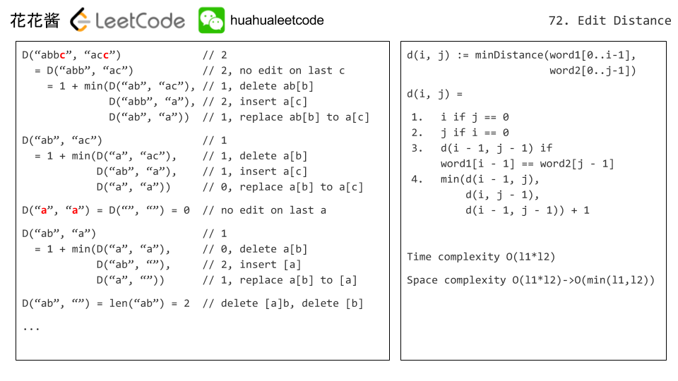

给了两个字符串，现在有三种操作，问最少做多少次操作，能使word1变成word2。三种操作是
- 插入一个字符
- 删除一个字符
- 替换一个字符


这个题和最长公共子序列非常相似，需要判断最后(或第一个))的一个字符是否相等：

- 如果相等，则最后一个字符不用做任何操作，那么只用计算除去最后一个字符外的前面的子串的编辑距离即可。
- 如果不等，则最后一个字符需要进行替换操作，那么只用计算除去最后一个字符外的前面的子串的编辑距离 ，再 +1（最后一个字符的替换操作），即可把word1变成word2。




```python
class Solution(object):
    def minDistance(self, word1, word2):
        """
        :type word1: str
        :type word2: str
        :rtype: int
        """
        L1, L2 = len(word1), len(word2)
        dp = [[-1] * (L2 + 1) for _ in range(L1 + 1)]
        return self.getDistance(word1, word2, dp, L1, L2)
    
    def getDistance(self, word1, word2, dp, pos1, pos2):
        if pos1 == 0:
            return pos2
        if pos2 == 0:
            return pos1
        if dp[pos1][pos2] >= 0:
            return dp[pos1][pos2]
        
        res = 0
        if word1[pos1 - 1] == word2[pos2 - 1]:
            res = self.getDistance(word1, word2, dp, pos1 - 1, pos2 - 1)
        else:
            res = min(self.getDistance(word1, word2, dp, pos1 - 1, pos2 - 1),
                      self.getDistance(word1, word2, dp, pos1, pos2 - 1),
                      self.getDistance(word1, word2, dp, pos1 - 1, pos2)) + 1
        dp[pos1][pos2] = res
        return res

```

知道了记忆化搜索之后，很容易改成动态规划。这两者的边界是一样的，只不过从递归转成了循环。

```python
class Solution(object):
    def minDistance(self, word1, word2):
        """
        :type word1: str
        :type word2: str
        :rtype: int
        """
        L1, L2 = len(word1), len(word2)
        dp = [[0] * (L2 + 1) for _ in range(L1 + 1)]
        for i in range(L1 + 1):
            dp[i][0] = i
        for j in range(L2 + 1):
            dp[0][j] = j
        for i in range(1, L1 + 1):
            for j in range(1, L2 + 1):
                if word1[i - 1] == word2[j - 1]:
                    dp[i][j] = dp[i - 1][j - 1]
                else:
                    dp[i][j] = min(dp[i - 1][j - 1], dp[i - 1][j], dp[i][j - 1]) + 1
        return dp[L1][L2]
```
