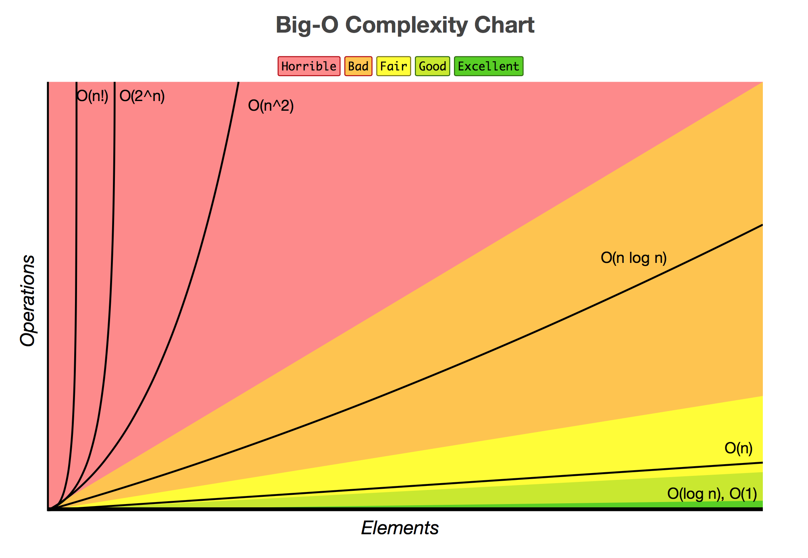

# [麻省理工学院:计算机科学与 Python 编程导论](https://courses.edx.org/courses/course-v1:MITx+6.00.1x_7+3T2015/course/)
虽然该课程的教学语言为 Python，但作为一门优秀的导论课，它强调学习计算机科学领域里的重要概念和范式，而不仅仅是教你特定的语言。 如果你不是科班生，这能让你在自学时开阔眼界; 课程内容:计算概念，Python 编程语言，一些简单的数据结构与算法，测试与调试。

## Week 1 

Goals:

* Skillful at not only getting the computer to do sth,but to do that thing you want it to.

* Learn computational modes of thinking

  


### What does a computer do?

2 things and 2 things only:

* Perform calculations

* Remember results


### Are simple fast calculations enough?

显然不是

* 比如网页搜索，按450亿个网页来算，每个网页1000个单词，按这样来遍历，目前民用计算机再快也无法在1秒内搜出结果。
* 又比如，下象棋。很多年前计算机就已打败最强的人类选手了。要达到这样的高度，可不仅仅是依赖计算机一秒可进行上亿次的运算

给我们一个启发，计算机虽然很快，但仍有许多局限性(Limitations)。我们需要: Good algorithm design 来完成我们的任务(thinking algorithmically)。


### What it knowledge?

* Declarative knowledge(陈述性知识)

  Statement of fact 比如 x 的平方等于9，所以: x**2 =9

* Imperative knowledge(程序性知识)

  'how to' methods or recipes, 比如x ** 2 = 25，一个找到 x = 5的具体一步步的方法(如Babylonian method)

而在计算机世界里，Algorithms are recipes


### Programming Language Characteristics

Aspects of languages

* Primitive constructs
* Syntax(语法)– which strings of characters and symbols are well-formed
* Static semantics(静态语义) – 表示什么程序是有意义的, 在还未运行时程序代码本身是否是有意义的
* Semantics(完整语义) –运行程序会达到什么效果, 解释器无法帮助你 debug，需要自己对代码进行逻辑判断

其课后习题可以较好解释以上不同:

* Syntax: Determines whether a string is legal

* Static semantics: Determines whether a string has meaning

* Semantics: Assigns a meaning to a legal sentence


### Where can things go wrong?

* Syntactic errors
  * Common but easily caught by computer
* Static semantic errors
  * Some languages check carefully before running, others check while interpreting the program
  * If not caught, behavior of program unpredictable
* Programs don’t have semantic errors, but meaning may not be what was intended
  * Crashes(stop running)
  * Runs forever
  * Produces an answer,but not wanted.

## Week 3

### Towers of Hanoi

有三根杆子A，B，C。A杆上有 N 个 (N>1) 穿孔圆盘，盘的尺寸由下到上依次变小。要求按下列规则将所有圆盘移至 C 杆：

- 每次只能移动一个圆盘；

- 大盘不能叠在小盘上面。

思路就是要把From的 n 层塔按规则放置到  To 塔上去，那么先把 From 上的前 n-1层放到 Temp 上去(step1)，再把 From 上的底层放到 To 上(step2)，再把 Temp 上的 n-1层放到 To 上(step3)。也就说说，只把汉诺塔看成2层——底层(n)和其上的(前 n-1层)。

```python
def hanoi_tower(n, from_='From', to_='To', temp='Temp'):
    if n == 1:
        print(f'{from_} --> {to_}')
    else:
        hanoi_tower(n-1, from_, temp, to_) # step1
        hanoi_tower(1, from_, to_, temp)   # step2
        hanoi_tower(n-1, temp, to_, from_) # step3

hanoi_tower(2)
# From --> Temp
# From --> To
# Temp --> To
```


### Fibonacci

```python
def fib(x):
    '''1, 1, 2, 3, 5......'''
    assert type(x) == int and x >= 0
    if x <= 1:
        return 1
    return fib(x - 1) + fib(x - 2)

fib(4) # 5 
```


### Palindrome

```python
def isPalindrome(s):
    s = s.lower()
    if len(s) <= 1:
        return True
    return s[0] == s[-1] and isPalindrome(s[1:-1])

isPalindrome('山东落花生花落东山') # True
```

This is an example of a `divide and conquer` algorithm:

**Solve a hard problem by breaking it into a set of sub-problems such that:**

* Sub-problems are easier to solve than the original
* Solutions of the sub-problems can be combined to solve the original


## Week 5

Complexity: Use `Big O` notation





其余的课程要么较为熟知( 如 Week 6)，那么打算在接下来的课程中再去深入了解(如 Week 7:Trees), 仅仅看了一遍而没做笔记，那么此教程就相当于结束了。