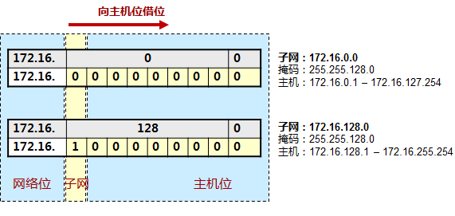
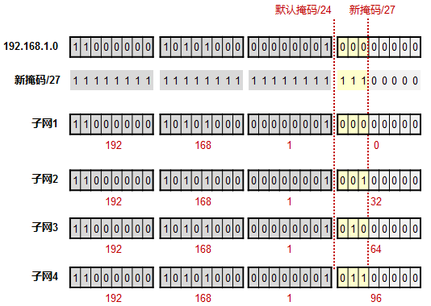

### IP子网划分 VLSM详解

#### 1 什么是IP地址

- IP地址在网络中用于标识一个节点（或者网络设备的接口）。

- IP网络中数据包的寻址是基于IP地址来进行的，因此IP地址就像是现实生活中的地址。

- IP协议定义了数据分组的格式，也定义了数据分组寻址的方式。目前我们在业务环境中常见的IP主要是两个版本：IPv4及IPv6，而现阶段网络主体仍然是IPv4，但是在可预见的未来，会逐渐向IPv6过渡。本章只介绍IPv4。

- 一个IPv4地址有32比特位（二进制格式下）。当然，我们不可能用二进制来书写IPv4地址，那是低效的，我们通常采用十进制格式来书写IP地址，但是计算机在进行IP地址的相关计算工作时，无疑是通过二进制的形式来进行。因此掌握十进制到二进制的数制转换是必备的技能。

- IPv4地址通常采用“点分十进制”表示，以适应人类的读写习惯，例如192.168.1.1。

#### 2 十进制与二进制的转换
“点分十进制”IP地址表现形式能够帮助我们更好的使用网络，但网络设备在对IP进行计算时使用的是二进制的操作方式，例如：

|  192.    |   168.   |   10.   | 1 |
| ---- | ---- | ---- | ----|
| 11000000 | 10101000 | 00001010 | 00000001 |

#### 3 IP地址的分类
IPv4地址的空间从0.0.0.0 一直到 255.255.255.255，这么庞大的空间，如果不加以区分和规划，势必不便于统筹管理。因此我们对IPv4地址空间进行类别上的划分，一共有五类：

|   |   8Bits |   8Bits   | 8Bits | 8Bits|
| ---- | ---- | ---- |---- | ----|
| A类 | 0NNNNNNN | Host | Host | Host|
| B类 | 10NNNNNN | Network | Host | Host|
| C类 | 110NNNNN | Network | Network | Host|
| D类 | 1110NNNN | Multicast Group | Multicast Group | Multicast Group|
| D类 |  | research |  | |

地址的类别上的区分主要体现在第一个八位组（一个IP地址拥有4个八位组）上：
- 第一个八位组首位恒定为0，那么我们就得到一个区间：1.0.0.0一直到127.255.255.255。这是A类地址，其中127.0.0.0/8作为本地回环使用，例如你ping 127.0.0.1实际上ping的是本机。所以如果看到一个IP，它的首个八位组掉落在1-126的区间内，那么这是一个A类地址。A类地址的网络号范围： 1~126； 默认子网掩码：255.0.0.0；最大网络数: 2^7 - 2 = 126个(A类第1位必须是0);最大主机数: 2^24 - 2 个。全0全1的地址不可分配，作为保留地址，上面减2也是这个原因，一般用于大型网络。

- 第一个八位组的最高两位恒定为10，就得到一个区间：128.0.0.0-191.255.255.255，这是B类地址。默认子网掩码：255.255.0.0；最大网络数: 2^14 - 2;最大主机数: 2^16 - 2 个，一般用于中等规模网络。

- 第一个八位组的最高三位恒定为110，就得到一个区间：192.0.0.0 – 223.255.255.255，这是C类地址。一般用于小型网络。

- 第一个八位组的最高四位恒定为1110，就得到一个区间：224.0.0.0 – 239.255.255.255，这是D类地址，这个类别的地址专门用于多路广播用户。

- 剩下的是E类地址，这类地址保留作为研究使用。

补充:关于私网地址，是在90年代，也就是互联网刚刚火起来的时候。私网地址这个标准的制定者和标准提交者，领头的是思科公司的Yakov Rekhter。至于说当时提出划分私网地址的目的，除了众所周知的延缓IPv4地址消耗速度以外，还有一个关键原因，就是减少互联网的路由条目。90年代内存还是非常贵的，一般路由器上没多少也就是几M而已，所以存储路由条目的代价也是很高的。可以想见，如果任何一台主机都配置一个可路由的公网地址，那路由表的条目数量会是可怕的，因此私网地址推出的目的除了减少公网地址的使用，还要减少直接连接公网的主机数量，以便减轻路由器的路由存储，查询的压力。其次，关于私网地址段的选择。对于私网地址的规范，在RFC 1918 - Address Allocation for Private Internets里有完整的规范定义。
其中A类，B类，C类网段各取了一部分：
- 10.0.0.0/8 (255.0.0.0)
- 172.16.0.0/12 (255.240.0.0)，其实172.16.0.0/12 = 72.16.0.0/16 ～ 172.31.0.0/16。(见下文)
- 192.168.0.0/16 (255.255.0.0) （所以，路由器常见的网关地址192.168.1.1 其实是一个私网地址，你在你家用和我在我家用互不冲突）

#### 4 网络掩码Netmask

一个IP地址包含两部分：网络部分以及主机部分。网络部分用于表示这个IP地址所处的“空间”，对于一台路由器而言，当它在为数据包寻址时，通常只关心IP地址的网络部分。那么如何区分一个IP地址中的网络与主机部分呢——网络掩码（Network Mask，简称netmask），用于和IP地址进行对应，从而标识出IP地址中的网络与主机部分。 网络掩码在二进制的表示上是一堆连续的1、后面接连续的0。

为了方便书写，我们往往使用掩码长度的方式来表示一个IP地址+掩码(CIDR格式: 无类别域间路由选择)：192.168.1.1 255.255.255.0 等同于 192.168.1.1/24。因为255.255.255.0写成二进制的话，从左往右数就是24个1，所以我们也说，它的掩码长度为24。

默认情况下，A类IP地址，首个八位组为网络位，其他位为主机位，因此A类地址的默认掩码就是255.0.0.0，或者长度为/8。B类IP地址前两个八位组为网络位，后两个八位组为主机位，因此B类地址的默认掩码就是255.255.0.0或者/16。C类地址的前三个八位组为网络位，后面一个八位组是主机位，因此C类地址的默认掩码就是255.255.255.0，或者/24。从这里我们可以看出来，如果你申请到一个A类地址空间：123.0.0.0/8，那么这是一个相当庞大的地址空间，因为这个空间有2的24次方个IP地址。相对的，一个B类的IP网络地址空间默认有2的16次方个IP地址，而C类地址则更少。

#### 5 IP地址类型

- 网络地址：标识一个网络，相当于一个“面”的概念。是一个IP地址中主机位全0的地址。例如192.168.10.0/24。

- 主机地址：可分配给网络中终端设备的地址。例如192.168.10.1/24至192.168.10.254/24。

- 广播地址：用于向网络中的所有主机发送数据的特殊地址。广播地址即主机部分的各比特位全部为1的地址。例如192.168.10.255/24。

可通过在线工具计算查看: [在线计算](https://www.sojson.com/convert/subnetmask.html)

#### 6 为什么要划分子网

假设你有一个B类地址：172.16.0.0，由于B类地址的默认掩码是255.255.0.0，这就意味着这个网络内有2的16次方个地址，而可分配给PC使用的IP地址就有2的16次方-2这么多个IP，为什么要减去2？因为广播地址及网络号是不能分配给PC使用的。

设想一下，如果你真有这么多台PC，这么多个IP地址处于同一个网络中、同一个网段中、同一个广播域中，那么一旦网络中发生广播，影响可就大了。再者，实际的业务环境中，我们往往给一个业务单元，划分一个网段，不同的业务单元不同的网段，那么如果你有10个业务单元，每个业务单元才百来号设备，一个业务单元就耗费一个B类地址，这就造成地址空间的浪费。

因此，我们提出子网划分的概念，子网划分的术语叫做VLSM（Variable Length Subnet Mask，可变长子网掩码），事实上是拿子网掩码变戏法。在这个例子中中，我们有五个网段(172.16.1.0、172.16.2.0、172.16.3.0、172.16.4.0、172.16.5.0)，需要五个IP地址段。而如果你只有一个B类地址（172.16.0.0/16）可用，通过子网划分，可以将这个B类地址划分成一个个小一点的子网。这样一来，一个庞大的广播域可以被分割成小的单元，另外IP地址的使用也更为科学更为合理。

#### 7 如何划分子网

假设我们有一个B类地址：172.16.0.0/16, 将原有的16个位的网络位向主机位去“借”一位，这样一来网络位就扩充到了17位，相对的主机位就变成了15位。那么借过来的这一位，就是子网位了。由于我们借了这一位，因此掩码就从默认的255.255.0.0变成了255.255.128.0或者说从172.16.0.0/16变成了172.16.0.0/17。

于是从原来的只有172.16.0.0/16的一个大网段，变成现在拥有172.16.0.0/17及172.16.128.0/17这两个小一点的网段。这就是子网划分。务必要关注网络掩码在这个过程中发挥的作用。

子网划分例子二
假设现在你有一个IP地址：192.168.1.64/27，想把这个地址配置在一台PC上，是否可行？

其实就是192.168.1.0/24借位3位，新掩码/27因此网络位向主机位借了3位，产生了8个子网(192.168.x.0/27，其中x可为0、32、64、96、128、160、192、224)，每个子网可用IP地址为30，而相应的每个子网块的大小就为32，也就是2的5次方（5是剩余的主机位数）。

现在开始把每个子网罗列一下，结果发现192.168.1.64/27这个IP地址，其实是一个子网的网络号，既然是网络号，当然是不能分配给PC用的了。

例子3: 某公司有172.16.0.0/20网段，共有3个部门，需要给每个部门分配不同的网段。

有3个部门，那么就有2的n次方≥3，n的最小值=2。因此，网络位需要向主机位借2位。那么就可以从172.16.0.0/20这个网段中再划出2的2次方=4个子网，符合要求。

先将172.16.0.0/20用二进制表示：

10101100.00010000.00**00**0000.00000000/20

借2位后（可划分出4个子网）：

① 10101100.00010000.0000**00**00.00000000/22【172.16.0.0/22】

② 10101100.00010000.0000**01**00.00000000/22【172.16.4.0/22】

③ 10101100.00010000.0000**10**00.00000000/22【172.16.8.0/22】

④ 10101100.00010000.0000**11**00.00000000/22【172.16.12.0/22】

例子4: 其实172.16.0.0/12 = 172.16.0.0/16 ～ 172.31.0.0/16

172.16.0.0/12 的二进制表示： 10101100.0001|**0000**.00000000.00000000/12

借位4位后，产生2^4个子网段，就是上面二进制4个加粗0位置的变体: 

10101100.0001|**0000**.00000000.00000000/16【172.16.0.0/16】

10101100.0001|**0001**.00000000.00000000/16【172.17.0.0/16】

10101100.0001|**0010**.00000000.00000000/16【172.18.0.0/16】

.....

10101100.0001|**1111**.00000000.00000000/16【172.31.0.0/16】

